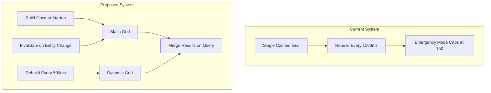

# Split Static/Dynamic Spatial Grid for Collision Detection

## Problem Statement

The current spatial grid system has a critical flaw:

- Emergency mode triggers at 500 entities (trees + stones = 1,080)
- Only 150 entities (100 trees, 50 stones) are included in collision checks
- **89% of trees and 72% of stones are NOT being collision-checked**
- The grid rebuilds every 1000ms even though static entities never move

## Architecture Overview



## Entity Classification

| Grid Type | Entities | Change Frequency |

|-----------|----------|------------------|

| **Static** | Trees, Stones, RuneStones, Cairns, SeaStacks, BasaltColumns, Shelters, AlkStations | Only when destroyed/placed |

| **Dynamic** | Players, WildAnimals, DroppedItems, HarvestableResources, Campfires, Furnaces, WoodenStorageBox, RainCollectors, PlayerCorpses, HomesteadHearths | Frequently (movement, respawn) |

## Implementation Plan

### Phase 1: Refactor Spatial Grid Module

**File: [server/src/spatial_grid.rs](server/src/spatial_grid.rs)**

1. Add new static grid cache alongside existing dynamic cache:
```rust
// Static grid - built once, invalidated on entity destruction/placement
static mut STATIC_GRID: Option<SpatialGrid> = None;
static mut STATIC_GRID_NEEDS_REBUILD: bool = true;

// Dynamic grid - rebuilt periodically (existing CACHED_GRID becomes this)
static mut DYNAMIC_GRID: Option<CachedDynamicGrid> = None;
```

2. Create separate entity type enums:
```rust
pub enum StaticEntityType {
    Tree(u64),
    Stone(u64),
    RuneStone(u64),
    Cairn(u64),
    SeaStack(u64),
    BasaltColumn(u64),
    Shelter(u32),
    AlkStation(u32),
}

pub enum DynamicEntityType {
    Player(Identity),
    WildAnimal(u64),
    DroppedItem(u64),
    HarvestableResource(u64),
    Campfire(u32),
    // ... etc
}
```

3. Create `populate_static_grid()` function that:

   - Iterates ALL trees, stones, monuments (no emergency capping)
   - Only called when `STATIC_GRID_NEEDS_REBUILD` is true
   - Sets flag to false after rebuild

4. Create `populate_dynamic_grid()` function that:

   - Iterates only dynamic entities (players, animals, items)
   - Much faster since fewer entities
   - Can use shorter refresh interval (500ms instead of 1000ms)

5. Create merged query function:
```rust
pub fn get_entities_in_range_merged(x: f32, y: f32) -> Vec<EntityType> {
    let static_entities = get_static_grid().get_entities_in_range(x, y);
    let dynamic_entities = get_dynamic_grid().get_entities_in_range(x, y);
    // Merge and return
}
```

6. Add invalidation function:
```rust
pub fn invalidate_static_grid() {
    unsafe { STATIC_GRID_NEEDS_REBUILD = true; }
}
```


### Phase 2: Add Invalidation Hooks

**File: [server/src/tree.rs](server/src/tree.rs)**

- Call `invalidate_static_grid()` when tree health reaches 0 (chopped)

**File: [server/src/stone.rs](server/src/stone.rs)**

- Call `invalidate_static_grid()` when stone health reaches 0 (mined)

**File: [server/src/shelter.rs](server/src/shelter.rs)**

- Call `invalidate_static_grid()` when shelter is placed or destroyed

**File: [server/src/rune_stone.rs](server/src/rune_stone.rs)**

- Call `invalidate_static_grid()` if rune stones can be destroyed

**File: [server/src/alk.rs](server/src/alk.rs)**

- Call `invalidate_static_grid()` when ALK station is activated/deactivated

### Phase 3: Update Collision Consumers

**File: [server/src/player_collision.rs](server/src/player_collision.rs)**

- Update `get_cached_spatial_grid()` calls to use new merged query
- No changes to collision logic itself, just the data source

**File: [server/src/animal_collision.rs](server/src/animal_collision.rs)**

- Same as player_collision - update to use merged query

**File: [server/src/projectile.rs](server/src/projectile.rs)**

- Update projectile collision checks to use merged query

**File: [server/src/lib.rs](server/src/lib.rs)**

- Update spawn collision checks to use merged query

### Phase 4: Performance Tuning

1. Reduce dynamic grid refresh interval from 1000ms to 500ms (fewer entities = faster rebuild)
2. Remove emergency mode capping from static grid (all entities included)
3. Keep emergency mode for dynamic grid only if needed
4. Add logging to track rebuild frequency and entity counts

## Key API Changes

```rust
// OLD API (single grid)
pub fn get_cached_spatial_grid(db, timestamp) -> &SpatialGrid

// NEW API (merged grids)  
pub fn get_collision_grid(db, timestamp) -> MergedSpatialGridView
// or keep same signature but internally use merged grids
```

## Risk Mitigation

1. **Backward Compatibility**: Keep the existing `get_cached_spatial_grid()` function signature, just change internal implementation
2. **Testing**: Add logging to compare entity counts before/after to verify all entities are included
3. **Rollback**: Keep old code commented for easy rollback if issues arise

## Expected Improvements

| Metric | Before | After |

|--------|--------|-------|

| Static entities in collision | 150 (capped) | ~1,700 (all) |

| Collision accuracy | ~11% | 100% |

| Grid rebuild work | 17+ tables/sec | 8-10 tables/sec (dynamic only) |

| Static entity rebuild | Every 1s | Only on change (~never) |

## Files to Modify

1. `server/src/spatial_grid.rs` - Main refactor (largest change)
2. `server/src/tree.rs` - Add invalidation hook
3. `server/src/stone.rs` - Add invalidation hook  
4. `server/src/shelter.rs` - Add invalidation hook
5. `server/src/player_collision.rs` - Update to use merged grid
6. `server/src/animal_collision.rs` - Update to use merged grid
7. `server/src/projectile.rs` - Update to use merged grid (if using spatial grid)
8. `server/src/lib.rs` - Update spawn collision checks