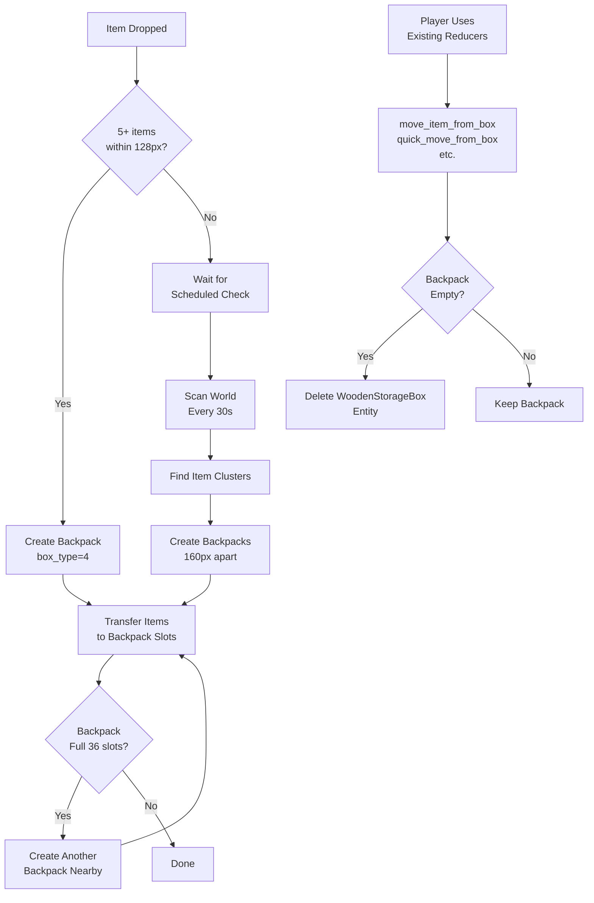

# Backpack Auto-Consolidation System (Box Type Variant)

## Overview
Implement backpacks as `BOX_TYPE_BACKPACK = 4` within the existing `WoodenStorageBox` system, reusing all inventory management reducers. Backpacks auto-spawn when dropped items cluster, using `burlap_sack.png` sprite.

## Architecture



## Key Insight: Reuse Existing Infrastructure

Instead of creating a separate `backpack.rs` module, we extend `WoodenStorageBox`:
- Add `BOX_TYPE_BACKPACK = 4` constant
- All existing reducers (`move_item_from_box`, `quick_move_from_box`, etc.) work automatically
- Only need to add backpack-specific logic: auto-spawning, consolidation, auto-despawn

## Implementation Steps

### 1. Server-Side: Extend WoodenStorageBox ([server/src/wooden_storage_box.rs](server/src/wooden_storage_box.rs))

**Add constants** (after line 32):
```rust
pub const BOX_TYPE_BACKPACK: u8 = 4;
pub const NUM_BACKPACK_SLOTS: usize = 36;
pub const BACKPACK_INITIAL_HEALTH: f32 = 100.0; // Low health, not meant to be attacked
pub const BACKPACK_MAX_HEALTH: f32 = 100.0;
```

**Update `ItemContainer` trait implementation** (around line 752):
```rust
fn num_slots(&self) -> usize {
    match self.box_type {
        BOX_TYPE_LARGE => NUM_LARGE_BOX_SLOTS,
        BOX_TYPE_REFRIGERATOR => NUM_REFRIGERATOR_SLOTS,
        BOX_TYPE_COMPOST => NUM_COMPOST_SLOTS,
        BOX_TYPE_BACKPACK => NUM_BACKPACK_SLOTS, // <<< ADD THIS
        _ => NUM_BOX_SLOTS,
    }
}
```

**Update `place_wooden_storage_box` reducer** (around line 468):
```rust
let box_type = if item_def.name == "Wooden Storage Box" {
    BOX_TYPE_NORMAL
} else if item_def.name == "Large Wooden Storage Box" {
    BOX_TYPE_LARGE
} else if item_def.name == "Refrigerator" {
    BOX_TYPE_REFRIGERATOR
} else if item_def.name == "Compost" {
    BOX_TYPE_COMPOST
} else if item_def.name == "Backpack" { // <<< ADD THIS (though players won't place backpacks manually)
    BOX_TYPE_BACKPACK
} else {
    return Err("Item is not a storage container.".to_string());
};
```

**Update health initialization** (around line 514):
```rust
let (initial_health, max_health) = match box_type {
    BOX_TYPE_LARGE => (LARGE_WOODEN_STORAGE_BOX_INITIAL_HEALTH, LARGE_WOODEN_STORAGE_BOX_MAX_HEALTH),
    BOX_TYPE_REFRIGERATOR => (REFRIGERATOR_INITIAL_HEALTH, REFRIGERATOR_MAX_HEALTH),
    BOX_TYPE_COMPOST => (COMPOST_INITIAL_HEALTH, COMPOST_MAX_HEALTH),
    BOX_TYPE_BACKPACK => (BACKPACK_INITIAL_HEALTH, BACKPACK_MAX_HEALTH), // <<< ADD THIS
    _ => (WOODEN_STORAGE_BOX_INITIAL_HEALTH, WOODEN_STORAGE_BOX_MAX_HEALTH),
};
```

### 2. Server-Side: New Backpack Module ([server/src/backpack.rs](server/src/backpack.rs))

Create a **small focused module** (~300 lines) for backpack-specific logic only:

```rust
use spacetimedb::{ReducerContext, Table, Timestamp, TimeDuration};
use spacetimedb::spacetimedb_lib::ScheduleAt;
use log;
use std::time::Duration;

use crate::wooden_storage_box::{WoodenStorageBox, BOX_TYPE_BACKPACK, NUM_BACKPACK_SLOTS};
use crate::dropped_item::{DroppedItem, dropped_item as DroppedItemTableTrait};
use crate::wooden_storage_box::wooden_storage_box as WoodenStorageBoxTableTrait;
use crate::items::{InventoryItem, inventory_item as InventoryItemTableTrait};
use crate::environment::calculate_chunk_index;
use crate::models::{ItemLocation, ContainerLocationData, ContainerType};

// --- Constants ---
const BACKPACK_PROXIMITY_RADIUS: f32 = 128.0;
const BACKPACK_PROXIMITY_RADIUS_SQUARED: f32 = 16384.0;
const MIN_ITEMS_FOR_BACKPACK: usize = 5;
const BACKPACK_SPAWN_SPACING: f32 = 160.0;
const CONSOLIDATION_CHECK_INTERVAL_SECS: u64 = 30;

// --- Schedule Table ---
#[spacetimedb::table(name = backpack_consolidation_schedule, scheduled(check_and_consolidate_all_clusters))]
#[derive(Clone)]
pub struct BackpackConsolidationSchedule {
    #[primary_key]
    #[auto_inc]
    pub id: u64,
    pub scheduled_at: ScheduleAt,
}

// --- Initialization ---
pub fn init_backpack_consolidation_schedule(ctx: &ReducerContext) {
    if ctx.db.backpack_consolidation_schedule().iter().count() == 0 {
        crate::try_insert_schedule!(
            ctx.db.backpack_consolidation_schedule(),
            BackpackConsolidationSchedule {
                id: 0,
                scheduled_at: ScheduleAt::Interval(TimeDuration::from_secs(CONSOLIDATION_CHECK_INTERVAL_SECS)),
            },
            "Backpack consolidation"
        );
    }
}

// --- Scheduled Reducer ---
#[spacetimedb::reducer]
pub fn check_and_consolidate_all_clusters(
    ctx: &ReducerContext,
    _args: BackpackConsolidationSchedule
) -> Result<(), String> {
    if ctx.sender != ctx.identity() {
        return Err("Backpack consolidation can only be run by scheduler".to_string());
    }
    
    let clusters = find_dropped_item_clusters(ctx);
    log::info!("[BackpackConsolidation] Found {} item clusters", clusters.len());
    
    for (center_x, center_y, items) in clusters {
        consolidate_dropped_items_near_position(ctx, center_x, center_y, items)?;
    }
    
    Ok(())
}

// --- Core Logic ---
pub fn consolidate_dropped_items_near_position(
    ctx: &ReducerContext,
    center_x: f32,
    center_y: f32,
    mut items: Vec<DroppedItem>,
) -> Result<(), String> {
    if items.len() < MIN_ITEMS_FOR_BACKPACK {
        return Ok(());
    }
    
    // Sort by distance from center
    items.sort_by(|a, b| {
        let dist_a = (a.pos_x - center_x).powi(2) + (a.pos_y - center_y).powi(2);
        let dist_b = (b.pos_x - center_x).powi(2) + (b.pos_y - center_y).powi(2);
        dist_a.partial_cmp(&dist_b).unwrap()
    });
    
    let mut backpack_count = 0;
    let mut current_backpack: Option<WoodenStorageBox> = None;
    let mut current_slot_index = 0u8;
    
    for item in items {
        // Create new backpack if needed
        if current_backpack.is_none() || current_slot_index >= NUM_BACKPACK_SLOTS as u8 {
            let spawn_offset = backpack_count as f32 * BACKPACK_SPAWN_SPACING;
            let backpack_x = center_x + spawn_offset;
            let backpack_y = center_y;
            
            current_backpack = Some(create_backpack_at_position(ctx, backpack_x, backpack_y)?);
            current_slot_index = 0;
            backpack_count += 1;
        }
        
        // Transfer item to backpack
        if let Some(ref mut backpack) = current_backpack {
            transfer_dropped_item_to_backpack(ctx, backpack, current_slot_index, &item)?;
            current_slot_index += 1;
            
            // Delete the dropped item
            ctx.db.dropped_item().id().delete(item.id);
        }
    }
    
    // Save final backpack
    if let Some(backpack) = current_backpack {
        ctx.db.wooden_storage_box().id().update(backpack);
    }
    
    log::info!("[BackpackConsolidation] Created {} backpack(s) at ({}, {})", backpack_count, center_x, center_y);
    Ok(())
}

fn create_backpack_at_position(
    ctx: &ReducerContext,
    pos_x: f32,
    pos_y: f32,
) -> Result<WoodenStorageBox, String> {
    use crate::wooden_storage_box::{BACKPACK_INITIAL_HEALTH, BACKPACK_MAX_HEALTH};
    
    let backpack = WoodenStorageBox {
        id: 0,
        pos_x,
        pos_y,
        chunk_index: calculate_chunk_index(pos_x, pos_y),
        placed_by: ctx.identity(), // System-placed
        box_type: BOX_TYPE_BACKPACK,
        // All 48 slots initialized to None (only first 36 used)
        slot_instance_id_0: None, slot_def_id_0: None,
        // ... (all other slots)
        health: BACKPACK_INITIAL_HEALTH,
        max_health: BACKPACK_MAX_HEALTH,
        is_destroyed: false,
        destroyed_at: None,
        last_hit_time: None,
        last_damaged_by: None,
    };
    
    Ok(ctx.db.wooden_storage_box().insert(backpack))
}

fn transfer_dropped_item_to_backpack(
    ctx: &ReducerContext,
    backpack: &mut WoodenStorageBox,
    slot_index: u8,
    dropped_item: &DroppedItem,
) -> Result<(), String> {
    // Create InventoryItem for the backpack slot
    let inv_item = InventoryItem {
        instance_id: 0,
        item_def_id: dropped_item.item_def_id,
        quantity: dropped_item.quantity,
        location: ItemLocation::Container(ContainerLocationData {
            container_type: ContainerType::WoodenStorageBox,
            container_id: backpack.id as u64,
            slot_index,
        }),
        item_data: dropped_item.item_data.clone(),
    };
    
    let inserted = ctx.db.inventory_item().insert(inv_item);
    backpack.set_slot(slot_index, Some(inserted.instance_id), Some(dropped_item.item_def_id));
    
    Ok(())
}

fn find_dropped_item_clusters(ctx: &ReducerContext) -> Vec<(f32, f32, Vec<DroppedItem>)> {
    let mut clusters = Vec::new();
    let mut processed_items = std::collections::HashSet::new();
    
    for item in ctx.db.dropped_item().iter() {
        if processed_items.contains(&item.id) {
            continue;
        }
        
        let mut cluster_items = vec![item.clone()];
        let mut center_x = item.pos_x;
        let mut center_y = item.pos_y;
        
        // Find nearby items
        for other in ctx.db.dropped_item().iter() {
            if other.id == item.id || processed_items.contains(&other.id) {
                continue;
            }
            
            let dx = other.pos_x - center_x;
            let dy = other.pos_y - center_y;
            if dx * dx + dy * dy <= BACKPACK_PROXIMITY_RADIUS_SQUARED {
                cluster_items.push(other.clone());
                // Update centroid
                center_x = cluster_items.iter().map(|i| i.pos_x).sum::<f32>() / cluster_items.len() as f32;
                center_y = cluster_items.iter().map(|i| i.pos_y).sum::<f32>() / cluster_items.len() as f32;
            }
        }
        
        if cluster_items.len() >= MIN_ITEMS_FOR_BACKPACK {
            for ci in &cluster_items {
                processed_items.insert(ci.id);
            }
            clusters.push((center_x, center_y, cluster_items));
        }
    }
    
    clusters
}

// --- Auto-despawn when empty ---
pub fn check_and_despawn_if_empty(ctx: &ReducerContext, backpack_id: u32) -> Result<(), String> {
    let backpack = ctx.db.wooden_storage_box().id().find(backpack_id)
        .ok_or("Backpack not found")?;
    
    if backpack.box_type != BOX_TYPE_BACKPACK {
        return Ok(()); // Not a backpack
    }
    
    // Check if all slots are empty
    let mut is_empty = true;
    for i in 0..NUM_BACKPACK_SLOTS as u8 {
        if backpack.get_slot_instance_id(i).is_some() {
            is_empty = false;
            break;
        }
    }
    
    if is_empty {
        ctx.db.wooden_storage_box().id().delete(backpack_id);
        log::info!("[Backpack] Auto-despawned empty backpack {}", backpack_id);
    }
    
    Ok(())
}
```

### 3. Server-Side: Hybrid Trigger in dropped_item.rs

**Modify [`server/src/dropped_item.rs`](server/src/dropped_item.rs)** `create_dropped_item_entity_with_data()` (after line 288):

```rust
pub(crate) fn create_dropped_item_entity_with_data(
    ctx: &ReducerContext,
    item_def_id: u64,
    quantity: u32,
    pos_x: f32,
    pos_y: f32,
    item_data: Option<String>,
) -> Result<(), String> {
    // ... existing code ...
    
    match ctx.db.dropped_item().try_insert(new_dropped_item) {
        Ok(_) => {
            log::info!("[CreateDroppedItem] Created dropped item entity (DefID: {}, Qty: {}) at ({:.1}, {:.1})",
                     item_def_id, quantity, pos_x, pos_y);
            
            // <<< ADD: Quick check for nearby items to trigger consolidation
            let nearby_count = ctx.db.dropped_item().iter()
                .filter(|item| {
                    let dx = item.pos_x - pos_x;
                    let dy = item.pos_y - pos_y;
                    dx * dx + dy * dy <= 16384.0 // 128px radius squared
                })
                .count();
            
            if nearby_count >= 5 {
                log::info!("[CreateDroppedItem] Detected {} nearby items, triggering consolidation", nearby_count);
                let _ = crate::backpack::consolidate_dropped_items_near_position(
                    ctx, pos_x, pos_y,
                    ctx.db.dropped_item().iter()
                        .filter(|item| {
                            let dx = item.pos_x - pos_x;
                            let dy = item.pos_y - pos_y;
                            dx * dx + dy * dy <= 16384.0
                        })
                        .collect()
                );
            }
            
            Ok(())
        },
        Err(e) => {
            log::error!("[CreateDroppedItem] Failed to insert dropped item: {}", e);
            Err(format!("Failed to create dropped item entity: {}", e))
        }
    }
}
```

### 4. Server-Side: Auto-despawn Hook

**Modify existing box reducers** to call `check_and_despawn_if_empty()` after item removal:

In [`server/src/wooden_storage_box.rs`](server/src/wooden_storage_box.rs), add after successful item moves:

```rust
// In move_item_from_box (after line 256):
boxes.id().update(storage_box);

// <<< ADD: Auto-despawn empty backpacks
if storage_box.box_type == crate::wooden_storage_box::BOX_TYPE_BACKPACK {
    let _ = crate::backpack::check_and_despawn_if_empty(ctx, box_id);
}

Ok(())
```

Repeat for: `quick_move_from_box`, `drop_item_from_box_slot_to_world`, `split_and_drop_item_from_box_slot_to_world`

### 5. Server-Side: Integration

**[`server/src/lib.rs`](server/src/lib.rs):**
- Add `mod backpack;` (around line 80)
- Call `backpack::init_backpack_consolidation_schedule(ctx)` in `init()` reducer (around line 650)

**[`server/src/models.rs`](server/src/models.rs):**
- No changes needed! `ContainerType::WoodenStorageBox` already covers backpacks

### 6. Client-Side: Rendering

**[`client/src/utils/renderers/woodenStorageBoxRenderingUtils.ts`](client/src/utils/renderers/woodenStorageBoxRenderingUtils.ts):**

Import backpack image (after line 4):
```typescript
import backpackImage from '../../assets/doodads/burlap_sack.png';
```

Add backpack constants (after line 11):
```typescript
export const BACKPACK_WIDTH = 48;
export const BACKPACK_HEIGHT = 48;
export const BOX_TYPE_BACKPACK = 4;
```

Update `getImageSource` in `boxConfig` (around line 37):
```typescript
getImageSource: (entity) => {
    if (entity.isDestroyed) return null;
    switch (entity.boxType) {
        case BOX_TYPE_LARGE: return largeBoxImage;
        case BOX_TYPE_REFRIGERATOR: return refrigeratorImage;
        case BOX_TYPE_COMPOST: return compostImage;
        case BOX_TYPE_BACKPACK: return backpackImage; // <<< ADD
        default: return boxImage;
    }
},
```

Update `getTargetDimensions` (around line 54):
```typescript
getTargetDimensions: (img, entity) => {
    switch (entity.boxType) {
        case BOX_TYPE_LARGE: return { width: LARGE_BOX_WIDTH, height: LARGE_BOX_HEIGHT };
        case BOX_TYPE_REFRIGERATOR: return { width: REFRIGERATOR_WIDTH, height: REFRIGERATOR_HEIGHT };
        case BOX_TYPE_BACKPACK: return { width: BACKPACK_WIDTH, height: BACKPACK_HEIGHT }; // <<< ADD
        default: return { width: BOX_WIDTH, height: BOX_HEIGHT };
    }
},
```

Preload image (after line 173):
```typescript
imageManager.preloadImage(backpackImage);
```

### 7. Client-Side: UI Configuration

**[`client/src/hooks/useContainer.ts`](client/src/hooks/useContainer.ts):**

Add backpack case to container config (find the switch statement for `box.boxType`):

```typescript
case 4: // BOX_TYPE_BACKPACK
    return {
        title: 'Backpack',
        slots: 36,
        columns: 6, // 6x6 grid
        allowedCategories: undefined, // All items allowed
    };
```

### 8. Client-Side: Interaction Labels

**[`client/src/utils/renderers/interactionLabelUtils.ts`](client/src/utils/renderers/interactionLabelUtils.ts):**

Update label text for backpacks (find the box rendering section):

```typescript
if (closestInteractableTarget?.type === 'box') {
    const box = woodenStorageBoxes.get(closestInteractableTarget.id.toString());
    if (box) {
        const labelText = box.boxType === 4 ? 'E - Open Backpack' : 'E - Open Storage';
        // ... render label
    }
}
```

## Key Advantages of This Approach

1. **Zero Code Duplication**: All 10+ inventory reducers work automatically
2. **Consistent Behavior**: Backpacks behave exactly like other containers
3. **Minimal Changes**: Only ~300 lines of new code in `backpack.rs`
4. **Easy Maintenance**: Changes to inventory system apply to backpacks automatically
5. **Type Safety**: Uses existing `WoodenStorageBox` table and `ItemContainer` trait

## Files to Create
- `server/src/backpack.rs` (~300 lines - consolidation logic only)

## Files to Modify
- `server/src/wooden_storage_box.rs` (add `BOX_TYPE_BACKPACK` constant, update match statements, add auto-despawn hooks)
- `server/src/lib.rs` (module declaration + init call)
- `server/src/dropped_item.rs` (hybrid trigger on drop)
- `client/src/utils/renderers/woodenStorageBoxRenderingUtils.ts` (add backpack image/dimensions)
- `client/src/hooks/useContainer.ts` (add backpack UI config)
- `client/src/utils/renderers/interactionLabelUtils.ts` (update label text)

## Testing Checklist
1. Drop 5+ items in cluster → backpack spawns instantly
2. Drop 10+ items → multiple backpacks spawn 160px apart
3. Open backpack → see 36 slots (6x6 grid)
4. Drag items from backpack to inventory → works (existing reducer)
5. Quick-move from backpack → works (existing reducer)
6. Split stack from backpack → works (existing reducer)
7. Take all items → backpack despawns automatically
8. Wait 30s with scattered items → scheduled consolidation runs
9. Verify `item_data` preservation (water content, etc.)
10. Check Y-sorting and interaction outline
