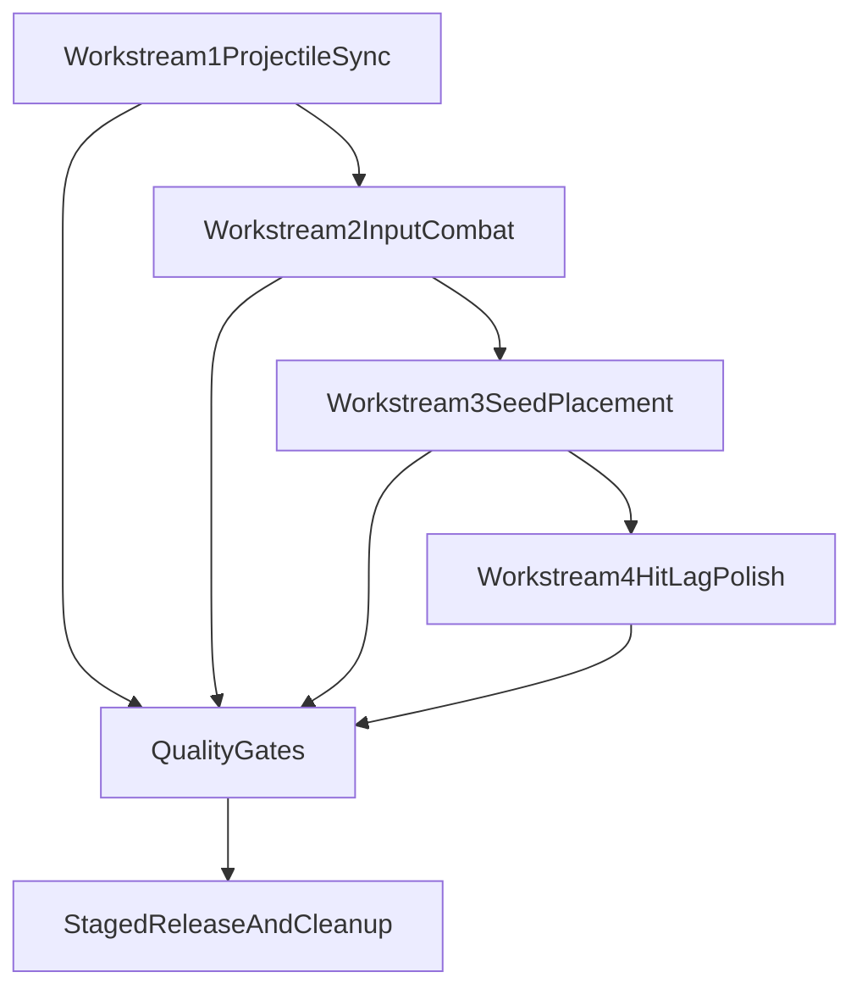

# Combat/Placement Smoothness Plan

## Outcomes

- Eliminate projectile pass-through visuals while preserving authoritative hit logic.
- Make melee/ranged input feel immediate and consistent under latency.
- Reduce worst-case seed placement delay spikes.
- Remove perceived hit lag on trees/barrels/stones/placeables without changing game rules.
- Ship safely with rollback/feature flags and parity checks.

## Architecture Constraints (Do Not Break)

- Keep server-authoritative combat and placement decisions.
- Preserve existing reducer contracts and gameplay rules (ranges, cooldowns, monument restrictions, break chances).
- Keep migration direction toward engine/runtime ownership, but avoid risky rewrites in one pass.

## Workstream 1: Projectile Visual/Authoritative Reconciliation

**Target files**

- [client/src/hooks/useInputHandler.ts](client/src/hooks/useInputHandler.ts)
- [client/src/utils/renderers/projectileRenderingUtils.ts](client/src/utils/renderers/projectileRenderingUtils.ts)
- [client/src/components/GameCanvas.tsx](client/src/components/GameCanvas.tsx)
- [server/src/projectile.rs](server/src/projectile.rs)

### Plan

1. Replace fragile optimistic→server projectile matching with deterministic matching metadata.
  - Attach a client-shot correlation token (if schema/reducer can accept safely) or improve matching with stricter local shot queue reconciliation.
  - Remove dependence on loose `(startTime ± window, startPos <= 48px)` matching alone.
2. Remove “linger” in renderer when authoritative deletion is known.
  - In [client/src/utils/renderers/projectileRenderingUtils.ts](client/src/utils/renderers/projectileRenderingUtils.ts), reduce/remove `PROJECTILE_TRACKING_DELETE_GRACE_MS` for matched local projectiles.
  - Keep a minimal grace only for subscription churn edge-cases, not normal gameplay.
3. Keep one visual source per projectile lifecycle.
  - Ensure optimistic projectile is retired as soon as authoritative counterpart is confirmed (and never co-renders too long).
4. Reassess server projectile tick cadence.
  - In [server/src/projectile.rs](server/src/projectile.rs), benchmark 75ms vs 50ms (or adaptive) with CPU budget guardrails.
  - Keep segment collision logic unchanged; only tune cadence if budget allows.

### Acceptance checks

- No visible pass-through after damage events in 200-shot stress test.
- No projectile ghosting after collision/range expiry.
- No regression in break/drop behavior and fire patch behavior.

## Workstream 2: Melee/Ranged Input Responsiveness

**Target files**

- [client/src/hooks/useInputHandler.ts](client/src/hooks/useInputHandler.ts)
- [server/src/active_equipment.rs](server/src/active_equipment.rs)
- [server/src/combat.rs](server/src/combat.rs)

### Plan

1. Fix client cooldown bookkeeping semantics.
  - Split local refs into: `lastLocalAttemptTs` and `lastServerConfirmedTs` (or remove faux-server timestamp gating on client).
  - Never advance “server-confirmed” throttle values before ack/observable state change.
2. Deduplicate attack pathways.
  - Consolidate mousedown/click/auto-attack melee dispatch into one code path in [client/src/hooks/useInputHandler.ts](client/src/hooks/useInputHandler.ts) to avoid divergent gating and duplicate logic.
3. Improve immediate feedback policy.
  - Add instant local feedback for resource-tool swings (audio/impact micro-feedback), while still reverting/ignoring if server denies damage.
4. Tighten ranged fire cadence consistency.
  - Ensure held-auto-fire and click fire share one cooldown source and one dispatch path.
5. Server-side optimization of cone target search.
  - In [server/src/combat.rs](server/src/combat.rs), move `find_targets_in_cone` heavy scans toward chunk/spatial filtering where available.

### Acceptance checks

- Input-to-feedback latency feels immediate (<1 frame visual feedback locally).
- No duplicate attack dispatches from mixed event paths.
- Cooldown enforcement remains server-auth and unchanged in game balance.

## Workstream 3: Seed Placement Latency Reduction

**Target files**

- [client/src/hooks/usePlacementManager.ts](client/src/hooks/usePlacementManager.ts)
- [client/src/utils/renderers/placementRenderingUtils.ts](client/src/utils/renderers/placementRenderingUtils.ts)
- [server/src/planted_seeds.rs](server/src/planted_seeds.rs)
- [server/src/building.rs](server/src/building.rs)

### Plan

1. Profile and reduce server-side hot loops in `plant_seed`.
  - Replace full-table seed occupancy checks with indexed tile/chunk-aware lookups.
  - Optimize tree-seed spacing checks via chunk-neighborhood filtering.
2. Reduce monument-zone validation cost in placement path.
  - Add short-lived server cache or precomputed monument exclusion structures for `check_monument_zone_placement` hot calls.
3. Trim noisy per-action logs on hot reducers.
  - Downgrade verbose `PLANT_SEED` info logs to debug/conditional diagnostics.
4. Client prevalidation alignment.
  - Keep client checks fast and deterministic; avoid expensive repeated scans in preview/attempt path where caches already exist.

### Acceptance checks

- P95 plant action roundtrip significantly reduced (target: >=30% improvement in busy areas).
- No changes in allowed/disallowed placement rules.
- No desync between client preview validity and server final validation.

## Workstream 4: Hit-Lag on Resources/Placeables

**Target files**

- [client/src/hooks/useInputHandler.ts](client/src/hooks/useInputHandler.ts)
- [client/src/hooks/useStructureImpactParticles.ts](client/src/hooks/useStructureImpactParticles.ts)
- [server/src/combat.rs](server/src/combat.rs)

### Plan

1. Introduce immediate local “contact hint” feedback.
  - On valid local swing arc candidate, trigger lightweight local impact feedback (audio/particles/camera micro-kick), then reconcile with server updates.
2. Preserve server damage authority.
  - Do not apply client-side health/damage authority; only feedback and anticipation.
3. Harmonize optimistic target picking with server geometry.
  - Align client arc/range constants with server-defined weapon arcs/ranges to reduce false-positive local hints.

### Acceptance checks

- Perceived responsiveness improves in tree/stone/barrel/placeable hits.
- No misleading frequent “fake hits” where server rejects.

## Cross-Cutting Quality Gates

### Instrumentation & diagnostics

- Add temporary metrics and counters (client + server):
  - Projectile match success/fail rates.
  - Optimistic projectile lifetime until authoritative retire.
  - Attack dispatch count per click/hold (duplicate detection).
  - Plant reducer timing buckets and validation branch timings.

### Test plan

- Combat regression matrix:
  - Melee vs players/animals/resources/placeables (land + water/snorkel cases).
  - Ranged (bow/crossbow/firearms/throwables), including dropped-item conversion paths.
- Placement regression matrix:
  - Seeds by biome restriction, water/beach/alpine/tundra, monument boundaries, foundation conflicts.
- Soak tests:
  - 10+ minute sustained combat and planting sessions with multiple nearby entities.

### Rollout strategy

- Ship behind temporary feature flags where risk is high (projectile reconciliation + input path consolidation).
- Enable progressively in dev/staging, then production.
- Keep rollback path to legacy logic for one release cycle.

## Sequencing (Recommended)

1. Projectile lifecycle reconciliation (highest visual trust issue).
2. Input path/cooldown cleanup (largest feel gain).
3. Seed placement server optimizations.
4. Structure/resource hit feedback polish.
5. Remove temporary flags/diagnostics after stability window.

