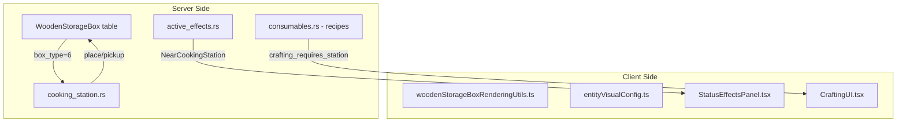

# Cooking Station Implementation Plan

## Overview

The Cooking Station is a placeable entity that enables players to craft advanced food recipes when standing nearby (within 100px). Unlike campfires/barbecues, it requires no fuel or cooking time - recipes are instant if the player has ingredients in their inventory. The station uses the WoodenStorageBox variant pattern (like Repair Bench, Compost, Refrigerator) but with **zero inventory slots** - it purely acts as a proximity enabler.

## Architecture



## Server Implementation

### 1. WoodenStorageBox Constants - [wooden_storage_box.rs](server/src/wooden_storage_box.rs)

Add new constants for the Cooking Station variant:

```rust
pub const BOX_TYPE_COOKING_STATION: u8 = 6;
pub const NUM_COOKING_STATION_SLOTS: usize = 0; // No inventory - proximity only
pub const COOKING_STATION_INITIAL_HEALTH: f32 = 400.0;
pub const COOKING_STATION_MAX_HEALTH: f32 = 400.0;
```

Update `num_slots()` and `pickup_storage_box` to handle the new type.

### 2. Cooking Station Module - [cooking_station.rs](server/src/cooking_station.rs) (new)

Create reducers:

- `place_cooking_station(instance_id, pos_x, pos_y)` - Places the station
- `pickup_cooking_station(box_id)` - Picks up the station

Since there's no inventory, no move/quick-move reducers needed.

### 3. Active Effects - [active_effects.rs](server/src/active_effects.rs)

Add `NearCookingStation` effect:

```rust
pub const EFFECT_NEAR_COOKING_STATION: &str = "NearCookingStation";

// In the proximity check scheduler (or player movement handler):
// Check if player is within 100px of any cooking station
// Apply/remove effect accordingly
```

This will likely be handled in a scheduled reducer that scans player positions vs cooking station positions.

### 4. Recipe Definitions - [consumables.rs](server/src/items_database/consumables.rs)

Add new advanced food items with `requires_station("Cooking Station")`:

**Example Recipes** (using cooked ingredients):

| Recipe | Ingredients | Stats (H/Hun/Thi) |

|--------|-------------|-------------------|

| Vegetable Stew | 2x Cooked Potato, 1x Cooked Carrot, 1x Cooked Beet | 60/90/40 |

| Fish Pie | 2x Cooked Pacific Cod, 1x Cooked Potato, 1x Flour | 70/100/30 |

| Mushroom Medley | 2x Cooked Porcini, 2x Cooked Chanterelle, 1x Roasted Bear Garlic | 55/75/35 |

| Seafood Platter | 1x Cooked Crab Meat, 1x Cooked Blue Mussel, 1x Cooked Sea Urchin | 65/85/25 |

| Hunter's Feast | 1x Cooked Wolf Meat, 1x Cooked Fox Meat, 2x Cooked Corn | 80/110/20 |

| Berry Tart | 3x Lingonberries, 2x Cloudberries, 1x Flour | 40/50/60 |

| Salmon Bake | 1x Cooked Sockeye Salmon, 1x Cooked Potato, 1x Mint Leaves | 75/95/35 |

| Herb-Crusted Meat | 1x Cooked Wolf Meat, 1x Chamomile, 1x Mugwort, 1x Yarrow | 70/80/25 |

| Root Vegetable Mash | 2x Cooked Potato, 2x Cooked Beet, 1x Roasted Bear Garlic | 50/85/30 |

| Crab Cakes | 2x Cooked Crab Meat, 1x Cooked Corn, 1x Seaweed | 55/70/20 |

**Note**: Need to verify if `Flour` exists or needs to be added as a basic material.

### 5. Crafting Validation - [crafting.rs](server/src/crafting.rs) or new module

Add station proximity check to crafting reducer:

- If recipe `requires_station` is set, verify player has the corresponding active effect
- Return error if not near required station

## Client Implementation

### 6. Rendering - [woodenStorageBoxRenderingUtils.ts](client/src/utils/renderers/woodenStorageBoxRenderingUtils.ts)

```typescript
import cookingStationImage from '../../assets/doodads/cooking_station.png';

export const BOX_TYPE_COOKING_STATION = 6;
export const COOKING_STATION_WIDTH = 128;
export const COOKING_STATION_HEIGHT = 128;

// Update getImage(), getTargetDimensions(), calculateDrawPosition()
```

### 7. Visual Config - [entityVisualConfig.ts](client/src/utils/entityVisualConfig.ts)

```typescript
cooking_station: {
    centerOffsetX: 0,
    centerOffsetY: -84,
    width: 120,
    height: 120,
    placementYOffset: -32,
    spriteWidth: 128,
    spriteHeight: 128,
}
```

### 8. Placement Preview - [placementRenderingUtils.ts](client/src/utils/renderers/placementRenderingUtils.ts)

Add `cooking_station.png` handling with proper visual config.

### 9. Label/Interaction Rendering - [renderingUtils.ts](client/src/utils/renderers/renderingUtils.ts), [labelRenderingUtils.ts](client/src/utils/renderers/labelRenderingUtils.ts)

Add `BOX_TYPE_COOKING_STATION` case to use `ENTITY_VISUAL_CONFIG.cooking_station`.

### 10. Item Icon - [itemIconUtils.ts](client/src/utils/itemIconUtils.ts)

```typescript
import cookingStationIcon from '../assets/items/cooking_station.png';
// Add to iconMap: 'cooking_station.png': cookingStationIcon
```

### 11. Status Effects Panel - [StatusEffectsPanel.tsx](client/src/components/StatusEffectsPanel.tsx)

Add display for `NearCookingStation` effect:

- Icon: Chef hat emoji (or custom icon)
- Tooltip: "Near Cooking Station - Advanced recipes available"

### 12. Crafting UI - [CraftingUI.tsx](client/src/components/CraftingUI.tsx) or related

- Filter recipes by `requires_station` field
- Show station requirement in recipe tooltip
- Gray out/disable recipes if player lacks the required station proximity effect

### 13. Container Utils - [containerUtils.ts](client/src/utils/containerUtils.ts)

Add `BOX_TYPE_COOKING_STATION` to `getContainerDisplayName()` returning "COOKING STATION".

Since it has 0 slots, container UI won't be shown (no ExternalContainerUI needed).

### 14. Placement Manager - [usePlacementManager.ts](client/src/hooks/usePlacementManager.ts)

Add case for `'Cooking Station'` calling `connection.reducers.placeCookingStation`.

### 15. Quick Move Utils - [quickMoveUtils.ts](client/src/utils/quickMoveUtils.ts)

Add `BOX_TYPE_COOKING_STATION` constant (even though it has no slots, for consistency).

## Files to Modify

**Server (Rust):**

- `server/src/lib.rs` - Add `mod cooking_station;`
- `server/src/wooden_storage_box.rs` - Add constants, update `num_slots()`, `pickup_storage_box`
- `server/src/cooking_station.rs` - New file with place/pickup reducers
- `server/src/active_effects.rs` - Add `NearCookingStation` effect + proximity detection
- `server/src/items_database/consumables.rs` - Add advanced recipes
- `server/src/items_database/placeables.rs` - Add Cooking Station item definition
- `server/src/crafting.rs` - Add station proximity validation (if crafting logic is there)

**Client (TypeScript):**

- `client/src/utils/renderers/woodenStorageBoxRenderingUtils.ts`
- `client/src/utils/entityVisualConfig.ts`
- `client/src/utils/renderers/placementRenderingUtils.ts`
- `client/src/utils/renderers/renderingUtils.ts`
- `client/src/utils/renderers/labelRenderingUtils.ts`
- `client/src/utils/itemIconUtils.ts`
- `client/src/components/StatusEffectsPanel.tsx`
- `client/src/hooks/usePlacementManager.ts`
- `client/src/utils/quickMoveUtils.ts`
- `client/src/utils/containerUtils.ts`
- `client/src/components/GameCanvas.tsx` - Preload doodad image

## Open Questions

1. **Flour ingredient**: Does `Flour` exist? If not, should it be added as a material that can be crafted from corn or wheat?

2. **Recipe count**: How many recipes to start with? The 10 examples above, or more/fewer?

3. **Proximity detection**: Should this run on a scheduled reducer (every 500ms check all players vs all cooking stations) or on player movement? The former is simpler but has slight latency.

4. **Station interaction**: Since there's no inventory, should pressing E on the station do anything? Options:

   - Nothing (just shows the chef hat effect when nearby)
   - Open crafting menu directly filtered to cooking station recipes
   - Show a simple tooltip

5. **Crafting UI integration**: Is there an existing `requires_station` field in `ItemDefinition`, or does it need to be added?