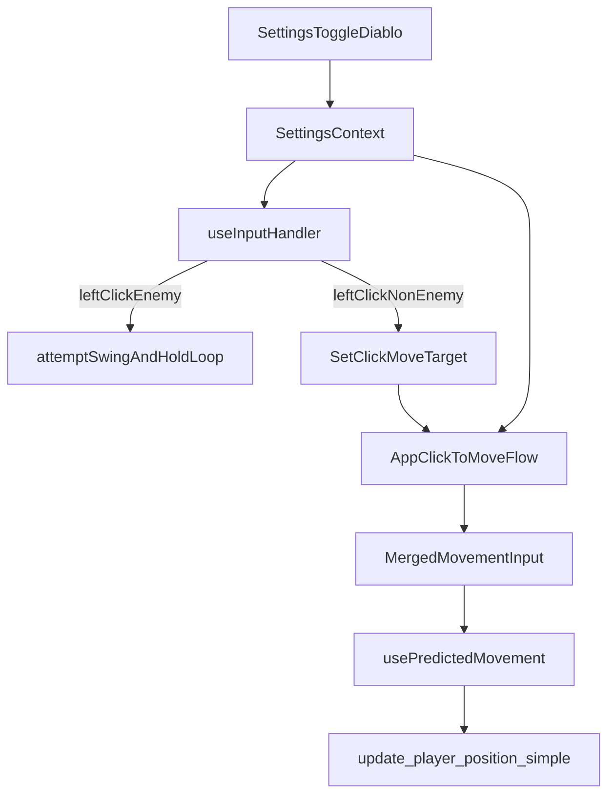

# Plan: Toggleable Diablo Desktop Controls

## Goal

Implement a desktop-only optional control mode with:

- Left click on enemies = attack (hold for continuous attacks)
- Left click on ground/non-enemy targets = click-to-move
- Always sprint while moving via click-to-move
- Keyboard movement still works

## Confirmed Behavior

- Left-click uses **smart context**: attack enemies, move otherwise.
- Keyboard movement remains enabled in this mode.

## Files and Changes

- **Settings flag + persistence** in [client/src/contexts/SettingsContext.tsx](client/src/contexts/SettingsContext.tsx)
  - Add `diabloStyleControls: boolean` and `setDiabloStyleControls(enabled: boolean)`.
  - Persist in `localStorage` using the same `loadBool(...)` pattern.
- **UI toggle** in [client/src/components/GameSettingsMenu.tsx](client/src/components/GameSettingsMenu.tsx)
  - Add a desktop controls section and checkbox toggle for Diablo mode.
  - Keep current styling conventions used in settings menus.
- **Desktop click-to-move plumbing** in [client/src/App.tsx](client/src/App.tsx)
  - Generalize mobile tap target state into a shared click-to-move target used by:
    - mobile taps (existing)
    - desktop clicks when `diabloStyleControls` is enabled.
  - Update merged movement logic so click target direction drives movement on desktop when mode is enabled.
  - Force sprint on click-target movement path in Diablo mode (while keeping keyboard sprint behavior unchanged for normal keyboard movement).
- **Input arbitration (attack vs move)** in [client/src/hooks/useInputHandler.ts](client/src/hooks/useInputHandler.ts)
  - In left-click handler, when Diablo mode is ON:
    - If cursor is over an **enemy target**: keep current attack flow (including hold-to-attack smooth loop already present in `processInputsAndActions`).
    - Otherwise: do **not** trigger swing; delegate to click-to-move callback.
  - Keep existing special-case item behavior (ranged, torch, build placement, etc.) intact unless explicitly conflicting.
- **Server compatibility check** in [server/src/player_movement.rs](server/src/player_movement.rs)
  - No protocol change expected: `update_player_position_simple(...)` already accepts sprint and position updates.
  - Validate that always-sprint client behavior remains acceptable with existing movement validation.
  - Only patch server if a concrete regression is observed during testing.

## Data Flow (after change)

## Verification

- Desktop Diablo mode OFF: existing controls unchanged.
- Desktop Diablo mode ON:
  - Click enemy: immediate attack; holding continues smooth attacks.
  - Click ground: character runs to point (always sprint).
  - Keyboard WASD still works.
  - Right-click actions (reload/torch/build radial) still function.
- Mobile tap-to-walk remains unchanged.
- Regression sweep for placement mode, fishing lockouts, chat/input-focus blocking.

