# Bone Carving System Implementation

## System Overview

```mermaid
flowchart TB
    subgraph spawn [Spawn System]
        WBG[Whale Bone Graveyard]
        Kit[Bone Carving Kit]
        WBG -->|spawns 1| Kit
        Kit -->|on pickup| Respawn[Schedule Respawn 30min]
        Respawn -->|after delay| WBG
    end
    
    subgraph crafting [Crafting Flow]
        Kit2[Bone Carving Kit in Inventory]
        Panel[BoneCarvingPanel UI]
        Queue[Crafting Queue]
        Totem[Bone Totem Item]
        
        Kit2 -->|Use Carving Kit button| Panel
        Panel -->|select recipe| Queue
        Queue -->|on complete| Totem
    end
    
    subgraph equip [Equipment Flow]
        Totem2[Bone Totem]
        Back[Back Slot]
        Bonus[Passive Bonus Active]
        Status[Status Panel Icon]
        
        Totem2 -->|equip| Back
        Back -->|applies| Bonus
        Back -->|shows| Status
    end
```




## Part 1: Bone Totem Items (10 totems with Aleutian naming)

Each totem uses animal skulls and provides unique passive bonuses. Names use Unangan (Aleut) linguistic patterns.


| Animal     | Totem Name      | Passive Bonus                          |
| ---------- | --------------- | -------------------------------------- |
| Fox        | Kayux Amulet    | -20% animal detection radius           |
| Wolf       | Sabaakax Totem  | +15% damage near allies (within 500px) |
| Viper      | Qax'aadax Totem | +1 poison damage on melee hits         |
| Walrus     | Tugix Totem     | +0.15 cold resistance, +10 max health  |
| Vole       | Tunux Charm     | +25% harvest yield bonus               |
| Wolverine  | Qilax Totem     | +30% damage when below 25% health      |
| Polar Bear | Tanuux Totem    | +15% melee damage, knockback immunity  |
| Hare       | Ulax Charm      | +0.08 movement speed                   |
| Owl        | Angunax Totem   | +100px detection radius                |
| Shark      | Alax Totem      | +0.15 water speed, 10% bleed on melee  |


---

## Part 2: Server Implementation

### 2.1 New Item Definitions

**File: [server/src/items_database/tools.rs**](server/src/items_database/tools.rs)

Add Bone Carving Kit as a tool item:

- Category: Tool
- Not stackable (unique)
- Icon: `bone_carving_kit.png`
- Description mentioning Aleutian carving traditions

**File: [server/src/items_database/armor.rs**](server/src/items_database/armor.rs)

Add 10 Bone Totems with Back slot and passive bonuses using existing armor fields:

- `EquipmentSlotType::Back`
- Use existing fields: `movement_speed_modifier`, `detection_radius_bonus`, `low_health_damage_bonus`, `water_speed_bonus`, `grants_knockback_immunity`
- New fields needed: `harvest_bonus`, `ally_damage_bonus`, `poison_on_hit`, `max_health_bonus`, `bleed_chance_on_melee`

### 2.2 New Bone Carving Module

**New File: server/src/bone_carving.rs**

Contains:

- `BoneCarvingRecipe` struct with recipe definitions
- `get_bone_carving_recipes()` function returning all 10 recipes
- `start_bone_carving(recipe_id: u64)` reducer that:
  1. Validates player has Bone Carving Kit in inventory
  2. Validates required materials
  3. Consumes materials (not the kit)
  4. Adds item to crafting queue with appropriate crafting time (60-120 seconds)

### 2.3 Kit Spawn and Respawn System

**File: [server/src/whale_bone_graveyard.rs**](server/src/whale_bone_graveyard.rs)

Add functions:

- `spawn_bone_carving_kit()` - Spawns kit at graveyard center
- `schedule_kit_respawn()` - Schedules respawn after 30 minutes

**File: [server/src/dropped_item.rs**](server/src/dropped_item.rs)

In the pickup item reducer, detect when Bone Carving Kit is picked up and call `schedule_kit_respawn()`.

**New Table: `BoneCarvingKitRespawn**`

```rust
#[table(name = bone_carving_kit_respawn, scheduled(respawn_bone_carving_kit))]
pub struct BoneCarvingKitRespawn {
    #[primary_key]
    #[auto_inc]
    pub id: u64,
    pub scheduled_at: ScheduleAt,
}
```

### 2.4 New Armor Stat Fields

**File: [server/src/items_database/item_builder.rs**](server/src/items_database/item_builder.rs)

Add new builder methods:

- `harvest_bonus(f32)` - Multiplier for harvest yields
- `ally_damage_bonus(f32)` - Damage bonus when allies nearby
- `poison_damage_on_hit(f32)` - Flat poison damage added to melee
- `max_health_bonus(i32)` - Flat max health increase
- `bleed_chance_on_melee(f32)` - Chance to cause bleed on melee hit

**File: [server/src/models.rs**](server/src/models.rs)

Add corresponding fields to `ItemDefinition` struct.

### 2.5 Apply Passive Bonuses

Update these files to check for equipped totem bonuses:

- **combat.rs**: Apply `ally_damage_bonus`, `poison_damage_on_hit`, `bleed_chance_on_melee`
- **player.rs**: Apply `max_health_bonus` to max health calculation
- **harvesting.rs**: Apply `harvest_bonus` to resource yields
- **animal.rs**: Apply detection radius reduction from Kayux Amulet

---

## Part 3: Client Implementation

### 3.1 New BoneCarvingPanel Component

**New File: client/src/components/BoneCarvingPanel.tsx**

Features:

- Grid of 10 carving recipes with totem icons
- Each recipe shows: name, description, passive bonus, required materials
- Material requirements show current inventory count vs required
- Click recipe to start carving (calls `start_bone_carving` reducer)
- Visual style matching existing UI (dark panels, amber accents)
- Close button returns to inventory

### 3.2 ItemInteractionPanel Update

**File: [client/src/components/ItemInteractionPanel.tsx**](client/src/components/ItemInteractionPanel.tsx)

Add detection for Bone Carving Kit:

```typescript
if (itemName === "Bone Carving Kit") {
    actions.push({
        label: 'Use Carving Kit',
        action: 'use_carving_kit',
        description: 'Open bone carving interface',
        buttonStyle: 'carvingKitButton'
    });
}
```

Add handler that:

1. Closes inventory via `onClose()` callback
2. Opens BoneCarvingPanel via new state/callback

### 3.3 Panel State Management

**File: [client/src/components/PlayerUI.tsx**](client/src/components/PlayerUI.tsx)

Add new state:

```typescript
const [showBoneCarvingPanel, setShowBoneCarvingPanel] = useState(false);
```

Pass callback to ItemInteractionPanel to open carving panel.

**File: [client/src/components/GameScreen.tsx**](client/src/components/GameScreen.tsx)

Add state management and pass props through to PlayerUI.

### 3.4 Status Panel Display

**File: [client/src/components/StatusEffectsPanel.tsx**](client/src/components/StatusEffectsPanel.tsx)

Add totem status icons. Since these are equipment bonuses (not active effects), check equipped back slot item and show corresponding icon:

```typescript
// In effect gathering logic
if (equippedBackItem?.name?.includes('Totem') || equippedBackItem?.name?.includes('Amulet') || equippedBackItem?.name?.includes('Charm')) {
    effects.push({
        id: 'bone_totem',
        name: equippedBackItem.name,
        emoji: '🦴',
        type: 'positive',
        description: getTotemDescription(equippedBackItem.name)
    });
}
```

### 3.5 Assets

**Existing:** `client/src/assets/items/bone_carving_kit.png` (already provided)

**Needed:** 10 totem icons in `client/src/assets/items/`:

- `kayux_amulet.png`, `sabaakax_totem.png`, `qaxaadax_totem.png`
- `tugix_totem.png`, `tunux_charm.png`, `qilax_totem.png`
- `tanuux_totem.png`, `ulax_charm.png`, `angunax_totem.png`, `alax_totem.png`

---

## Part 4: Recipe Requirements (Using Existing Items)

All materials below are existing items in the game. Crafting time: 60-90 seconds per totem.

### Kayux Amulet (Fox - Stealth)

- 1x Fox Skull
- 10x Animal Bone
- 5x Tallow
- 2x Fox Fur
- 3x Rope

### Sabaakax Totem (Wolf - Pack Bonus)

- 1x Wolf Skull
- 15x Animal Bone
- 5x Tallow
- 2x Wolf Fur
- 3x Rope

### Qax'aadax Totem (Viper - Poison)

- 1x Viper Skull
- 10x Animal Bone
- 3x Cable Viper Gland
- 3x Viper Scale
- 2x Rope

### Tugix Totem (Walrus - Cold/Health)

- 1x Walrus Skull
- 20x Animal Bone
- 8x Tallow
- 5x Animal Leather
- 4x Rope

### Tunux Charm (Vole - Harvest)

- 1x Vole Skull
- 8x Animal Bone
- 3x Tallow
- 10x Plant Fiber
- 2x Rope

### Qilax Totem (Wolverine - Berserker)

- 1x Wolverine Skull
- 15x Animal Bone
- 5x Tallow
- 3x Animal Leather
- 3x Rope

### Tanuux Totem (Polar Bear - Strength)

- 1x Polar Bear Skull
- 25x Animal Bone
- 10x Tallow
- 5x Animal Leather
- 5x Rope

### Ulax Charm (Hare - Speed)

- 1x Hare Skull
- 8x Animal Bone
- 3x Tallow
- 10x Plant Fiber
- 2x Rope

### Angunax Totem (Owl - Detection)

- 1x Owl Skull
- 12x Animal Bone
- 4x Tallow
- 5x Owl Feathers
- 3x Rope

### Alax Totem (Shark - Sea Hunter)

- 1x Shark Skull
- 15x Animal Bone
- 5x Tallow
- 2x Shark Fin
- 3x Rope

---

## Files Changed Summary

### Server (Rust):

- `server/src/items_database/tools.rs` - Add Bone Carving Kit
- `server/src/items_database/armor.rs` - Add 10 Bone Totems
- `server/src/items_database/item_builder.rs` - New stat builder methods
- `server/src/models.rs` - New ItemDefinition fields
- `server/src/bone_carving.rs` (NEW) - Recipe system and reducer
- `server/src/whale_bone_graveyard.rs` - Kit spawn logic
- `server/src/dropped_item.rs` - Pickup respawn trigger
- `server/src/combat.rs` - Apply combat bonuses
- `server/src/harvesting.rs` - Apply harvest bonus
- `server/src/player.rs` - Apply max health bonus
- `server/src/animal.rs` - Apply detection reduction
- `server/src/lib.rs` - Module declaration

### Client (TypeScript):

- `client/src/components/BoneCarvingPanel.tsx` (NEW) - Carving UI
- `client/src/components/BoneCarvingPanel.module.css` (NEW) - Styles
- `client/src/components/ItemInteractionPanel.tsx` - Add button
- `client/src/components/PlayerUI.tsx` - Panel state
- `client/src/components/GameScreen.tsx` - State management
- `client/src/components/StatusEffectsPanel.tsx` - Totem status display
- `client/src/assets/items/*.png` - 10 totem icons

