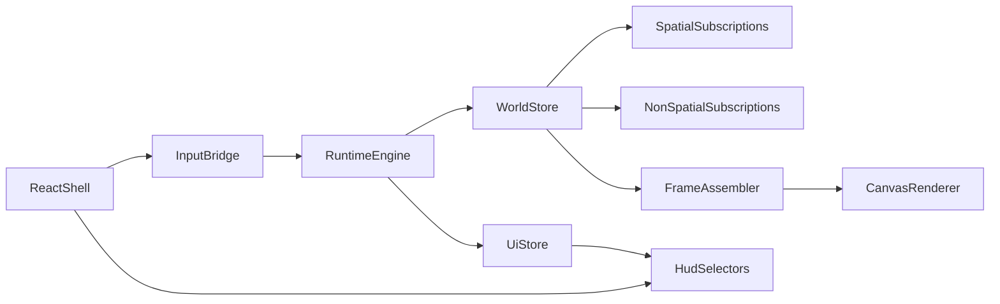

# Full Runtime Migration Plan

## Target Architecture

React becomes a shell for auth, routing, HUD, menus, and DOM event capture. The engine becomes the owner of gameplay/runtime state, frame stepping, subscriptions, prediction, interpolation, filtering, and canvas rendering.




## Phase 1: Establish a Real Engine Store Boundary

Create an engine-owned store layer that becomes the single client authority for DB-backed runtime data and derived frame state.

Files to introduce or reshape:

- [client/src/engine/runtimeEngine.ts](client/src/engine/runtimeEngine.ts)
- [client/src/engine/types.ts](client/src/engine/types.ts)
- [client/src/engine/store/uiSnapshotStore.ts](client/src/engine/store/uiSnapshotStore.ts)
- New engine store modules under `[client/src/engine/store/**](client/src/engine/store)`

Work:

- Expand `runtimeEngine` from RAF host + mirror into the owner of world state, UI state, frame state, and intent dispatch.
- Split snapshot domains explicitly: `worldState`, `uiState`, `frameState`, `connectionState`.
- Add selector-based reads so React stops receiving giant world props from `App.tsx`.
- Keep high-frequency internal state off the public UI snapshot; expose coarse, change-based selectors only.

Exit criteria:

- No React hook is the authoritative owner of gameplay table maps.
- `runtimeEngine.dispatch()` is no longer effectively a no-op for runtime intents.

## Phase 2: Migrate Subscription Ownership Into Engine Adapters

Move all SpacetimeDB subscription setup and table mutation into engine-side adapters, preserving the current batching/throttling behavior.

Files to migrate from:

- [client/src/hooks/useSpacetimeTables.ts](client/src/hooks/useSpacetimeTables.ts)
- [client/src/hooks/useUISubscriptions.ts](client/src/hooks/useUISubscriptions.ts)
- [client/src/hooks/useWorldChunkDataMap.ts](client/src/hooks/useWorldChunkDataMap.ts)
- [client/src/engine/adapters/spacetime/nonSpatialSubscriptions.ts](client/src/engine/adapters/spacetime/nonSpatialSubscriptions.ts)
- [client/src/engine/adapters/spacetime/spatialSubscriptions.ts](client/src/engine/adapters/spacetime/spatialSubscriptions.ts)
- [client/src/engine/adapters/spacetime/uiSubscriptions.ts](client/src/engine/adapters/spacetime/uiSubscriptions.ts)

Work:

- Create engine-owned gameplay non-spatial, UI, and spatial subscription services.
- Fold `world_chunk_data` into the same engine-owned world cache instead of maintaining a separate React hook cache.
- Port the existing batching policies for players, projectiles, wild animals, trees, stones, campfires, harvestables, and dropped items into store mutators.
- Keep viewport-driven chunk loading, hysteresis, throttling, and progressive subscribe behavior, but drive it from engine state instead of React effects.
- Convert `App.tsx` and `GameScreen.tsx` to consume selectors rather than hook-returned `Map`s.

Key current seam to remove:

```ts
// today: React owns the source of truth, engine mirrors it later
runtimeEngine.updateSnapshot((current) => ({ ...current, world: { ...current.world, tables: { ... }}}))
```

Exit criteria:

- `useSpacetimeTables`, `useUISubscriptions`, and `useWorldChunkDataMap` are deleted or reduced to thin compatibility wrappers.
- `App.tsx` no longer fans out most gameplay tables as props.

## Phase 3: Move Prediction, Input, And Interaction State Machines Out Of React

Make the engine own the local player runtime: input buffer, prediction, reconciliation, interaction targeting, action repetition, and optimistic combat/projectile behavior.

Files to migrate from:

- [client/src/hooks/usePredictedMovement.ts](client/src/hooks/usePredictedMovement.ts)
- [client/src/hooks/useInputHandler.ts](client/src/hooks/useInputHandler.ts)
- [client/src/hooks/useMovementInput.ts](client/src/hooks/useMovementInput.ts)
- Relevant setup in [client/src/App.tsx](client/src/App.tsx) and [client/src/components/GameCanvas.tsx](client/src/components/GameCanvas.tsx)

Work:

- Keep browser key/mouse/touch listeners in React only as an input bridge.
- Move action synthesis and per-frame command processing into engine services.
- Move predicted movement state, dodge-roll timing, facing, collision stepping, and server send cadence into engine-owned modules.
- Move optimistic projectile sim/reconciliation out of React UI state.
- Expose only minimal selectors to React: local player HUD snapshot, interaction UI snapshot, and intent dispatch methods.

Exit criteria:

- `App.tsx` no longer assembles movement prediction or collision entities.
- `GameCanvas.tsx` no longer calls hot-path gameplay state machines defined in React hooks.

## Phase 4: Move Frame Assembly And Derived World Data Into Engine

Build one engine-owned `FrameWorldSnapshot` per frame that contains everything needed to render consistently.

Files to migrate from:

- [client/src/hooks/useEntityFiltering.ts](client/src/hooks/useEntityFiltering.ts)
- [client/src/hooks/useRemotePlayerInterpolation.ts](client/src/hooks/useRemotePlayerInterpolation.ts)
- [client/src/hooks/useDayNightCycle.ts](client/src/hooks/useDayNightCycle.ts)
- Derived logic in [client/src/components/GameCanvas.tsx](client/src/components/GameCanvas.tsx)

Work:

- Centralize remote-player interpolation so every subsystem shares the same interpolated snapshot.
- Move visible-set derivation, y-sort, swimming split logic, building cluster derivation, and other derived world data into engine frame assembly.
- Move day/night light mask inputs and generation into engine-side render preparation.
- Produce a stable frame object reused by rendering, lighting, labels, speech bubbles, and combat overlays.

Exit criteria:

- No subsystem performs its own remote-player interpolation independently.
- Expensive derived world data is computed once per frame, not independently across hooks/renderers.

## Phase 5: Shrink `GameCanvas` Into A Thin Canvas Host

Convert `GameCanvas.tsx` from runtime orchestrator into a mount point plus view bridge.

Primary file:

- [client/src/components/GameCanvas.tsx](client/src/components/GameCanvas.tsx)

Work:

- Move `renderGame()` and frame orchestration into engine/gameworld renderer modules.
- Keep `GameCanvas` responsible only for canvas refs, resize integration, DOM-layer overlays, and engine start/stop wiring.
- Move render subsystem coordination behind an engine-facing renderer API that consumes the frame snapshot.
- Preserve existing renderer utility modules under `[client/src/utils/renderers/**](client/src/utils/renderers)` initially, but call them from engine-owned render coordinators instead of React component code.

Exit criteria:

- `GameCanvas` no longer owns the main per-frame render callback body.
- UI overlays remain in React; world drawing is engine-owned.

## Phase 6: Collapse Prop Drilling And Convert Screens To Selectors

Make `App.tsx` and `GameScreen.tsx` stop acting as world-data routers.

Files to simplify:

- [client/src/App.tsx](client/src/App.tsx)
- [client/src/components/GameScreen.tsx](client/src/components/GameScreen.tsx)

Work:

- Replace giant prop lists with engine selector hooks and intent dispatch APIs.
- Keep `App.tsx` focused on auth/bootstrap/router concerns.
- Keep `GameScreen.tsx` focused on HUD composition, menus, chat, notifications, and UI-only state.
- Preserve `useSyncExternalStore`-style consumption for low-frequency UI snapshots only.

Exit criteria:

- `GameScreen` no longer receives most gameplay tables as props.
- The React tree can mount/unmount UI without re-owning runtime state.

## Phase 7: Multiplayer Hardening And Validation

After ownership migration, profile and tighten the high-load multiplayer path.

Focus areas:

- Dense combat with many `projectiles`, `wildAnimals`, and players.
- Chunk crossing and spatial subscription churn.
- Lighting cost under movement/camera/mouse changes.
- Frame consistency across renderers using the shared frame snapshot.

Validation:

- Compare pre/post frame times and GC churn in crowded scenes.
- Verify prediction/reconciliation behavior under latency.
- Confirm no regression in chunk streaming, minimap, placement, fishing, interaction labels, or lighting.
- Add targeted instrumentation around frame assembly, subscription churn, and render phases.

## Suggested Delivery Order

1. Engine store boundary
2. UI subscriptions migration
3. Gameplay subscriptions + world chunk cache migration
4. Prediction/input migration
5. Frame assembly migration
6. Canvas/render orchestration migration
7. React shell cleanup and perf validation

## Risk Controls

- Migrate in slices with compatibility adapters rather than a big-bang rewrite.
- Maintain temporary selectors that can read from old and new stores during the transition.
- Keep current batching/throttling semantics until ownership is moved; optimize only after behavior parity is reached.
- Add explicit parity checks for local player movement, combat projectiles, and chunk-driven streaming before deleting old hooks.

