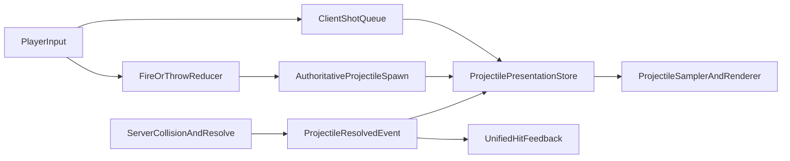

# Projectile And Combat Refactor

## Goal

Make projectile flight and combat feedback feel deterministic and seamless for the local player, while staying fully authoritative on the server for hits, misses, and drops.

## Diagnosis

The current projectile system is split across [client/src/hooks/useInputHandler.ts](client/src/hooks/useInputHandler.ts), [client/src/components/GameCanvas.tsx](client/src/components/GameCanvas.tsx), [client/src/utils/renderers/projectileRenderingUtils.ts](client/src/utils/renderers/projectileRenderingUtils.ts), [client/src/hooks/useSpacetimeTables.ts](client/src/hooks/useSpacetimeTables.ts), and [server/src/projectile.rs](server/src/projectile.rs).

Core problems:

- Local shots exist as both optimistic and authoritative projectiles, matched by fuzzy heuristics instead of a real shared shot ID.
- Projectiles are simulated in multiple places with different lifecycles, so sprites, particles, cleanup, and collision latching drift apart.
- The renderer can freeze projectiles on speculative client-only collision points.
- The server contract is mostly `projectile row appears` then `projectile row disappears`, which forces the client to infer too much.

Essential current pattern:

```506:620:client/src/hooks/useInputHandler.ts
// Lifecycle reconciliation: match optimistic→server deterministically...
if (Math.abs(serverStartMs - meta.createdAtMs) > 400) continue;
if (serverProjectile.ammoDefId !== optimisticProjectile.ammoDefId) continue;
const dx = serverProjectile.startPosX - optimisticProjectile.startPosX;
const dy = serverProjectile.startPosY - optimisticProjectile.startPosY;
if ((dx * dx + dy * dy) > (24 * 24)) continue;
```

```1183:1196:server/src/projectile.rs
fn consume_projectile_on_impact(
    ctx: &ReducerContext,
    projectile: &Projectile,
    ammo_item_def_cached: Option<&crate::items::ItemDefinition>,
    impact_x: f32,
    impact_y: f32,
    missed_projectiles_for_drops: &mut Vec<(u64, u64, f32, f32)>,
    projectiles_to_delete: &mut Vec<u64>,
) {
    if let Some(ammo_item_def) = ammo_item_def_cached {
        create_fire_patch_if_fire_arrow(ctx, ammo_item_def, impact_x, impact_y, projectile.owner_id);
    }
    missed_projectiles_for_drops.push((projectile.id, projectile.ammo_def_id, impact_x, impact_y));
    projectiles_to_delete.push(projectile.id);
}
```

## Target Architecture




## Refactor Shape

1. Add explicit shot correlation.

- Extend fire/throw reducers to accept a `client_shot_id` generated by the client.
- Persist that ID on the server projectile row or echo it through a spawn event.
- Match optimistic to authoritative by `client_shot_id`, never by time/position heuristics.
- Files: [client/src/hooks/useInputHandler.ts](client/src/hooks/useInputHandler.ts), [server/src/projectile.rs](server/src/projectile.rs), generated bindings.

1. Replace dual projectile sources with one presentation store.

- Create a client projectile presentation layer that owns states like `pendingLocal`, `authoritative`, `resolved`, `done`.
- `GameCanvas` should render only normalized presentation objects, not separately merged optimistic and authoritative maps.
- Remove duplicate suppression logic from both `useInputHandler` and `GameCanvas`.
- Files: [client/src/hooks/useInputHandler.ts](client/src/hooks/useInputHandler.ts), [client/src/components/GameCanvas.tsx](client/src/components/GameCanvas.tsx).

1. Centralize trajectory sampling.

- Move projectile motion math into one pure sampler used by sprite rendering, fire-arrow particles, debug overlays, and cleanup.
- Eliminate duplicated ballistic math in [client/src/utils/renderers/projectileRenderingUtils.ts](client/src/utils/renderers/projectileRenderingUtils.ts) and [client/src/hooks/useFireArrowParticles.ts](client/src/hooks/useFireArrowParticles.ts).
- Encode gravity mode and projectile motion parameters explicitly instead of inferring from weapon names where possible.

1. Remove speculative impact freezing.

- Stop latching projectile position permanently from client collision circles.
- Client-side collision prediction may produce a temporary anticipation effect, but only an authoritative resolve event should terminate or pin the projectile.
- Keep the debug overlay path separate from gameplay rendering.
- Files: [client/src/utils/renderers/projectileRenderingUtils.ts](client/src/utils/renderers/projectileRenderingUtils.ts), [client/src/utils/renderers/debugOverlayUtils.ts](client/src/utils/renderers/debugOverlayUtils.ts).

1. Add explicit authoritative projectile resolution events.

- Emit one server-side event with `projectile_id`, `client_shot_id`, `impact_x`, `impact_y`, `reason`, `target_kind`, `target_id`, `dropped_item_created`, and optional damage/effect info.
- Use this event to drive projectile completion, break particles, impact VFX, and item-drop handoff.
- Files: [server/src/projectile.rs](server/src/projectile.rs), [server/src/combat.rs](server/src/combat.rs), sound/effect tables if needed.

1. Fix server timing contract.

- Replace the fixed `prev_time = elapsed_time - 0.075` assumption with true last-processed-time tracking per projectile, so delayed scheduler ticks never skip collision segments.
- Normalize thrown-projectile spawn origin to the same predicted/acknowledged contract as ranged fire.
- Files: [server/src/projectile.rs](server/src/projectile.rs).

1. Unify combat hit feedback.

- Create one authoritative hit-feedback event model for resources, deployables, animals, players, and corpses.
- Local prediction should be limited to swing responsiveness and very light anticipation, while confirmed sounds/particles/shakes come from the server event.
- This removes per-target special casing and makes animals/resources/players consistent.
- Files: [client/src/hooks/useInputHandler.ts](client/src/hooks/useInputHandler.ts), [client/src/hooks/useImpactParticles.ts](client/src/hooks/useImpactParticles.ts), [server/src/combat.rs](server/src/combat.rs), [server/src/sound_events.rs](server/src/sound_events.rs).

## Implementation Order

1. Define the new network contract first: `client_shot_id` plus `projectile_resolved` event.
2. Implement server spawn/resolve support and regenerate bindings.
3. Build a client `ProjectilePresentationStore` and migrate rendering to it.
4. Move all projectile math to one shared sampler and remove old duplicate lifecycle code.
5. Switch impact cleanup, dropped-item handoff, and arrow break effects to use authoritative resolve events.
6. Unify combat feedback after projectile lifecycle is stable.

## Success Criteria

- A local shot is represented by exactly one rendered projectile for its entire life.
- No projectile can freeze mid-air without a matching authoritative resolve reason.
- Projectile impact visuals happen at the authoritative impact point.
- Remote viewers and the shooter see the same spawn and resolution behavior.
- Resource, deployable, animal, and PvP hit feedback all follow one consistent confirmation model.

## Key Files

- [client/src/hooks/useInputHandler.ts](client/src/hooks/useInputHandler.ts)
- [client/src/components/GameCanvas.tsx](client/src/components/GameCanvas.tsx)
- [client/src/utils/renderers/projectileRenderingUtils.ts](client/src/utils/renderers/projectileRenderingUtils.ts)
- [client/src/hooks/useFireArrowParticles.ts](client/src/hooks/useFireArrowParticles.ts)
- [client/src/hooks/useSpacetimeTables.ts](client/src/hooks/useSpacetimeTables.ts)
- [server/src/projectile.rs](server/src/projectile.rs)
- [server/src/combat.rs](server/src/combat.rs)
- [server/src/sound_events.rs](server/src/sound_events.rs)

