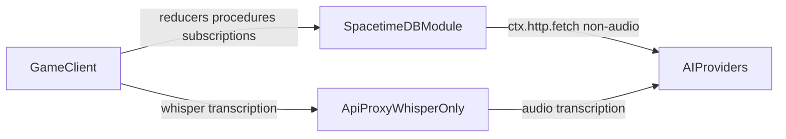

# SpacetimeDB 2.0 Migration Plan

## Outcome

- Upgrade CLI workflow, Rust crate, and TS SDK to SpacetimeDB 2.0.
- Remove broth/non-Whisper logic from `api-proxy`.
- Move non-audio AI HTTP calls into Spacetime procedures with guardrails.
- Keep Whisper in `api-proxy` until transcription parity is validated.

## Scope

- Server: `server/Cargo.toml`, `server/src/lib.rs`, new AI procedure module.
- Client: `client/src/contexts/GameConnectionContext.tsx`, AI services, subscription/callback updates.
- Proxy: `api-proxy/server.ts` reduced to Whisper path.
- Dev workflow/docs: `README.md`, deploy scripts, add `spacetime.json`.

## Steps

1. **Version upgrades + config**
  - Bump `spacetimedb` crate and TS SDK to latest 2.0-compatible versions.
  - Add `spacetime.json` and align build/publish/generate scripts.
2. **Client 2.0 API migration**
  - Replace `.withModuleName(...)` with `.withDatabaseName(...)`.
  - Migrate reducer callback assumptions to 2.0 patterns (event tables or per-call handling).
  - Prefer typed query subscriptions in active gameplay paths.
3. **Server AI procedures (non-Whisper)**
  - Add procedures for OpenAI/Grok/Gemini chat + brew generation (and icon if retained).
  - Enforce auth, model allowlist, payload limits, timeouts, and DB-backed quotas.
4. **Proxy reduction**
  - Remove broth and non-Whisper routes from `api-proxy/server.ts`.
  - Keep `/api/whisper/transcribe` with existing auth/rate limit.
5. **Client cutover**
  - Point chat/brew client services to procedures.
  - Keep Whisper on proxy temporarily.
6. **Validation + final removal**
  - Run build/publish/generate and regression checks.
  - After Whisper parity testing, migrate Whisper and decommission `api-proxy`.

## Interim Architecture

