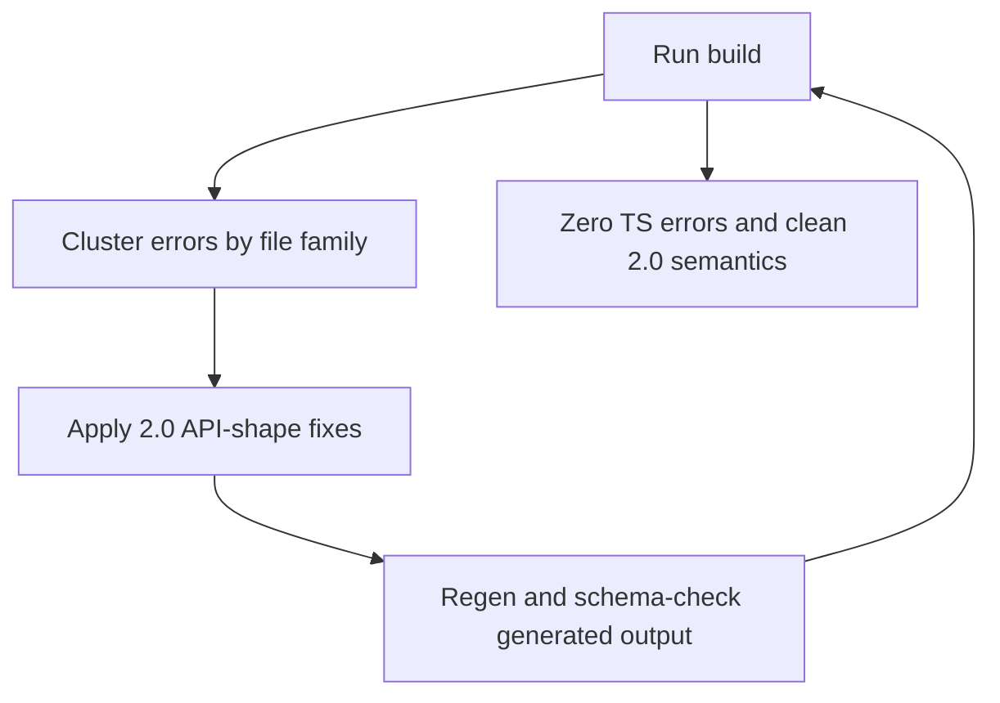

# SpacetimeDB 2.0 Client Migration Plan

## Goal

Complete a full client migration to native SpacetimeDB 2.0 semantics so `npm run build` passes without compatibility edits inside generated files.

## Scope and Constraints

- Do not edit generated files under [client/src/generated](c:\WebProjects\vibe-coding-starter-pack-2d-multiplayer-survival\client\src\generated) except regeneration outputs.
- Convert app code to 2.0 patterns:
  - reducer calls use one object argument
  - reducer result handling uses Promise flows (no `onX/removeOnX` callback APIs)
  - `connection.db` table access uses generated snake_case names
- Keep behavior parity (same UX/error messages/audio cues), only API-shape changes.

## Execution Waves

### Wave 1: Core interaction and inventory paths (highest error volume)

- Update reducer argument shapes and db table names in:
  - [client/src/components/Hotbar.tsx](c:\WebProjects\vibe-coding-starter-pack-2d-multiplayer-survival\client\src\components\Hotbar.tsx)
  - [client/src/components/InventoryUI.tsx](c:\WebProjects\vibe-coding-starter-pack-2d-multiplayer-survival\client\src\components\InventoryUI.tsx)
  - [client/src/hooks/useInputHandler.ts](c:\WebProjects\vibe-coding-starter-pack-2d-multiplayer-survival\client\src\hooks\useInputHandler.ts)
  - [client/src/hooks/useDragDropManager.ts](c:\WebProjects\vibe-coding-starter-pack-2d-multiplayer-survival\client\src\hooks\useDragDropManager.ts)
  - [client/src/components/ItemInteractionPanel.tsx](c:\WebProjects\vibe-coding-starter-pack-2d-multiplayer-survival\client\src\components\ItemInteractionPanel.tsx)
- Remove remaining callback-style reducer listeners and map them to local Promise error handling where needed.

### Wave 2: Systems/UI feature groups

- Convert remaining reducer/table usages in:
  - [client/src/components/InterfaceContainer.tsx](c:\WebProjects\vibe-coding-starter-pack-2d-multiplayer-survival\client\src\components\InterfaceContainer.tsx)
  - [client/src/components/Chat.tsx](c:\WebProjects\vibe-coding-starter-pack-2d-multiplayer-survival\client\src\components\Chat.tsx)
  - [client/src/components/PlayerUI.tsx](c:\WebProjects\vibe-coding-starter-pack-2d-multiplayer-survival\client\src\components\PlayerUI.tsx)
  - [client/src/hooks/useBuildingManager.ts](c:\WebProjects\vibe-coding-starter-pack-2d-multiplayer-survival\client\src\hooks\useBuildingManager.ts)
  - [client/src/effects/cutGrassEffect.ts](c:\WebProjects\vibe-coding-starter-pack-2d-multiplayer-survival\client\src\effects\cutGrassEffect.ts)
  - [client/src/hooks/useArrowBreakEffects.ts](c:\WebProjects\vibe-coding-starter-pack-2d-multiplayer-survival\client\src\hooks\useArrowBreakEffects.ts)
- Fix all camelCase table properties to snake_case (`inventory_item`, `foundation_cell`, etc.).

### Wave 3: Crafting/matronage/ALK and remaining reducer signatures

- Migrate object-arg reducer calls in:
  - [client/src/components/CraftingUI.tsx](c:\WebProjects\vibe-coding-starter-pack-2d-multiplayer-survival\client\src\components\CraftingUI.tsx)
  - [client/src/components/CraftingScreen.tsx](c:\WebProjects\vibe-coding-starter-pack-2d-multiplayer-survival\client\src\components\CraftingScreen.tsx)
  - [client/src/components/ActiveCraftingQueueUI.tsx](c:\WebProjects\vibe-coding-starter-pack-2d-multiplayer-survival\client\src\components\ActiveCraftingQueueUI.tsx)
  - [client/src/components/AlkPanel.tsx](c:\WebProjects\vibe-coding-starter-pack-2d-multiplayer-survival\client\src\components\AlkPanel.tsx)
  - [client/src/components/AlkDeliveryPanel.tsx](c:\WebProjects\vibe-coding-starter-pack-2d-multiplayer-survival\client\src\components\AlkDeliveryPanel.tsx)
  - [client/src/components/MatronagePanel.tsx](c:\WebProjects\vibe-coding-starter-pack-2d-multiplayer-survival\client\src\components\MatronagePanel.tsx)
  - [client/src/contexts/PlayerActionsContext.tsx](c:\WebProjects\vibe-coding-starter-pack-2d-multiplayer-survival\client\src\contexts\PlayerActionsContext.tsx)

### Wave 4: Type import and generated-shape cleanup

- Replace stale direct imports of removed generated type files in:
  - [client/src/components/TamedAnimalTooltip.tsx](c:\WebProjects\vibe-coding-starter-pack-2d-multiplayer-survival\client\src\components\TamedAnimalTooltip.tsx)
- Ensure all type imports come from [client/src/generated](c:\WebProjects\vibe-coding-starter-pack-2d-multiplayer-survival\client\src\generated) (or `types.ts` where required) without editing generated code.
- Resolve `unknown` iteration typing introduced by 2.0 table iterators with local type-safe casting/helpers.

### Wave 5: Generated-code integrity check and blocker resolution

- Re-run generation from current server schema and verify generated TS compiles.
- Investigate and fix the generated-file compile blocker:
  - [client/src/generated/plant_config_definition_table.ts](c:\WebProjects\vibe-coding-starter-pack-2d-multiplayer-survival\client\src\generated\plant_config_definition_table.ts)
- If this is schema-driven, patch server table/type definition source and regenerate.

## Validation Loop

After each wave:

1. `npm run build`
2. Read and triage next error cluster by file group
3. Apply minimal targeted fixes
4. Repeat until clean build

Final checks:

- `npm run build` passes
- no callback-era reducer usages remain
- no camelCase `connection.db.*` table usage remains
- no local edits required in generated files for correctness

## Migration Flow

