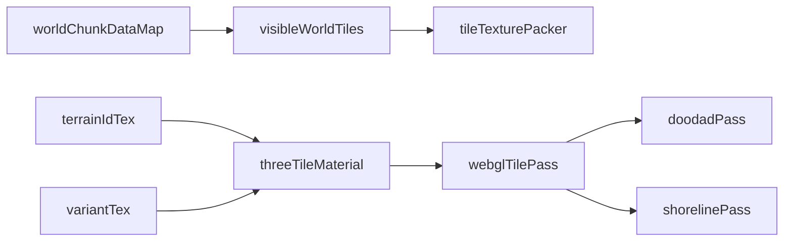

# Three.js/WebGL Tile Layer Rewrite Plan

## Goal

Ship a full client-side tile rendering rewrite using Three.js + shader blending, while preserving the existing backend chunk data format and gameplay systems.

## Current Integration Points To Preserve

- World tile data derivation in [client/src/components/GameCanvas.tsx](client/src/components/GameCanvas.tsx) (`visibleWorldTiles` map creation from chunk data).
- Tile renderer orchestration in [client/src/utils/renderers/worldRenderingUtils.ts](client/src/utils/renderers/worldRenderingUtils.ts).
- Renderer lifecycle/cache hook in [client/src/hooks/useWorldTileCache.ts](client/src/hooks/useWorldTileCache.ts).
- Existing terrain semantics and priority rules from [client/src/utils/dualGridAutotile.ts](client/src/utils/dualGridAutotile.ts) (logic retained, sprite atlas assumptions removed).

## Architecture (Target)

## Execution Strategy

- Hard-replace tile rendering: remove the current Canvas autotile path and route tile-layer rendering directly to Three.js/WebGL.
- Build a dedicated Three.js tile pass that consumes the same `visibleWorldTiles` input but uploads compact GPU textures (terrain IDs, variants, optional metadata) per visible region.
- Replace atlas-indexed transition drawing with shader-based neighborhood blending:
  - fragment shader samples center + 4/8 neighbors from terrain ID texture,
  - applies terrain priority blending (existing semantics),
  - computes smooth edge weights procedurally (no transition sprite atlas).
- Replace beach/sea shoreline atlas masking with shader edge detection + animated noise/phase offsets (preserving current wave-motion feel).
- Keep higher-level systems unchanged initially (camera, entity rendering, interaction logic), then reconnect doodads to render over/with the new tile pass.

## Concrete File Changes

- **Create** `client/src/utils/renderers/webgl/ThreeTileRenderer.ts` (renderer lifecycle, scene/camera/mesh, texture uploads).
- **Create** `client/src/utils/renderers/webgl/shaders/tileBlend.frag.glsl` and `.vert.glsl` (terrain blend + procedural base detail).
- **Create** `client/src/utils/renderers/webgl/shaders/shoreline.frag.glsl` (beach/sea and hot spring shoreline animation).
- **Refactor** [client/src/utils/renderers/worldRenderingUtils.ts](client/src/utils/renderers/worldRenderingUtils.ts) to call the new Three.js renderer as the only tile-layer path.
- **Refactor** [client/src/hooks/useWorldTileCache.ts](client/src/hooks/useWorldTileCache.ts) to own only the Three.js tile renderer lifecycle and cache uploads.
- **Refactor** [client/src/components/GameCanvas.tsx](client/src/components/GameCanvas.tsx) only at integration seams (pass viewport/camera/tile map to new renderer; keep data extraction intact).
- **Reduce scope of** [client/src/utils/dualGridAutotile.ts](client/src/utils/dualGridAutotile.ts) to terrain metadata/priority utilities; deprecate atlas lookup usage.
- **Refactor/replace** [client/src/utils/renderers/shorelineOverlayUtils.ts](client/src/utils/renderers/shorelineOverlayUtils.ts) and adapt [client/src/utils/renderers/tileDoodadRenderer.ts](client/src/utils/renderers/tileDoodadRenderer.ts) for new pass ordering.

## Validation Gates

- Visual parity gate: key biome boundaries (Beach/Sea, Grass/Dirt, Tundra/Forest, Asphalt/terrain) render correctly at all camera positions.
- Stability gate: no gameplay regression in chunk streaming, camera movement, snorkeling mode, and doodad visibility rules.
- Performance gate: frame time at least equal to current implementation at typical viewport density, with GPU upload throttling and tile texture reuse.
- Cutover gate: remove old Canvas transition rendering code paths once parity/perf checks pass.

