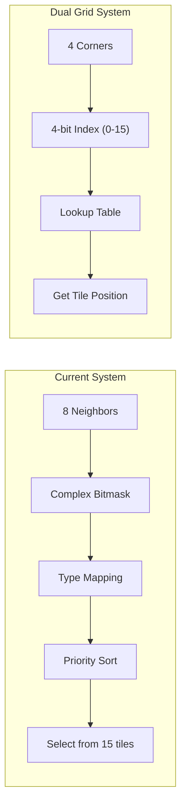

# Dual Grid Autotile System Migration

## Current State

The existing autotile system in [client/src/utils/autotileUtils.ts](client/src/utils/autotileUtils.ts) has grown to 1700 lines with:

- 80+ lines of `mapTileTypeForAutotile()` special cases
- 70+ lines of neighbor skip conditions in `getNeighborMask()`
- 370+ lines of priority sorting in `shouldUseAutotiling()`
- 40+ `AUTOTILE_CONFIGS` entries for transition pairs

## Architecture Change



## Key Insight: Reuse Existing Tilesets

The existing 4x5 tilesets (512x640px) contain all required visual elements. The Dual Grid 16-tile indices map directly to existing tile positions:

| Dual Grid Index | Corners (TL TR BL BR) | Maps To |

|-----------------|----------------------|---------|

| 0 | 0 0 0 0 | A5 (row 1, col 2) - Interior |

| 1 | 0 0 0 1 | B1 (row 3, col 1) - Concave BR |

| 2 | 0 0 1 0 | B2 (row 3, col 2) - Concave BL |

| 3 | 0 0 1 1 | A8 (row 2, col 2) - Bottom edge |

| 4 | 0 1 0 0 | B3 (row 4, col 1) - Concave TR |

| 5 | 0 1 0 1 | A6 (row 1, col 3) - Right edge |

| 6 | 0 1 1 0 | C1 (row 3, col 3) - Diagonal |

| 7 | 0 1 1 1 | A1 (row 0, col 1) - Convex TL |

| 8 | 1 0 0 0 | B4 (row 4, col 2) - Concave TL |

| 9 | 1 0 0 1 | C2 (row 4, col 3) - Diagonal |

| 10 | 1 0 1 0 | A4 (row 1, col 1) - Left edge |

| 11 | 1 0 1 1 | A3 (row 0, col 3) - Convex TR |

| 12 | 1 1 0 0 | A2 (row 0, col 2) - Top edge |

| 13 | 1 1 0 1 | A7 (row 2, col 1) - Convex BL |

| 14 | 1 1 1 0 | A9 (row 2, col 3) - Convex BR |

| 15 | 1 1 1 1 | INT (row 0, col 0) - Secondary interior |

## Files to Modify

### 1. Create New Autotile Module

**File:** [client/src/utils/dualGridAutotile.ts](client/src/utils/dualGridAutotile.ts) (NEW)

Core implementation (~150 lines total):

```typescript
// Lookup table: Dual Grid index → existing 4x5 tileset position
const DUAL_GRID_LOOKUP: Array<{row: number, col: number}> = [
    { row: 1, col: 2 },  // 0 - Interior
    { row: 3, col: 1 },  // 1 - Concave BR
    { row: 3, col: 2 },  // 2 - Concave BL
    { row: 2, col: 2 },  // 3 - Bottom edge
    { row: 4, col: 1 },  // 4 - Concave TR
    { row: 1, col: 3 },  // 5 - Right edge
    { row: 3, col: 3 },  // 6 - Diagonal TR+BL
    { row: 0, col: 1 },  // 7 - Convex TL
    { row: 4, col: 2 },  // 8 - Concave TL
    { row: 4, col: 3 },  // 9 - Diagonal TL+BR
    { row: 1, col: 1 },  // 10 - Left edge
    { row: 0, col: 3 },  // 11 - Convex TR
    { row: 0, col: 2 },  // 12 - Top edge
    { row: 2, col: 1 },  // 13 - Convex BL
    { row: 2, col: 3 },  // 14 - Convex BR
    { row: 0, col: 0 },  // 15 - Secondary interior
];

// Terrain priority for determining which terrain "wins" at junctions
const TERRAIN_PRIORITY: Record<string, number> = {
    'Sea': 0, 'HotSpringWater': 1, 'Beach': 2,
    'DirtRoad': 3, 'Asphalt': 4, 'Dirt': 5, 'Quarry': 6,
    'Grass': 7, 'Forest': 8, 'TundraGrass': 9, 'Tundra': 10, 'Alpine': 11
};

// Simple tileset config: terrain → tileset path
const TERRAIN_TILESETS: Record<string, string> = {
    'Grass': grassBeachAutotile,  // Reuse existing
    'Beach': beachSeaAutotile,
    // ... etc
};
```

### 2. Update Renderer

**File:** [client/src/utils/renderers/proceduralWorldRenderer.ts](client/src/utils/renderers/proceduralWorldRenderer.ts)

Key changes:

- Render loop iterates with half-tile offset for Dual Grid
- Each rendered position checks 4 corner tiles instead of 8 neighbors
- Call new `getDualGridTileInfo()` instead of `shouldUseAutotiling()`

The rendering offset change (lines 150-158):

```typescript
// OLD: Render at exact tile positions
for (let y = startTileY; y < endTileY; y++) {
    for (let x = startTileX; x < endTileX; x++) {
        this.renderTileAt(ctx, x, y, tileSize);
    }
}

// NEW: Render at half-tile offset positions (Dual Grid)
for (let y = startTileY; y < endTileY; y++) {
    for (let x = startTileX; x < endTileX; x++) {
        this.renderDualGridTile(ctx, x, y, tileSize);
    }
}
```

### 3. Archive Old System

**File:** [client/src/utils/autotileUtils.ts](client/src/utils/autotileUtils.ts)

Rename to `autotileUtils.legacy.ts` as backup, then replace with thin re-export from new module for any remaining dependencies.

## What Stays Unchanged

- All 55+ tileset image files (`tileset_*.png`)
- Server-side code (world_generation.rs, lib.rs)
- Game logic (swimming, cold effects, collision)
- WorldTile data structure
- Base terrain textures (grass.png, beach.png, etc.)

## Implementation Order

1. Create `dualGridAutotile.ts` with lookup table and core functions
2. Add `renderDualGridTile()` method to renderer
3. Test with a few terrain types (Grass/Beach/Sea)
4. If working, remove old autotile calls
5. Archive old autotileUtils.ts

## Expected Results

- **Lines of code:** 1700 → ~200
- **Manual overrides needed:** Many → Zero (3-way junctions automatic)
- **Tileset files changed:** 0
- **Server changes:** 0