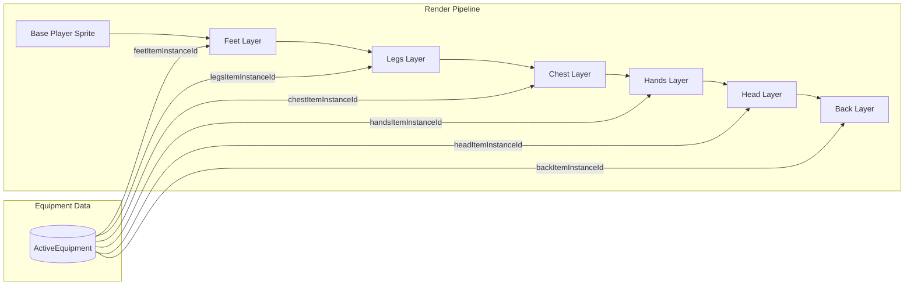

# Procedural Equipment Sprite Compositing Plan

## System Overview

Instead of pre-baking every armor combination into the base sprite, you create separate **overlay spritesheets** for each equipment piece. At render time, you draw the base character first, then layer armor sprites on top in the correct order.




---

## Art Assets to Create

### Current Sprite Specifications

- **Frame size:** 48x48 pixels
- **Display size:** 96x96 pixels (2x scale)
- **Directions:** 4 rows (Down, Right, Left, Up)

### Animation Layouts (frames x directions)


| Animation | Columns | Rows | Sheet Size | Required For |
| --------- | ------- | ---- | ---------- | ------------ |
| Walk      | 6       | 4    | 288x192    | All armor    |
| Sprint    | 8       | 4    | 384x192    | All armor    |
| Idle      | 4       | 4    | 192x192    | All armor    |
| Crouch    | 3       | 4    | 144x192    | Optional     |
| Swim      | 6       | 4    | 288x192    | Optional     |
| Dodge     | 7       | 4    | 336x192    | Optional     |


### Armor Sets to Create Overlays For

**Priority 1 - Common Armor (ship first):**

1. **Cloth Set** (6 pieces): Hood, Shirt, Pants, Gloves, Boots, Cape
2. **Leather Set** (6 pieces): Helmet, Chestplate, Leggings, Gauntlets, Boots, Cape

**Priority 2 - Mid-tier Armor:**
3. **Bone Set** (5 pieces): Helmet, Chestplate, Leggings, Gauntlets, Boots
4. **Wood Set** (5 pieces): Helmet, Chestplate, Leggings, Gauntlets, Boots

**Priority 3 - End-game and Special:**
5. **Scale Set** (5 pieces): Helmet, Chestplate, Leggings, Gauntlets, Boots
6. **Fox Fur Set** (5 pieces): Hood, Coat, Leggings, Gloves, Boots
7. **Wolf Fur Set** (5 pieces): Hood, Coat, Leggings, Gloves, Boots
8. **Special Items**: Headlamp, Reed Diver's Helm, Reed Flippers

### File Naming Convention

```
client/src/assets/equipment/
  cloth/
    cloth_hood_walk.png      (288x192)
    cloth_hood_sprint.png    (384x192)
    cloth_hood_idle.png      (192x192)
    cloth_shirt_walk.png
    cloth_shirt_sprint.png
    cloth_shirt_idle.png
    ... (repeat for each piece)
  leather/
    leather_helmet_walk.png
    ... (same pattern)
  bone/
  wood/
  scale/
  fox_fur/
  wolf_fur/
  special/
    headlamp_walk.png
    headlamp_sprint.png
    headlamp_idle.png
```

### Art Creation Guidelines

1. **Transparent backgrounds** - Only draw the armor piece itself, no body underneath
2. **Match frame positions exactly** - Each frame must align pixel-perfect with the base sprite
3. **Consistent anchor point** - All sprites anchored at center-bottom of character
4. **Direction row order:** Row 0 = Down, Row 1 = Right, Row 2 = Left, Row 3 = Up

**Example frame grid for walk animation (6x4):**

```
[D0][D1][D2][D3][D4][D5]  <- Down direction
[R0][R1][R2][R3][R4][R5]  <- Right direction
[L0][L1][L2][L3][L4][L5]  <- Left direction
[U0][U1][U2][U3][U4][U5]  <- Up direction
```

---

## Code Implementation

### 1. Equipment Asset Loader

Create a new utility to preload and cache equipment overlay images:

**File:** [client/src/utils/equipmentAssets.ts](client/src/utils/equipmentAssets.ts) (new)

```typescript
// Map: itemDefId -> { walk, sprint, idle } images
const equipmentOverlays = new Map<number, {
  walk: HTMLImageElement | null;
  sprint: HTMLImageElement | null;
  idle: HTMLImageElement | null;
}>();

export function getEquipmentOverlay(
  itemDefId: number, 
  animationType: 'walk' | 'sprint' | 'idle'
): HTMLImageElement | null;

export function preloadEquipmentAssets(itemDefinitions: Map<number, ItemDefinition>): void;
```

### 2. Modify Player Rendering

**File:** [client/src/utils/renderers/playerRenderingUtils.ts](client/src/utils/renderers/playerRenderingUtils.ts)

Add a new function after base sprite rendering:

```typescript
function renderEquipmentLayers(
  ctx: CanvasRenderingContext2D,
  player: SpacetimeDBPlayer,
  activeEquipment: ActiveEquipment | null,
  itemDefs: Map<number, ItemDefinition>,
  sx: number, sy: number,  // Current sprite frame coords
  drawX: number, drawY: number,
  drawWidth: number, drawHeight: number,
  animationType: 'walk' | 'sprint' | 'idle'
) {
  if (!activeEquipment) return;
  
  // Draw order: feet -> legs -> chest -> hands -> head -> back
  const slotOrder = [
    activeEquipment.feetItemInstanceId,
    activeEquipment.legsItemInstanceId,
    activeEquipment.chestItemInstanceId,
    activeEquipment.handsItemInstanceId,
    activeEquipment.headItemInstanceId,
    activeEquipment.backItemInstanceId,
  ];
  
  for (const instanceId of slotOrder) {
    if (!instanceId) continue;
    const itemDef = /* lookup item definition */;
    const overlay = getEquipmentOverlay(itemDef.id, animationType);
    if (overlay) {
      ctx.drawImage(
        overlay,
        sx, sy, gameConfig.spriteWidth, gameConfig.spriteHeight,
        drawX, drawY, drawWidth, drawHeight
      );
    }
  }
}
```

### 3. Pass Equipment Data to Renderer

**File:** [client/src/components/GameCanvas.tsx](client/src/components/GameCanvas.tsx)

The `activeEquipments` Map already flows through to rendering. Ensure it reaches `renderPlayer()`:

```typescript
renderPlayer(
  ctx, player, heroImg, /* ... existing params ... */,
  activeEquipments.get(player.identity.toHexString()),
  itemDefinitions
);
```

### 4. Item Definition Enhancement

**File:** [server/src/items_database/builders.rs](server/src/items_database/builders.rs)

Add an optional `overlay_sprite_id` field to `ItemDefinition` to map armor items to their sprite assets:

```rust
pub overlay_sprite_id: Option<String>, // e.g., "cloth_hood", "bone_helmet"
```

---

## Asset Count Summary

**Minimum viable (Walk + Sprint + Idle for Cloth and Leather):**

- 12 armor pieces x 3 animations = **36 spritesheets**

**Full implementation (all 7 sets + 3 special items):**

- 38 armor pieces x 3 animations = **114 spritesheets**
- Plus optional crouch/swim/dodge: up to **228 spritesheets**

**Recommended approach:** Start with Priority 1 (Cloth + Leather) for Walk/Sprint/Idle only, then expand based on player feedback.

---

## Implementation Order

1. Create folder structure and naming convention
2. Draw Cloth set overlays (easiest, lowest detail)
3. Implement `equipmentAssets.ts` loader
4. Add `renderEquipmentLayers()` to rendering pipeline
5. Test with Cloth set
6. Draw remaining armor sets in priority order
7. Add crouch/swim/dodge animations as needed

