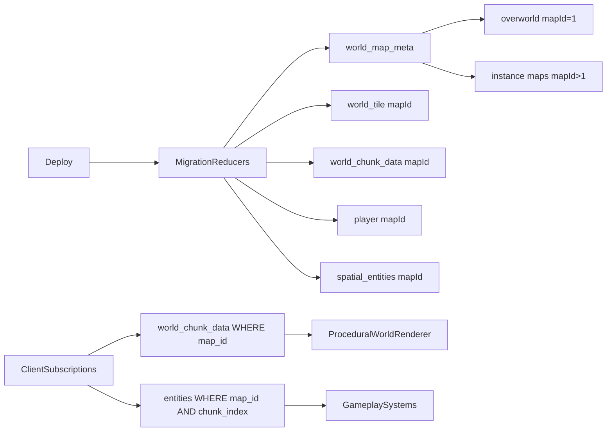

# Full World + Instance Migration Plan

## Goals

- Preserve the current overworld look/gameplay exactly (same terrain generation behavior, deep-sea ring, monuments, spawn balance, autotile visuals).
- Enable future deploys to add:
  - new overworld chunks, and
  - new map instances/areas,
  without clearing DB.
- Keep existing player/game systems working under the new map-aware data model.

## Target Architecture

## Phase 1: Schema + Data Model Cutover (single migration)

- Add map identity and bounds metadata table in [c:\WebProjects\vibe-coding-starter-pack-2d-multiplayer-survival\server\src\lib.rs](c:\WebProjects\vibe-coding-starter-pack-2d-multiplayer-survival\server\src\lib.rs):
  - `world_map_meta` (map_id, map_kind, seed, gen_version, width_tiles, height_tiles, chunk_size, max_generated_radius or generated_bounds, is_active).
- Extend world tables in [c:\WebProjects\vibe-coding-starter-pack-2d-multiplayer-survival\server\src\lib.rs](c:\WebProjects\vibe-coding-starter-pack-2d-multiplayer-survival\server\src\lib.rs):
  - `world_tile` add `map_id` and map-aware indexes.
  - `world_chunk_data` add `map_id` and map-aware indexes.
- Extend player/spatial tables to carry `map_id` (single big migration path):
  - Start in [c:\WebProjects\vibe-coding-starter-pack-2d-multiplayer-survival\server\src\lib.rs](c:\WebProjects\vibe-coding-starter-pack-2d-multiplayer-survival\server\src\lib.rs), then propagate into modules that own table structs.
- Keep default map contract:
  - Existing world becomes `map_id = 1` (overworld), preserving all current behavior.

## Phase 2: World Generation Refactor (preserve current output)

- Refactor generation entrypoints in [c:\WebProjects\vibe-coding-starter-pack-2d-multiplayer-survival\server\src\world_generation.rs](c:\WebProjects\vibe-coding-starter-pack-2d-multiplayer-survival\server\src\world_generation.rs):
  - Convert full-regenerate reducer into map-scoped APIs:
    - `generate_map_if_missing(map_id, config)` (bootstrap only)
    - `append_overworld_chunks(map_id=1, expansion_spec)` (non-destructive)
    - `create_instance_map(instance_config)` (new map rows only)
- Ensure sea/deepsea ring and all monument placement logic use map-local bounds from metadata instead of global constants where map-specific behavior is needed.
- Keep current overworld algorithm and constants for `map_id=1` to preserve visual parity.

## Phase 3: Chunk/Tile Access and Environment Systems

- Update tile lookup helpers in [c:\WebProjects\vibe-coding-starter-pack-2d-multiplayer-survival\server\src\lib.rs](c:\WebProjects\vibe-coding-starter-pack-2d-multiplayer-survival\server\src\lib.rs):
  - `get_tile_type_at_position(ctx, map_id, x, y)` map-scoped.
- Update chunk calculations and world-bound checks in [c:\WebProjects\vibe-coding-starter-pack-2d-multiplayer-survival\server\src\environment.rs](c:\WebProjects\vibe-coding-starter-pack-2d-multiplayer-survival\server\src\environment.rs):
  - Make chunk index map-aware (or key by `(map_id, chunk_index)`).
  - Replace global width/height assumptions with map metadata where required.
- Regenerate compressed chunks/minimap per map, not globally.

## Phase 4: Gameplay and Spatial Entity Migration

- Migrate all spatial gameplay systems to map-aware spawn/query/filter logic.
- For systems already keyed by `chunk_index`, add map gating in queries and reducer logic.
- Required hot paths include movement, combat collision, animals, environment spawns, projectiles, dropped items, placeables, monuments, and weather-linked systems.

## Phase 5: Client Map-Scoped Subscriptions and Rendering

- Keep renderer output unchanged while introducing map scope:
  - [c:\WebProjects\vibe-coding-starter-pack-2d-multiplayer-survival\client\src\utils\dualGridAutotile.ts](c:\WebProjects\vibe-coding-starter-pack-2d-multiplayer-survival\client\src\utils\dualGridAutotile.ts) stays algorithmically unchanged.
  - [c:\WebProjects\vibe-coding-starter-pack-2d-multiplayer-survival\client\src\utils\renderers\proceduralWorldRenderer.ts](c:\WebProjects\vibe-coding-starter-pack-2d-multiplayer-survival\client\src\utils\renderers\proceduralWorldRenderer.ts) remains map-agnostic by consuming already-scoped tile/chunk caches.
- Update subscription layer:
  - [c:\WebProjects\vibe-coding-starter-pack-2d-multiplayer-survival\client\src\hooks\useSpacetimeTables.ts](c:\WebProjects\vibe-coding-starter-pack-2d-multiplayer-survival\client\src\hooks\useSpacetimeTables.ts)
  - [c:\WebProjects\vibe-coding-starter-pack-2d-multiplayer-survival\client\src\hooks\useWorldChunkDataMap.ts](c:\WebProjects\vibe-coding-starter-pack-2d-multiplayer-survival\client\src\hooks\useWorldChunkDataMap.ts)
  - [c:\WebProjects\vibe-coding-starter-pack-2d-multiplayer-survival\client\src\components\GameCanvas.tsx](c:\WebProjects\vibe-coding-starter-pack-2d-multiplayer-survival\client\src\components\GameCanvas.tsx)
  so chunk/tile/entity subscriptions are filtered by active `map_id`.
- Replace hardcoded world size assumptions in [c:\WebProjects\vibe-coding-starter-pack-2d-multiplayer-survival\client\src\config\gameConfig.ts](c:\WebProjects\vibe-coding-starter-pack-2d-multiplayer-survival\client\src\config\gameConfig.ts) with server-driven map metadata for the active map.

## Phase 6: Migration Reducers + Deploy Workflow

- Add one-time migration reducers:
  - seed `world_map_meta` for existing world (`map_id=1`),
  - backfill `map_id=1` into all migrated rows,
  - rebuild map-aware compressed chunk rows,
  - preserve existing rows without delete/reset.
- Integrate with deploy flow:
  - `./deploy-production.ps1` publishes schema/reducers,
  - migration reducers execute idempotently on startup/init,
  - no DB clear step.

## Reducer Contracts (practical commands)

- `append_overworld_chunks(direction_or_ring, amount, gen_version)`:
  - Expands only `map_id=1` bounds and inserts missing `world_tile` + `world_chunk_data` rows for new coordinates.
  - Never deletes existing tiles/entities.
  - Re-runnable safely: skip if chunk/tile already exists.
- `refresh_minimap(map_id)`:
  - Rebuilds minimap cache for the specified map so newly added areas appear.
  - Can run immediately after chunk append.
- `create_instance_map(template_or_seed, width_tiles, height_tiles, map_kind)`:
  - Allocates a new `map_id`, writes `world_map_meta`, generates tiles/chunks for that map only.
- `transfer_player_map(player_id, target_map_id, spawn_x, spawn_y)`:
  - Atomically updates player map context and position.
  - Triggers client-side map swap through normal subscriptions.
- `ensure_map_data_integrity(map_id)`:
  - Rebuild helper for chunk compression/minimap if partial generation occurs.
  - Safe to run as an admin repair command.

## Operator Runbook (what you do in production)

1. Deploy code/schema with `./deploy-production.ps1` (no DB reset).
2. Verify migration reducers completed:
  - Existing rows are preserved.
  - Existing world is registered as `map_id=1`.
3. To expand overworld:
  - Run `append_overworld_chunks(...)`.
  - Run `refresh_minimap(map_id=1)`.
4. To add a dungeon/cave/area:
  - Run `create_instance_map(...)`.
  - Add/seed map-specific entities if needed.
  - Transfer players with `transfer_player_map(...)` when entering/exiting.
5. If anything is partially generated:
  - Run `ensure_map_data_integrity(map_id)` and re-check subscriptions.

## Runtime Behavior Guarantees

- Overworld expansion is additive: old tiles, monuments, placed objects, and player-built state remain.
- Minimap updates after `refresh_minimap`; new overworld land appears without wiping old map data.
- `map_id` acts as world context:
  - players only subscribe/render active-map chunks/entities,
  - cave/dungeon entry is a map switch, not a global map overwrite,
  - cross-map entities cannot leak if all reducers enforce `map_id` filtering.

## Acceptance Criteria

- Existing overworld (`map_id=1`) looks and plays the same (terrain, sea/deepsea, monuments, resources, autotiles).
- New deploy can add extra overworld chunks without wiping data.
- New deploy can create/select additional maps/instances.
- Client only receives chunks/entities for active map.
- No global world-size assumptions required for gameplay correctness.

## Primary Risks (managed)

- High compile churn from map_id propagation across many modules.
- Runtime bugs from missed map filters in one or more reducers.
- Chunk index collisions if map is not included in query keys.
- Client desync if map switch does not atomically swap subscriptions.

## Test Plan

- Snapshot-test overworld generation parity before/after migration (tile counts by type + monument counts/positions tolerance).
- Validate map-scoped subscriptions by switching maps and confirming no cross-map entities render.
- Validate append operation by adding new overworld chunk ring and confirming old tiles/entities remain unchanged.
- Validate deploy idempotency by running startup/migration twice with no duplicate backfills.

