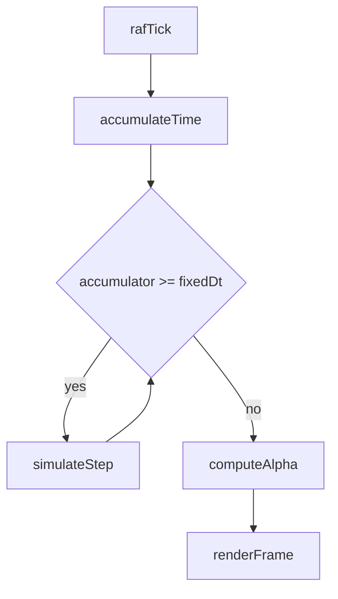

# Gold Standard Optimization Plan

## Goals

- Make gameplay behavior independent of display refresh rate while keeping visuals smooth on 60/120/144 Hz displays.
- Reduce main-thread load by preventing unnecessary render/update work above configured budgets.
- Minimize React reconciliation pressure from high-frequency table updates.
- Preserve current server-authoritative movement and existing player feel.

## Phase 1: Frame Pacing Foundation

- Implement real `targetFPS` gating in [client/src/hooks/useGameLoop.ts](client/src/hooks/useGameLoop.ts).
- Keep `requestAnimationFrame` as the driver, but add frame-interval budgeting (`1000 / targetFPS`) and accumulator-based callback dispatch.
- Add explicit `deltaTime` clamps for callback consumers and keep current severe-spike guards.
- Ensure `GameCanvas` still renders at intended cadence via [client/src/components/GameCanvas.tsx](client/src/components/GameCanvas.tsx) without behavior regression.

Essential snippet to replace conceptually in `useGameLoop`:

- Current loop always executes callback every RAF.
- New loop should execute callback only when elapsed >= target interval, with carry-over remainder.

## Phase 2: Fixed Simulation + Variable Render

- Introduce a fixed-step simulation scheduler in [client/src/components/GameCanvas.tsx](client/src/components/GameCanvas.tsx):
  - Simulation tick target: 30 Hz (`FIXED_DT = 33.333ms`) for client-side systems.
  - Render remains display-driven (RAF).
- Split frame work into:
  - `simulateFixedStep(dt)`: input processing, local prediction step advancement, transient world effects updates that should be deterministic.
  - `renderFrame(alpha)`: visual interpolation and drawing.
- Add accumulator cap and max-steps-per-frame guard to prevent spiral-of-death stalls.
- Keep `deltaTimeRef` for visual effects timing but source simulation from fixed `dt`, not raw frame delta.

## Phase 3: Prediction Path Alignment

- Refactor [client/src/hooks/usePredictedMovement.ts](client/src/hooks/usePredictedMovement.ts) to support fixed-step updates:
  - Expose a deterministic `stepPredictedMovement(fixedDt)` path.
  - Keep network send throttle (`POSITION_UPDATE_INTERVAL_MS`) independent from render cadence.
- Preserve server-ack flow and current correction philosophy, but separate:
  - simulation advancement,
  - server send schedule,
  - render-time position reads (`predictedPosition` / `getCurrentPositionNow`).
- Verify dodge roll branch continues to use collision-safe incremental motion at fixed dt.

## Phase 4: Remote Interpolation Robustness

- Tune [client/src/hooks/useRemotePlayerInterpolation.ts](client/src/hooks/useRemotePlayerInterpolation.ts) for stable render interpolation under variable display Hz:
  - Keep teleport/snap thresholds.
  - Normalize smoothing behavior to fixed simulation cadence assumptions.
- Ensure player rendering path in [client/src/utils/renderers/renderingUtils.ts](client/src/utils/renderers/renderingUtils.ts) and [client/src/utils/renderers/playerRenderingUtils.ts](client/src/utils/renderers/playerRenderingUtils.ts) continues to use:
  - local predicted position,
  - remote interpolated position.

## Phase 5: React Churn Reduction for Table Streams

- In [client/src/hooks/useSpacetimeTables.ts](client/src/hooks/useSpacetimeTables.ts), expand current batching strategy beyond players/selected resources:
  - group high-frequency update tables into microtask or short-window batched commits,
  - avoid per-event `new Map(...)` where visual urgency is low.
- Introduce priority tiers:
  - immediate (critical UI/gameplay state),
  - 20–50ms batched (position/noisy updates),
  - deferred (analytics/debug/non-critical).
- Validate callback lifecycle and cleanup paths remain leak-safe during reconnect/unmount.

## Phase 6: Measurement and Acceptance Gates

- Add a lightweight perf telemetry panel/log path (dev-only) in [client/src/hooks/useGameLoop.ts](client/src/hooks/useGameLoop.ts) and [client/src/components/GameCanvas.tsx](client/src/components/GameCanvas.tsx) to track:
  - effective update rate,
  - render FPS,
  - slow-frame ratio,
  - max frame time.
- Acceptance thresholds:
  - 60 Hz display: stable 60 render FPS in normal gameplay zones.
  - 120/144 Hz display: no gameplay-speed change; CPU cost does not scale linearly with display Hz for simulation work.
  - Movement parity: traversal speed and dodge distance remain server-consistent.
  - No increased desync/rubber-banding reports.

## Rollout Strategy

- Ship behind a runtime feature flag:
  - `fixedSimulationEnabled` default off in first pass.
  - Run side-by-side profiling in internal testing.
  - Flip default after parity validation.
- Keep a one-click fallback to current variable-step behavior during soak testing.

## Risks and Mitigations

- Risk: changed input feel at 30 Hz simulation.
  - Mitigation: retain render interpolation and tune per-action responsiveness constants.
- Risk: hidden systems currently relying on raw frame delta.
  - Mitigation: centralize timing source and audit all `deltaTime` consumers in `GameCanvas` pipeline.
- Risk: batching table updates delays UI state.
  - Mitigation: strict priority lanes for critical updates.

## Test Plan

- Functional parity checks:
  - movement speed, dodge roll distance, attack cadence, interaction timing.
- Display-rate checks:
  - 60 Hz vs 120/144 Hz behavior equivalence.
- Stress checks:
  - crowded chunks, rapid chunk boundary crossing, combat-heavy scenes.
- Regression checks:
  - reconnect, death/respawn, minimap open/close, profiler toggles.

