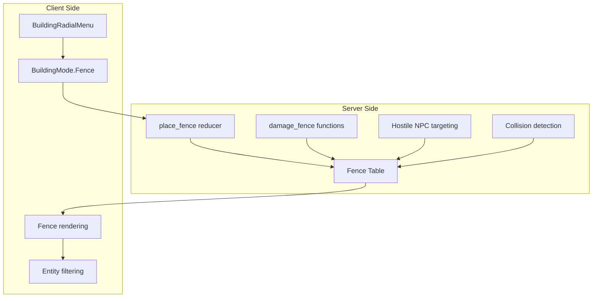

# Add Fence Building System

## Architecture Overview

Fences are a new building type distinct from walls:

- **Grid**: Snap to 48px world tile edges (not tile centers, not 96px foundation cells)
- **Placement**: One fence segment per tile, with orientation (horizontal/vertical) determined by mouse position relative to tile edge
- **Dimensions**: Shorter than walls - Horizontal fences: 48px wide × 24px tall, Vertical fences: 24px wide × 48px tall
- **Health**: Same as wooden walls (500 HP)
- **Collision**: Blocks player/NPC movement and projectiles
- **Graphics**: Reuse wood wall sprites with adjusted dimensions
- **Repair**: Repairable with repair hammer (same as walls)
- **Sound Effects**: Same as wood walls (placement, hit, destruction)
- **Health Bars**: Show health bars when damaged (using unified healthBarUtils system)



## Server Implementation

### 1. Create `server/src/fence.rs`

**Table Definition:**

```rust
#[spacetimedb::table(name = fence, public, ...)]
pub struct Fence {
    pub id: u64,           // Primary key, auto_inc
    pub owner_id: Identity,
    pub tile_x: i32,       // World tile X (48px grid)
    pub tile_y: i32,       // World tile Y (48px grid)
    pub orientation: u8,   // 0 = Horizontal (E-W), 1 = Vertical (N-S)
    pub pos_x: f32,        // World position X (tile center)
    pub pos_y: f32,        // World position Y (tile center)
    pub health: f32,       // Default 500 (WALL_WOOD_MAX_HEALTH)
    pub max_health: f32,
    pub is_destroyed: bool,
    pub chunk_index: u32,
    // ... timestamps, damage tracking
}
```

**Key Constants (reuse from building.rs):**

- `FENCE_MAX_HEALTH = 500.0` (same as `WALL_WOOD_MAX_HEALTH`)
- `FENCE_COLLISION_THICKNESS = 6.0` (same as walls)
- `FENCE_WOOD_COST = 15` (same as walls)

**Reducers:**

- `place_fence(tile_x: i64, tile_y: i64, orientation: u8)` - Place a new fence
- `damage_fence(fence_id: u64, damage: f32, timestamp: Timestamp)` - Melee damage with tier reduction
- `damage_fence_explosive(fence_id: u64, damage: f32, timestamp: Timestamp)` - Full explosive damage
- `repair_fence(fence_id: u64, repairer_id: Identity, weapon_damage: f32, timestamp: Timestamp)` - Repair fence with repair hammer

**Validation Rules:**

- Not on water tiles
- Not inside monument zones
- Not overlapping existing fences at same tile + orientation
- Within placement distance of player (128px)
- Player has wood in inventory (15 wood)
- Blueprint must be equipped

### 2. Update `server/src/lib.rs`

Add module declaration and table trait imports:

```rust
pub mod fence;
pub use fence::fence as FenceTableTrait;
```

### 3. Update `server/src/wild_animal_npc/core.rs`

Add fences to `find_nearest_attackable_structure()`:

- Priority: Doors > Shelters > Walls > **Fences**
- Use same 400px search range
- `DrownedWatch` can attack fences when player is inside building

### 4. Update Collision Systems

**`server/src/player_collision.rs`** - Block player movement through fences

**`server/src/animal_collision.rs`** - Block NPC movement through fences

**`server/src/projectile.rs`** - Block projectiles (add `check_projectile_fence_collision`)

### 5. Add Repair System

**`server/src/repair.rs`** - Add `repair_fence()` function:
- Follows same pattern as `repair_wall()`
- Uses repair hammer detection from combat system
- Costs 15 wood per repair (proportional to damage)
- Emits repair success/fail sounds

**`server/src/combat.rs`** - Integrate fence repair:
- Check for repair hammer when attacking fence
- Call `repair_fence()` instead of `damage_fence()` if repair hammer equipped
- Same pattern as wall repair integration

### 6. Add Sound Effects

**`server/src/fence.rs`** - Emit sounds in reducers:
- **Placement** (in `place_fence`): `sound_events::emit_foundation_wood_constructed_sound(ctx, pos_x, pos_y, sender_id)` (same as walls)
- **Hit/Damage** (in `damage_fence` when not destroyed): `sound_events::emit_melee_hit_sharp_sound(ctx, pos_x, pos_y, attacker_id)` (same as walls)
- **Destruction** (in `damage_fence` when health <= 0): `sound_events::emit_foundation_twig_destroyed_sound(ctx, pos_x, pos_y, attacker_id)` (same as walls)

## Client Implementation

### 7. Update `client/src/hooks/useBuildingManager.ts`

Add `BuildingMode.Fence`:

```typescript
export enum BuildingMode {
  None = 'none',
  Foundation = 'foundation',
  Wall = 'wall',
  Fence = 'fence',  // NEW
}
```

Add fence placement logic to `attemptPlacement()`:

- Convert world position to tile coordinates (48px grid)
- Determine orientation based on mouse position relative to tile edge (snap to nearest edge)
- Call `connection.reducers.placeFence(tileX, tileY, orientation)`

### 8. Update `client/src/components/BuildingRadialMenu.tsx`

Add fence option:

```typescript
{
  mode: BuildingMode.Fence,
  name: 'Fence',
  icon: faBorderAll,  // Or similar icon
  description: 'Build fences to protect crops',
  requirements: { wood: 15 },
  available: woodCount >= 15,
}
```

### 9. Create Fence Rendering

**Add to `foundationRenderingUtils.ts`** (recommended for code reuse):

- Add `renderFence()` function
- Reuse `getWallTileFilename()` for wood wall sprite
- Adjust dimensions:
  - Horizontal fence: 48px wide, 24px tall
  - Vertical fence: 24px wide, 48px tall
- Reuse wall shadow rendering logic
- Add health bar rendering using `renderEntityHealthBar()` from `healthBarUtils.ts`
- Health bar shows when fence is damaged (same visibility rules as walls)

### 10. Add Ghost Preview and Placement Validation

**Update `client/src/utils/renderers/placementRenderingUtils.ts`**:

- Add `isFencePlacementValid()` function:
  - Checks distance from player (128px max)
  - Checks for overlapping fences at same tile + orientation
  - Checks for water tiles
  - Checks for monument zones
  - Checks player has 15 wood
  - Uses caching similar to foundation/wall validation

- Add `renderFencePreview()` function:
  - Renders ghost fence preview at tile edge
  - Determines orientation based on mouse position relative to tile edge
  - **Tile Edge Snapping Logic**:
    - Convert world mouse position to tile coordinates (48px grid)
    - Calculate tile center: `tileCenterX = tileX * 48 + 24`, `tileCenterY = tileY * 48 + 24`
    - Calculate offset from center: `dx = mouseX - tileCenterX`, `dy = mouseY - tileCenterY`
    - Snap to nearest edge:
      - If `|dy| > |dx|`: Vertical fence (N-S) on North (`dy < 0`) or South (`dy > 0`) edge
      - If `|dx| > |dy|`: Horizontal fence (E-W) on East (`dx > 0`) or West (`dx < 0`) edge
    - Position fence sprite at tile edge (not tile center)
  - Shows red if invalid, green if valid
  - Uses same opacity/visual style as wall previews

- Update `renderPlacementPreview()` to handle `BuildingMode.Fence`:
  - Call `renderFencePreview()` when in fence mode
  - Pass validation result from `isFencePlacementValid()`

### 11. Update `client/src/hooks/useEntityFiltering.ts`

Add fence filtering:

```typescript
const visibleFences = useMemo(() =>
  fences ? Array.from(fences.values())
    .filter(f => isEntityInView(f, viewBounds) && !f.isDestroyed)
  : []
, [fences, viewBounds]);
```

Add to Y-sorted entities for proper depth rendering.

### 12. Update `client/src/hooks/useSpacetimeTables.ts`

Add fence subscription and state management with **chunk-based subscriptions**:

```typescript
const [fences, setFences] = useState<Map<string, Fence>>(() => new Map());

// Insert handler
const handleFenceInsert = (ctx: any, fence: Fence) => {
  setFences(prev => new Map(prev).set(fence.id.toString(), fence));
};

// Update handler (only update if relevant fields changed)
const handleFenceUpdate = (ctx: any, oldFence: Fence, newFence: Fence) => {
  const changed = oldFence.posX !== newFence.posX || 
                  oldFence.posY !== newFence.posY ||
                  oldFence.health !== newFence.health ||
                  oldFence.isDestroyed !== newFence.isDestroyed;
  if (changed) {
    setFences(prev => new Map(prev).set(newFence.id.toString(), newFence));
  }
};

// Delete handler
const handleFenceDelete = (ctx: any, fence: Fence) => {
  setFences(prev => {
    const newMap = new Map(prev);
    newMap.delete(fence.id.toString());
    return newMap;
  });
};

// Register callbacks
connection.db.fence.onInsert(handleFenceInsert);
connection.db.fence.onUpdate(handleFenceUpdate);
connection.db.fence.onDelete(handleFenceDelete);
```

**Chunk-based subscription** (in `subscribeToChunk()` function):

```typescript
// Add to resourceQueries batch:
`SELECT * FROM fence WHERE chunk_index = ${chunkIndex}`,

// Or add to individual subscriptions if not using batching:
timedSubscribe('Fence', `SELECT * FROM fence WHERE chunk_index = ${chunkIndex}`)
```

### 13. Update Data Flow

Pass fences through the component chain:

- `App.tsx` - Destructure from useSpacetimeTables, pass to GameScreen
- `GameScreen.tsx` - Pass to GameCanvas
- `GameCanvas.tsx` - Pass to rendering and filtering hooks

## Files to Create/Modify

| File | Action | Description |

|------|--------|-------------|

| `server/src/fence.rs` | Create | New fence module with table, reducers, damage, repair |

| `server/src/lib.rs` | Modify | Add module declaration |

| `server/src/wild_animal_npc/core.rs` | Modify | Add fence targeting |

| `server/src/player_collision.rs` | Modify | Add fence collision |

| `server/src/animal_collision.rs` | Modify | Add fence collision |

| `server/src/projectile.rs` | Modify | Add fence projectile collision |

| `server/src/repair.rs` | Modify | Add repair_fence function |

| `server/src/combat.rs` | Modify | Integrate fence repair with repair hammer |

| `client/src/hooks/useBuildingManager.ts` | Modify | Add Fence mode and placement logic |

| `client/src/components/BuildingRadialMenu.tsx` | Modify | Add fence option |

| `client/src/utils/renderers/foundationRenderingUtils.ts` | Modify | Add fence rendering and health bars |

| `client/src/utils/renderers/placementRenderingUtils.ts` | Modify | Add fence ghost preview and validation |

| `client/src/hooks/useEntityFiltering.ts` | Modify | Add fence filtering |

| `client/src/hooks/useSpacetimeTables.ts` | Modify | Add fence subscriptions (chunk-based) |

| `client/src/App.tsx` | Modify | Pass fence data |

| `client/src/components/GameScreen.tsx` | Modify | Pass fence data |

| `client/src/components/GameCanvas.tsx` | Modify | Render fences |

## Implementation Order

1. **Server: Create fence.rs** with table, place_fence reducer, damage functions, and sound effects
2. **Server: Add module to lib.rs** and regenerate TypeScript bindings
3. **Server: Add repair_fence** reducer and integrate with repair hammer system
4. **Client: Add fence state management** and chunk-based subscriptions in useSpacetimeTables.ts
5. **Client: Add BuildingMode.Fence** and placement logic in useBuildingManager.ts
6. **Client: Add fence ghost preview** and validation in placementRenderingUtils.ts
7. **Client: Add fence rendering** (reuse wall graphics) and health bars in foundationRenderingUtils.ts
8. **Client: Add fence option** to BuildingRadialMenu.tsx
9. **Client: Add fence filtering** and Y-sorting in useEntityFiltering.ts
10. **Client: Update data flow** through App.tsx -> GameScreen.tsx -> GameCanvas.tsx
11. **Server: Add collision detection** (player, NPC, projectile)
12. **Server: Add hostile NPC fence targeting** in wild_animal_npc/core.rs
13. **Test end-to-end**: Placement, ghost preview, collision, repair, destruction, sound effects