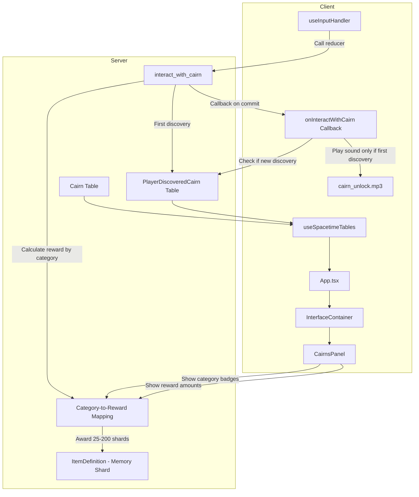

# Cairns Tab and Variable Memory Shard Rewards

## Overview

Add a fourth lore tab "CAIRNS" to the InterfaceContainer that displays all 26 cairn markers with their discovery status, category badges, and variable Memory Shard rewards. Each cairn's first interaction rewards 25-200 Memory Shards based on category rarity, providing variable dopamine rewards for exploration. Fix critical bug where `cairn_unlock.mp3` plays on every interaction instead of only first discovery.

## File Changes

### 1. Fix Sound Bug: Only Play on First Discovery

**File:** [client/src/hooks/useInputHandler.ts](client/src/hooks/useInputHandler.ts)

**Problem:** Sound plays every interaction because client checks `playerDiscoveredCairns` BEFORE reducer completes.

**Solution:** Use reducer callback `onInteractWithCairn` and listen for `PlayerDiscoveredCairn` table inserts to detect actual first discoveries.

Key changes:

- Remove sound playing from immediate interaction handler (lines 863-867)
- Register `onInteractWithCairn` reducer callback
- In callback, check if reducer status is `Committed` AND if a new `PlayerDiscoveredCairn` was inserted
- Only play `cairn_unlock.mp3` when both conditions are true
- Track which cairns we've already played sound for to prevent duplicates

### 2. Server: Add Variable Memory Shard Rewards Based on Category

**File:** [server/src/cairn.rs](server/src/cairn.rs)

Define rarity tiers and category-to-reward mapping:

```rust
// Rarity tiers for variable rewards (dopamine engagement)
pub(crate) const REWARD_COMMON: u32 = 25;      // Common categories: island, infrastructure
pub(crate) const REWARD_UNCOMMON: u32 = 50;    // Uncommon: shards, alk, survival
pub(crate) const REWARD_RARE: u32 = 100;       // Rare: aleuts, admiralty, compound
pub(crate) const REWARD_EPIC: u32 = 150;       // Epic: philosophy
pub(crate) const REWARD_LEGENDARY: u32 = 200;  // Legendary: meta (SOVA/system lore)

// Category-to-reward mapping function
fn get_cairn_reward_for_category(lore_id: &str) -> u32 {
    // Map lore_id to category, then to reward tier
    // Categories: island=25, infrastructure=25, shards=50, alk=50, survival=50,
    //             aleuts=100, admiralty=100, compound=100, philosophy=150, meta=200
}
```

Key changes:

- Import `give_item_to_player_or_drop` from `dropped_item`
- Import `item_definition` table trait
- Create category-to-reward mapping function (can match on lore_id prefix or use a lookup table)
- After successfully inserting a new discovery, calculate reward based on cairn's lore_id/category
- Find Memory Shard item definition and award variable shards
- Log the reward amount for debugging
- Return reward amount in reducer (or store in discovery table) for client display

**Category Reward Mapping:**

- `island`: 25 shards (Common - geographic info)
- `infrastructure`: 25 shards (Common - technical info)
- `shards`: 50 shards (Uncommon - important game mechanic)
- `alk`: 50 shards (Uncommon - important system)
- `survival`: 50 shards (Uncommon - gameplay tips)
- `aleuts`: 100 shards (Rare - cultural lore)
- `admiralty`: 100 shards (Rare - historical lore)
- `compound`: 100 shards (Rare - location lore)
- `philosophy`: 150 shards (Epic - deep thematic content)
- `meta`: 200 shards (Legendary - SOVA/system lore, highest value)

### 2. Client: Extend InterfaceTabs Type

**File:** [client/src/components/InterfaceTabs.tsx](client/src/components/InterfaceTabs.tsx)

- Add `'cairns'` to the view type union: `'minimap' | 'encyclopedia' | 'memory-grid' | 'alk' | 'cairns'`
- Add new tab button with styling similar to existing tabs
- Tab label: "CAIRNS"

### 3. Client: Update InterfaceContainer

**File:** [client/src/components/InterfaceContainer.tsx](client/src/components/InterfaceContainer.tsx)

- Update `currentView` type to include `'cairns'`
- Update `handleViewChange` to accept `'cairns'`
- Add new props for cairns data (cairns map, playerDiscoveredCairns map)
- Add `case 'cairns':` in `renderContent()` to render CairnsPanel

### 4. Client: Create CairnsPanel Component

**New file:** `client/src/components/CairnsPanel.tsx`

Display all 26 cairns from `CAIRN_LORE_TIDBITS` in a scrollable list:

- Show cairn index/number and title
- Show category as colored badge (with category name)
- Show reward amount badge (e.g., "25", "50", "100", "150", "200") with rarity color coding
- Discovered cairns: Full color with checkmark icon
- Undiscovered cairns: Grayed out with lock icon
- Count display: "12/26 DISCOVERED"
- Total shards earned display: "1,250 SHARDS EARNED"
- Styling consistent with existing panels (dark background, cyan accents)
- Category badges color-coded by rarity tier

Component structure:

```typescript
interface CairnsPanelProps {
  cairns: Map<string, Cairn>;  // All cairns in world
  playerDiscoveredCairns: Map<string, PlayerDiscoveredCairn>;
  currentPlayerIdentity: Identity | null;
}

// Helper function to get reward for category
function getRewardForCategory(category: CairnLoreCategory): number {
  // Match server-side mapping
  switch(category) {
    case 'island': case 'infrastructure': return 25;
    case 'shards': case 'alk': case 'survival': return 50;
    case 'aleuts': case 'admiralty': case 'compound': return 100;
    case 'philosophy': return 150;
    case 'meta': return 200;
  }
}
```

**Visual Design:**

- Rarity color coding: Common (gray), Uncommon (green), Rare (blue), Epic (purple), Legendary (gold)
- Reward badges: Small badge next to category showing shard amount
- Category badges: Colored by rarity tier
- Sort by: Index (default) or by discovery status (discovered first)

### 5. Wire Up Data Flow

**Files:**

- [client/src/App.tsx](client/src/App.tsx) - Pass cairns and playerDiscoveredCairns to InterfaceContainer
- [client/src/components/GameScreen.tsx](client/src/components/GameScreen.tsx) - Pass props through

### 6. Sound Bug Fix Details

**Current Bug:** Sound plays every interaction because client checks discovery state BEFORE reducer completes.

**Fix Implementation:**

1. Remove sound playing from immediate handler (lines 863-867)
2. Register `onInteractWithCairn` reducer callback in `useInputHandler`
3. In callback, check:

   - Reducer status is `Committed`
   - A new `PlayerDiscoveredCairn` insert event occurred for this cairn
   - We haven't already played sound for this discovery

4. Only then play `cairn_unlock.mp3`
5. Track played sounds in a Set to prevent duplicates

**Alternative Approach:** Listen to `PlayerDiscoveredCairn.onInsert` events and play sound there, but only if it's from our own interaction (check `ctx.event`).

## Data Flow Diagram



## Balance Notes

**Variable Reward System:**

- Common (island, infrastructure): 25 shards × 3 cairns = 75 shards
- Uncommon (shards, alk, survival): 50 shards × 5 cairns = 250 shards
- Rare (aleuts, admiralty, compound): 100 shards × 6 cairns = 600 shards
- Epic (philosophy): 150 shards × 1 cairn = 150 shards
- Legendary (meta): 200 shards × 2 cairns = 400 shards
- **Total: ~1,475 shards** from all 26 cairns

**Progression Impact:**

- Tier 1 Memory Grid nodes cost 60-100 shards each
- This rewards exploration with ~15-25 Tier 1 unlocks (massive boost!)
- Variable rewards create dopamine spikes (finding a meta cairn = 200 shards!)
- Casual players have reliable shard source through exploration
- Higher-value cairns incentivize thorough exploration

**Rarity Distribution:**

- Most cairns (8) are Common/Uncommon (25-50 shards) - reliable baseline
- Rare cairns (6) provide significant boosts (100 shards)
- Epic/Legendary (3) provide huge dopamine hits (150-200 shards)
- Creates variable reward schedule that keeps players engaged