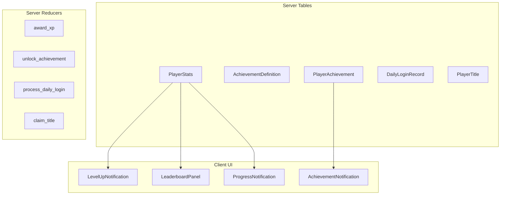

# Engagement Systems Implementation Plan

## Architecture Overview



---

## Phase 1: Core Data Layer (Server)

### 1.1 Create `server/src/player_progression.rs`

New module containing all progression tables:

```rust
// PlayerStats - XP, level, and aggregate tracking
#[spacetimedb::table(name = player_stats, public)]
pub struct PlayerStats {
    #[primary_key]
    pub player_id: Identity,
    pub total_xp: u64,
    pub level: u32,
    pub xp_to_next_level: u64,
    
    // Aggregate stats for achievements/leaderboards
    pub fish_caught: u32,
    pub animals_killed: u32,
    pub cairns_discovered: u32,
    pub contracts_completed: u32,
    pub items_crafted: u32,
    pub trees_chopped: u32,
    pub stones_mined: u32,
    pub deaths: u32,
    pub play_time_seconds: u64,
    pub longest_survival_seconds: u64,
    pub total_shards_earned: u64,
    
    pub last_login_day: u32,        // For daily rewards
    pub login_streak_days: u32,     // For streaks
    pub active_title_id: Option<String>,
    pub updated_at: Timestamp,
}

// AchievementDefinition - seeded at init
#[spacetimedb::table(name = achievement_definition, public)]
pub struct AchievementDefinition {
    #[primary_key]
    pub id: String,  // e.g., "first_cairn", "fish_100"
    pub name: String,
    pub description: String,
    pub icon: String,
    pub xp_reward: u64,
    pub title_reward: Option<String>,
    pub category: AchievementCategory,
}

// PlayerAchievement - unlocked achievements per player
#[spacetimedb::table(name = player_achievement, public)]
pub struct PlayerAchievement {
    #[primary_key]
    #[auto_inc]
    pub id: u64,
    #[index(btree)]
    pub player_id: Identity,
    pub achievement_id: String,
    pub unlocked_at: Timestamp,
}

// DailyLoginReward - reward tier definitions
#[spacetimedb::table(name = daily_login_reward, public)]
pub struct DailyLoginReward {
    #[primary_key]
    pub day: u32,  // 1-7, then loops
    pub shard_reward: u64,
    pub bonus_xp: u64,
}
```


### 1.2 XP Formula and Level Calculation

```rust
// XP required per level: 100 * level^1.5
pub fn xp_for_level(level: u32) -> u64 {
    (100.0 * (level as f64).powf(1.5)) as u64
}

// XP sources (tuned for engagement)
pub const XP_FISH_CAUGHT: u64 = 10;
pub const XP_CAIRN_DISCOVERED: u64 = 50;
pub const XP_CONTRACT_COMPLETED: u64 = 25;
pub const XP_ITEM_CRAFTED: u64 = 5;
pub const XP_TREE_CHOPPED: u64 = 2;
pub const XP_STONE_MINED: u64 = 2;
pub const XP_ANIMAL_KILLED: u64 = 15;
pub const XP_SURVIVAL_MINUTE: u64 = 1;
```

---

## Phase 2: Achievement System

### 2.1 Achievement Definitions (seeded in init)

| ID | Name | Trigger | XP | Title Reward ||----|------|---------|-----|--------------|| `first_cairn` | "Curious Explorer" | Discover 1 cairn | 50 | - || `cairn_hunter` | "Lore Keeper" | Discover 10 cairns | 200 | "[Lore Keeper]" || `fish_10` | "Novice Angler" | Catch 10 fish | 50 | - || `fish_100` | "Master Angler" | Catch 100 fish | 300 | "[Master Angler]" || `survivor_1h` | "Survivor" | Survive 1 hour | 100 | - || `survivor_24h` | "Veteran" | Survive 24 hours | 500 | "[Veteran]" || `contracts_10` | "Contractor" | Complete 10 contracts | 150 | - || `contracts_50` | "ALK Elite" | Complete 50 contracts | 400 | "[ALK Elite]" || `first_death` | "Learning Experience" | Die for the first time | 10 | - || `level_10` | "Rising Star" | Reach level 10 | 200 | - || `level_25` | "Established" | Reach level 25 | 500 | "[Established]" |

### 2.2 Achievement Unlock Notification Table

```rust
// Sent to client for toast notifications
#[spacetimedb::table(name = achievement_unlock_notification, public)]
pub struct AchievementUnlockNotification {
    #[primary_key]
    #[auto_inc]
    pub id: u64,
    pub player_id: Identity,
    pub achievement_id: String,
    pub achievement_name: String,
    pub xp_awarded: u64,
    pub title_awarded: Option<String>,
    pub unlocked_at: Timestamp,
}
```

---

## Phase 3: Daily Login and Streaks

### 3.1 Daily Reward Tiers

| Day | Shards | Bonus XP ||-----|--------|----------|| 1 | 10 | 25 || 2 | 15 | 50 || 3 | 25 | 75 || 4 | 35 | 100 || 5 | 50 | 150 || 6 | 75 | 200 || 7 | 150 | 500 |After day 7, the cycle repeats but at 1.5x rewards.

### 3.2 Integration Point

Modify [`identity_connected`](server/src/lib.rs) (around line 896) to:

1. Check if player's `last_login_day` is different from current world day
2. If new day: increment streak (or reset if gap > 1 day)
3. Award daily reward shards and XP
4. Insert `DailyLoginNotification` for client toast

---

## Phase 4: Leaderboards

### 4.1 Leaderboard Categories

Computed from `PlayerStats` table with indexed queries:

1. **Shards Earned (Weekly)** - `total_shards_earned` with time filter
2. **Longest Survival** - `longest_survival_seconds`
3. **Contracts Completed** - `contracts_completed`
4. **Fish Caught** - `fish_caught`
5. **Cairns Discovered** - `cairns_discovered`

### 4.2 Leaderboard Reducer

```rust
#[spacetimedb::reducer]
pub fn get_leaderboard(ctx: &ReducerContext, category: String, limit: u32) -> Result<(), String>
```

Client subscribes to `leaderboard_entry` table filtered by category.---

## Phase 5: Titles/Badges

### 5.1 Title Display in Chat

Modify [`send_message`](server/src/chat.rs) to prepend active title:

```rust
// In send_message reducer
if let Some(stats) = ctx.db.player_stats().player_id().find(&sender_id) {
    if let Some(title) = &stats.active_title_id {
        formatted_name = format!("[{}] {}", title, player.username);
    }
}
```


### 5.2 Title Selection Reducer

```rust
#[spacetimedb::reducer]
pub fn set_active_title(ctx: &ReducerContext, title_id: Option<String>) -> Result<(), String>
```

---

## Phase 6: Progress Notifications

### 6.1 Server-side Progress Check

Add to `award_xp` function:

```rust
// Check thresholds and send progress notifications
if stats.total_xp >= threshold_80_percent {
    insert_progress_notification(ctx, player_id, "80% to next level!", ProgressType::Level);
}
```


### 6.2 Progress Notification Table

```rust
#[spacetimedb::table(name = progress_notification, public)]
pub struct ProgressNotification {
    #[primary_key]
    #[auto_inc]
    pub id: u64,
    pub player_id: Identity,
    pub message: String,
    pub progress_type: ProgressType,
    pub current_value: u64,
    pub target_value: u64,
    pub created_at: Timestamp,
}
```

---

## Phase 7: Comparative Stats

### 7.1 Percentile Calculation

Add to player death handling in [`chat.rs`](server/src/chat.rs) `/kill` command and [`respawn.rs`](server/src/respawn.rs):

```rust
// On death, calculate percentile
let all_survival_times: Vec<u64> = ctx.db.player_stats()
    .iter()
    .map(|s| s.longest_survival_seconds)
    .collect();
let percentile = calculate_percentile(player_survival, &all_survival_times);
// Insert comparative stat notification
```

---

## Phase 8: Client UI Components

### 8.1 New Components

| Component | Purpose | Location ||-----------|---------|----------|| `AchievementNotification.tsx` | Toast for unlocks | `client/src/components/` || `LevelUpNotification.tsx` | Level up celebration | `client/src/components/` || `LeaderboardPanel.tsx` | Leaderboard display | `client/src/components/` || `DailyRewardPopup.tsx` | Login reward display | `client/src/components/` || `ProgressBar.tsx` | XP bar in PlayerUI | `client/src/components/` |

### 8.2 Modify Existing Components

- [`PlayerUI.tsx`](client/src/components/PlayerUI.tsx): Add XP bar and level display
- [`Chat.tsx`](client/src/components/Chat.tsx): Display titles in chat messages
- [`InterfaceContainer.tsx`](client/src/components/InterfaceContainer.tsx): Add Leaderboard tab

---

## Integration Points (Key Files to Modify)

| File | Changes ||------|---------|| [`server/src/lib.rs`](server/src/lib.rs) | Add module, modify `identity_connected` for daily login || [`server/src/fishing.rs`](server/src/fishing.rs) | Call `award_xp` on fish catch || [`server/src/cairn.rs`](server/src/cairn.rs) | Call `award_xp` and `check_achievements` on discovery || [`server/src/crafting_queue.rs`](server/src/crafting_queue.rs) | Call `award_xp` on craft complete || [`server/src/alk.rs`](server/src/alk.rs) | Call `award_xp` on contract delivery || [`server/src/chat.rs`](server/src/chat.rs) | Prepend title to sender name || [`client/src/hooks/useSpacetimeTables.ts`](client/src/hooks/useSpacetimeTables.ts) | Subscribe to new tables |---

## Implementation Order

1. **PlayerStats table + XP system** - Foundation for everything
2. **Achievement system** - High dopamine impact
3. **Level up notifications** - Clear progress feedback
4. **Daily login rewards** - Daily engagement hook
5. **Streaks** - Retention mechanism
6. **Titles in chat** - Social validation
7. **Leaderboards** - Competitive element
8. **Progress notifications** - Anticipation builder
9. **Comparative stats** - Post-death engagement

---

## Estimated Scope

- **New server file**: ~800-1000 lines
- **Server modifications**: ~200 lines across 6 files