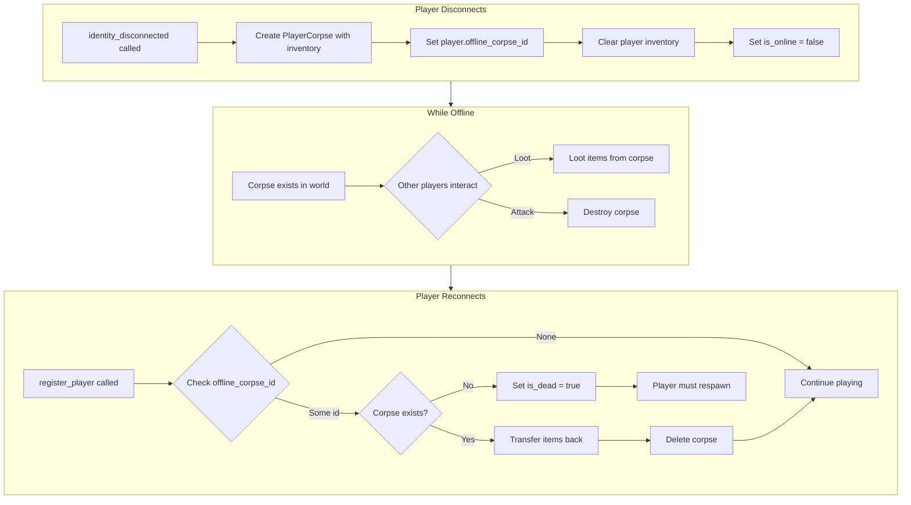

# Offline Player Corpse System

## Overview

When a player disconnects, their body becomes a `PlayerCorpse` that other players can loot or destroy. On reconnect:

- If corpse exists: transfer remaining items back, continue playing
- If corpse was destroyed: player is dead and must respawn



## Implementation Details

### 1. Add Field to Player Struct

In [server/src/lib.rs](server/src/lib.rs), add to `Player` struct (around line 607):

```rust
pub offline_corpse_id: Option<u32>, // Links to corpse created when player went offline
```

### 2. Create Offline Corpse Function

In [server/src/player_corpse.rs](server/src/player_corpse.rs), add new function `create_offline_corpse`:

- Similar to `create_player_corpse` but:
  - Does NOT schedule a despawn timer (offline corpses persist until destroyed or player returns)
  - Sets a distinguishing field if needed for UI (e.g., username shows "Sleeping" status)
  - Returns the corpse ID so it can be stored on the player

### 3. Modify Disconnect Handler

In [server/src/lib.rs](server/src/lib.rs), modify `identity_disconnected` (line 894):

```rust
// After setting is_online = false:
if !player.is_dead {
    // Create offline corpse with player's items
    match player_corpse::create_offline_corpse(ctx, &player) {
        Ok(corpse_id) => {
            player.offline_corpse_id = Some(corpse_id);
            // Items are transferred inside create_offline_corpse
        }
        Err(e) => log::error!("Failed to create offline corpse: {}", e),
    }
}
players.identity().update(player);
```

### 4. Create Restore From Corpse Function

In [server/src/player_corpse.rs](server/src/player_corpse.rs), add `restore_from_offline_corpse`:

- Takes player identity and corpse ID
- Transfers all remaining items from corpse back to player inventory/hotbar/equipment
- Deletes the corpse
- Cancels any despawn schedule if one exists

### 5. Modify Reconnect Handler

In [server/src/lib.rs](server/src/lib.rs), modify `register_player` (around line 950):

```rust
// After finding existing player:
if let Some(corpse_id) = existing_player.offline_corpse_id {
    if let Some(_corpse) = ctx.db.player_corpse().id().find(corpse_id) {
        // Corpse still exists - restore items
        player_corpse::restore_from_offline_corpse(ctx, sender_id, corpse_id)?;
        existing_player.offline_corpse_id = None;
    } else {
        // Corpse was destroyed - player died while offline
        existing_player.is_dead = true;
        existing_player.death_timestamp = Some(ctx.timestamp);
        existing_player.offline_corpse_id = None;
        log::info!("Player {} was killed while offline", existing_player.username);
    }
}
```

### 6. Handle Corpse Destruction

In [server/src/combat.rs](server/src/combat.rs), when a corpse is destroyed (health reaches 0):

- The existing corpse destruction logic already drops items or deletes the corpse
- No changes needed here - if corpse is gone when player reconnects, they're dead

### 7. Initialize New Field for Existing Players

In `register_player` for NEW players, initialize:

```rust
offline_corpse_id: None,
```

In migration/init, existing players will get `None` by default (Option type).

## Files to Modify

| File | Changes |

|------|---------|

| [server/src/lib.rs](server/src/lib.rs) | Add `offline_corpse_id` field, modify disconnect/reconnect handlers |

| [server/src/player_corpse.rs](server/src/player_corpse.rs) | Add `create_offline_corpse` and `restore_from_offline_corpse` functions |

## Post-Implementation

1. Build server: `spacetime build --project-path ./server`
2. Publish (destructive): `spacetime publish -c --project-path ./server broth-bullets-local`
3. Regenerate client bindings: `spacetime generate --lang typescript --out-dir ./client/src/generated --project-path ./server`

## Edge Cases Handled

- **Player was already dead when disconnecting**: No corpse created (already have death corpse)
- **Player reconnects quickly**: Connection ID check in disconnect prevents duplicate corpse creation
- **Corpse partially looted**: Player gets back whatever items remain
- **Corpse fully looted but not destroyed**: Player reconnects with empty inventory but alive
- **Corpse destroyed**: Player reconnects dead and must respawn