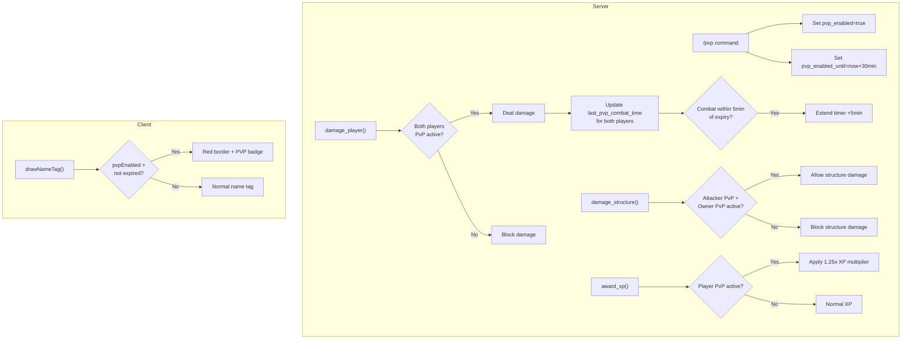

# PvP Flag System Implementation

## Architecture Overview



## Server Changes

### 1. Add PvP fields to Player struct in [server/src/lib.rs](server/src/lib.rs)

Add three new fields after `has_seen_memory_shard_tutorial`:

```rust
pub pvp_enabled: bool,                      // Whether PvP mode is currently active
pub pvp_enabled_until: Option<Timestamp>,   // When PvP will auto-disable (minimum 30min)
pub last_pvp_combat_time: Option<Timestamp>, // Last time player dealt/received PvP damage (for combat extension)
```

### 2. Initialize fields in player creation

In `client_connected` reducer in [server/src/lib.rs](server/src/lib.rs), add default values:

```rust
pvp_enabled: false,
pvp_enabled_until: None,
last_pvp_combat_time: None,
```

### 3. Add `/pvp` command handler in [server/src/chat.rs](server/src/chat.rs)

Add a new command case in the `match command.as_str()` block:

```rust
"/pvp" => {
    let player = ctx.db.player().identity().find(&sender_id)
        .ok_or("Player not found")?;
    
    // Check if already active (using helper from combat module)
    let is_active = crate::combat::is_pvp_active_for_player(&player, current_time);
    
    if is_active {
        // Calculate remaining time
        let remaining_micros = player.pvp_enabled_until.unwrap()
            .to_micros_since_unix_epoch()
            .saturating_sub(current_time.to_micros_since_unix_epoch());
        let remaining_mins = (remaining_micros / 60_000_000) + 1; // Round up
        
        // Send private feedback
        let feedback = PrivateMessage {
            id: 0,
            recipient_identity: sender_id,
            sender_display_name: "SYSTEM".to_string(),
            text: format!("PvP is already enabled. ~{} minutes remaining. Timer extends if you're in combat.", remaining_mins),
            sent: current_time,
        };
        ctx.db.private_message().insert(feedback);
    } else {
        // Enable PvP for 30 minutes
        let pvp_duration_micros = 30 * 60 * 1_000_000u64; // 30 minutes
        let until = Timestamp::from_micros_since_unix_epoch(
            current_time.to_micros_since_unix_epoch() + pvp_duration_micros
        );
        
        let mut updated_player = player.clone();
        updated_player.pvp_enabled = true;
        updated_player.pvp_enabled_until = Some(until);
        updated_player.last_pvp_combat_time = None; // Reset combat timer
        ctx.db.player().identity().update(updated_player);
        
        // Send confirmation
        let feedback = PrivateMessage {
            id: 0,
            recipient_identity: sender_id,
            sender_display_name: "SYSTEM".to_string(),
            text: "PvP ENABLED for 30 minutes! You gain +25% XP. You can attack (and be attacked by) other PvP players and raid their structures.".to_string(),
            sent: current_time,
        };
        ctx.db.private_message().insert(feedback);
    }
    return Ok(());
}
```

### 4. Add PvP helper functions in [server/src/combat.rs](server/src/combat.rs)

Add these helper functions near the top of the file (after imports):

```rust
/// Combat extension window - if player was in PvP combat within this time, timer can't expire
const PVP_COMBAT_EXTENSION_WINDOW_MICROS: u64 = 5 * 60 * 1_000_000; // 5 minutes

/// Checks if a player has active PvP status (enabled + not expired + combat extension)
pub fn is_pvp_active_for_player(player: &Player, current_time: Timestamp) -> bool {
    if !player.pvp_enabled {
        return false;
    }
    
    let Some(until) = player.pvp_enabled_until else {
        return false;
    };
    
    // Check if base timer hasn't expired
    if until > current_time {
        return true;
    }
    
    // Check combat extension: if player was in PvP combat within last 5 minutes, extend
    if let Some(last_combat) = player.last_pvp_combat_time {
        let combat_elapsed = current_time.to_micros_since_unix_epoch()
            .saturating_sub(last_combat.to_micros_since_unix_epoch());
        if combat_elapsed < PVP_COMBAT_EXTENSION_WINDOW_MICROS {
            return true; // Combat extension active
        }
    }
    
    false
}

/// Updates combat timestamp for both players and extends timer if needed
fn update_pvp_combat_time(ctx: &ReducerContext, player_id: Identity, current_time: Timestamp) {
    if let Some(mut player) = ctx.db.player().identity().find(&player_id) {
        player.last_pvp_combat_time = Some(current_time);
        
        // Auto-extend timer if within 5 minutes of expiry
        if let Some(until) = player.pvp_enabled_until {
            let time_remaining = until.to_micros_since_unix_epoch()
                .saturating_sub(current_time.to_micros_since_unix_epoch());
            if time_remaining < PVP_COMBAT_EXTENSION_WINDOW_MICROS {
                // Extend by 5 minutes from now
                let new_until = Timestamp::from_micros_since_unix_epoch(
                    current_time.to_micros_since_unix_epoch() + PVP_COMBAT_EXTENSION_WINDOW_MICROS
                );
                player.pvp_enabled_until = Some(new_until);
                log::info!("PvP timer extended for {:?} due to active combat", player_id);
            }
        }
        
        ctx.db.player().identity().update(player);
    }
}
```

### 5. Modify `damage_player()` in [server/src/combat.rs](server/src/combat.rs)

Replace the `PVP_ENABLED` constant check (~line 2084) with:

```rust
// <<< PVP CHECK - Per-player PvP flag system >>>
let attacker_pvp_active = attacker_player_opt.as_ref()
    .map(|p| is_pvp_active_for_player(p, timestamp))
    .unwrap_or(false);
let target_pvp_active = is_pvp_active_for_player(&target_player, timestamp);

// Both players must have PvP enabled for damage to occur
if attacker_player_opt.is_some() && (!attacker_pvp_active || !target_pvp_active) {
    log::debug!("PvP blocked - Attacker PvP: {}, Target PvP: {}", 
        attacker_pvp_active, target_pvp_active);
    return Ok(AttackResult { hit: false, target_type: Some(TargetType::Player), resource_granted: None });
}
// <<< END PVP CHECK >>>
```

After successful damage is applied (after updating target health), add:

```rust
// Update PvP combat timestamps for both players (extends timer if in combat near expiry)
if attacker_player_opt.is_some() {
    update_pvp_combat_time(ctx, attacker_id, timestamp);
    update_pvp_combat_time(ctx, target_id, timestamp);
}
```

### 6. Add PvP checks to structure damage functions

For each structure damage function, add an owner PvP check. Example for `damage_wooden_storage_box()`:

```rust
// After getting the wooden_box, add:
// <<< PVP RAIDING CHECK >>>
if let Some(attacker_player) = ctx.db.player().identity().find(attacker_id) {
    let attacker_pvp = is_pvp_active_for_player(&attacker_player, timestamp);
    
    // Check if owner has PvP enabled (if owner is not the attacker)
    if wooden_box.placed_by != attacker_id {
        if let Some(owner_player) = ctx.db.player().identity().find(&wooden_box.placed_by) {
            let owner_pvp = is_pvp_active_for_player(&owner_player, timestamp);
            
            if !attacker_pvp || !owner_pvp {
                log::debug!("Structure raiding blocked - Attacker PvP: {}, Owner PvP: {}", 
                    attacker_pvp, owner_pvp);
                return Ok(AttackResult { hit: false, target_type: Some(TargetType::WoodenStorageBox), resource_granted: None });
            }
        }
    }
}
// <<< END PVP RAIDING CHECK >>>
```

Apply similar checks to: `damage_campfire()`, `damage_lantern()`, `damage_stash()`, `damage_sleeping_bag()`, `damage_rain_collector()`, `damage_furnace()`, `damage_homestead_hearth()`, and wall/door damage functions.

### 7. Add XP bonus in [server/src/player_progression.rs](server/src/player_progression.rs)

Modify the `award_xp()` function to apply a 25% bonus for PvP-enabled players:

```rust
pub fn award_xp(ctx: &ReducerContext, player_id: Identity, base_xp_amount: u32) -> Result<(), String> {
    // Check for PvP XP bonus
    let mut xp_amount = base_xp_amount;
    if let Some(player) = ctx.db.player().identity().find(&player_id) {
        if crate::combat::is_pvp_active_for_player(&player, ctx.timestamp) {
            let bonus = (base_xp_amount as f32 * 0.25) as u32;
            xp_amount = base_xp_amount + bonus;
            log::info!("PvP XP bonus: {} -> {} (+{}) for player {:?}", 
                base_xp_amount, xp_amount, bonus, player_id);
        }
    }
    
    // ... rest of existing function using xp_amount instead of base_xp_amount
}
```

## Client Changes

### 8. Regenerate TypeScript bindings

After server changes, run:

```bash
spacetime generate --lang typescript --out-dir ./client/src/generated --project-path ./server
```

This will add to the Player type:
- `pvpEnabled: boolean`
- `pvpEnabledUntil: Timestamp | undefined`
- `lastPvpCombatTime: Timestamp | undefined`

### 9. Update `drawNameTag()` in [client/src/utils/renderers/playerRenderingUtils.ts](client/src/utils/renderers/playerRenderingUtils.ts)

Add PvP indicator rendering:

```typescript
// Helper to check if player has active PvP (simplified client check - server is authoritative)
const isPvpActive = (player: SpacetimeDBPlayer): boolean => {
  if (!player.pvpEnabled || !player.pvpEnabledUntil) return false;
  const now = Date.now();
  const until = player.pvpEnabledUntil.toDate().getTime();
  
  // Check base timer
  if (until > now) return true;
  
  // Check combat extension (5 minute window)
  if (player.lastPvpCombatTime) {
    const lastCombat = player.lastPvpCombatTime.toDate().getTime();
    const combatElapsed = now - lastCombat;
    if (combatElapsed < 5 * 60 * 1000) return true; // Within 5min of combat
  }
  
  return false;
};

// In drawNameTag(), after drawing the name tag background and before drawing text:
const pvpActive = isPvpActive(player);

if (pvpActive) {
  // Draw red glow/border around name tag
  ctx.save();
  ctx.shadowColor = '#ff0000';
  ctx.shadowBlur = 8;
  ctx.strokeStyle = '#ff4444';
  ctx.lineWidth = 2;
  ctx.beginPath();
  ctx.roundRect(tagX - 1, tagY - 1, tagWidth + 2, tagHeight + 2, 6);
  ctx.stroke();
  ctx.restore();
  
  // Draw "PVP" badge to the right of name tag
  const pvpText = 'PVP';
  ctx.font = '9px "Courier New", monospace';
  const pvpMetrics = ctx.measureText(pvpText);
  const pvpPadding = 4;
  const pvpWidth = pvpMetrics.width + pvpPadding * 2;
  const pvpHeight = 12;
  const pvpX = tagX + tagWidth + 3;
  const pvpY = tagY + (tagHeight - pvpHeight) / 2;
  
  // Badge background
  ctx.fillStyle = 'rgba(180, 0, 0, 0.9)';
  ctx.beginPath();
  ctx.roundRect(pvpX, pvpY, pvpWidth, pvpHeight, 3);
  ctx.fill();
  
  // Badge border
  ctx.strokeStyle = '#ff6666';
  ctx.lineWidth = 1;
  ctx.stroke();
  
  // Badge text
  ctx.fillStyle = '#ffffff';
  ctx.textAlign = 'center';
  ctx.fillText(pvpText, pvpX + pvpWidth / 2, pvpY + pvpHeight / 2 + 3);
}
```

## Key Design Decisions

1. **Both players must have PvP enabled** - A PvP-enabled player can only damage other PvP-enabled players (and their structures). This prevents griefing.

2. **Minimum 30 minutes, extends in combat** - Base duration is 30 minutes, but timer cannot expire if you dealt/received PvP damage within the last 5 minutes. Prevents unfair mid-fight cutoffs.

3. **Structure raiding enabled** - PvP players can damage structures owned by other PvP players. Creates meaningful risk/reward for enabling PvP.

4. **+25% XP bonus** - Incentivizes PvP participation. Applies to all XP sources while PvP is active.

5. **Persists through death** - The flag is on the Player record, not reset on respawn.

6. **Instant activation** - No warmup delay after typing /pvp.

7. **Visual indicator** - Red glowing border + "PVP" badge on name tags makes PvP players easily identifiable.