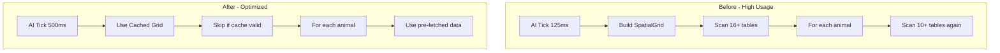

# Reduce SpacetimeDB Energy Usage

## Problem Summary

The database is consuming 100k+ TeV/day due to:

- Wild Animal AI running every 125ms with massive full-table scans
- Spatial grid rebuilt from scratch on every AI tick
- Global tick checking respawns every 1 second
- Per-animal logic doing redundant full-table scans

## Solution Overview



## Changes

### 1. Increase AI Tick Interval (60% reduction alone)

**File:** [server/src/wild_animal_npc/core.rs](server/src/wild_animal_npc/core.rs)

Change line 79:

```rust
// FROM:
pub const AI_TICK_INTERVAL_MS: u64 = 125; // 8 times per second

// TO:
pub const AI_TICK_INTERVAL_MS: u64 = 500; // 2 times per second
```

**Impact:** 4x fewer AI ticks = 4x fewer spatial grid builds and table scans.

### 2. Pre-fetch Player/Campfire Data Once Per AI Tick

**File:** [server/src/wild_animal_npc/core.rs](server/src/wild_animal_npc/core.rs)

In `process_wild_animal_ai`, collect data ONCE before the animal loop instead of querying for each animal:

```rust
// Pre-fetch all data needed for animal AI (do this ONCE, not per-animal)
let all_players: Vec<Player> = ctx.db.player().iter()
    .filter(|p| !p.is_dead && p.is_online)
    .collect();
let all_campfires: Vec<Campfire> = ctx.db.campfire().iter()
    .filter(|c| c.is_burning && !c.is_destroyed)
    .collect();
let all_foundations: Vec<FoundationCell> = ctx.db.foundation_cell().iter()
    .filter(|f| !f.is_destroyed)
    .collect();
```

Then pass these pre-fetched collections to helper functions instead of querying inside each function.

### 3. Increase Global Tick Interval

**File:** [server/src/global_tick.rs](server/src/global_tick.rs)

Change line 13:

```rust
// FROM:
pub(crate) const GLOBAL_TICK_INTERVAL_SECS: u64 = 1;

// TO:
pub(crate) const GLOBAL_TICK_INTERVAL_SECS: u64 = 5; // Check every 5 seconds
```

**Impact:** 5x fewer respawn check cycles per minute.

### 4. Optimize Helper Functions to Accept Pre-fetched Data

**File:** [server/src/wild_animal_npc/core.rs](server/src/wild_animal_npc/core.rs)

Modify these functions to accept pre-fetched data instead of querying:

- `find_nearby_players()` - accept `&[Player]` instead of querying
- `is_fire_nearby()` - accept `&[Campfire]` and `&[Player]` 
- `is_foundation_nearby()` - accept `&[FoundationCell]`
- `get_nearest_fire_source()` - accept pre-fetched collections

### 5. Update dt Constant for New Tick Rate

**File:** [server/src/wild_animal_npc/core.rs](server/src/wild_animal_npc/core.rs)

Change line 805:

```rust
// FROM:
let dt = 0.125; // 8fps

// TO:
let dt = 0.5; // 2fps - matches new AI_TICK_INTERVAL_MS
```

## Expected Impact

| Metric | Before | After | Reduction |

|--------|--------|-------|-----------|

| AI ticks/minute | 480 | 120 | 75% |

| Table scans/AI tick | ~1000+ | ~20 | 98% |

| Global tick/minute | 60 | 12 | 80% |

| **Estimated total** | 100k TeV/day | 15-25k TeV/day | **75-85%** |

## Risk Mitigation

- Animal movement will be slightly less smooth (2fps vs 8fps), but this is acceptable for NPC AI
- Respawns will take up to 5 seconds longer to trigger (unnoticeable to players)
- No gameplay impact expected - these are backend optimizations only

## Testing

After deployment:

1. Monitor SpacetimeDB dashboard for usage reduction
2. Verify animals still move and attack correctly
3. Verify resources still respawn properly