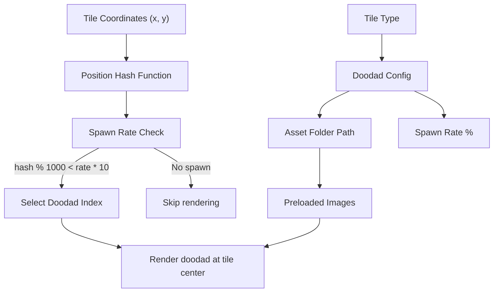

# Tile Doodad Rendering System

## Architecture Overview



## Files to Create/Modify

### 1. New File: `client/src/utils/renderers/tileDoodadRenderer.ts`

Core renderer class with:

- **Doodad configuration** mapping tile types to folders and spawn rates:
  - Grass: 10% spawn rate
  - Tundra: 6% spawn rate  
  - Beach: 6% spawn rate
  - Underwater: 12% spawn rate (only when snorkeling)
  - Alpine: 5% spawn rate
  - TundraGrass: 9% spawn rate
  - Forest: 14% spawn rate
  - DirtRoad: 6% spawn rate
  - Dirt: 8% spawn rate

- **Deterministic hash function:**
```typescript
function hashPosition(x: number, y: number, salt: number = 0): number {
    const h = ((x + salt) * 374761393 + y * 668265263) ^ (x * 1013904223);
    return Math.abs(h) >>> 0; // Ensure positive 32-bit integer
}
```

- **Image preloading** from `client/src/assets/environment/tile_object/<folder>/`
- **Render method** that iterates visible tiles and draws doodads at tile centers

### 2. Modify: `client/src/utils/renderers/proceduralWorldRenderer.ts`

- Import and instantiate `TileDoodadRenderer`
- Add **PASS 3** after base tiles and transitions: render doodads
- Pass `isSnorkeling` flag to control underwater doodad visibility
- Doodads render at tile center (not offset like transitions)

### 3. Create Asset Folders

Ensure these folders exist (some already do):

- `client/src/assets/environment/tile_object/grass/`
- `client/src/assets/environment/tile_object/forest/`
- `client/src/assets/environment/tile_object/beach/` (exists)
- `client/src/assets/environment/tile_object/dirt/`
- `client/src/assets/environment/tile_object/dirt_road/`
- `client/src/assets/environment/tile_object/tundra/`
- `client/src/assets/environment/tile_object/tundra_grass/`
- `client/src/assets/environment/tile_object/alpine/`
- `client/src/assets/environment/tile_object/underwater/` (exists)

## Key Implementation Details

### Tile Type to Folder Mapping

```typescript
const TILE_DOODAD_CONFIG: Record<string, DoodadConfig> = {
    'Grass':       { folder: 'grass',       spawnRate: 0.10 },
    'Tundra':      { folder: 'tundra',      spawnRate: 0.06 },
    'Beach':       { folder: 'beach',       spawnRate: 0.06 },
    'Sea':         { folder: 'underwater',  spawnRate: 0.12, requiresSnorkeling: true },
    'Alpine':      { folder: 'alpine',      spawnRate: 0.05 },
    'TundraGrass': { folder: 'tundra_grass', spawnRate: 0.09 },
    'Forest':      { folder: 'forest',      spawnRate: 0.14 },
    'DirtRoad':    { folder: 'dirt_road',   spawnRate: 0.06 },
    'Dirt':        { folder: 'dirt',        spawnRate: 0.08 },
};
```

### Spawn Decision Logic

```typescript
shouldSpawnDoodad(tileX: number, tileY: number, spawnRate: number): boolean {
    const hash = hashPosition(tileX, tileY, 12345); // Fixed salt for spawn decision
    return (hash % 1000) < Math.floor(spawnRate * 1000);
}

getDoodadIndex(tileX: number, tileY: number, imageCount: number): number {
    const hash = hashPosition(tileX, tileY, 67890); // Different salt for selection
    return hash % imageCount;
}
```

### Dynamic Image Loading

Images will be discovered at runtime using Vite's `import.meta.glob`. This automatically finds all images in each folder without hardcoding filenames.

### Rendering Order

1. Base tiles (existing)
2. Dual-grid transitions (existing)
3. **Tile doodads (new)** - rendered at tile center, same layer as ground

## Performance Considerations

- Hash computation is O(1) per tile - negligible cost
- Images preloaded once during initialization
- Only visible tiles processed (viewport culling already exists)
- No React re-renders - pure canvas operations