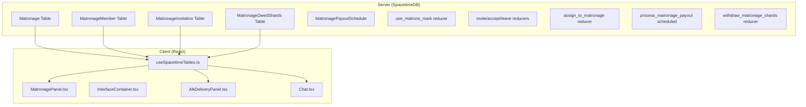

# Matronage Pooled Rewards System

## Architecture Overview



## Server Implementation

### 1. New Module: `server/src/matronage.rs`

**Tables:**

```rust
// Main Matronage entity
#[spacetimedb::table(name = matronage, public)]
pub struct Matronage {
    #[primary_key]
    #[auto_inc]
    pub id: u64,
    pub name: String,              // Unique name chosen at creation
    pub pool_balance: u64,         // Current shard pool
    pub created_at: Timestamp,
    pub created_by: Identity,      // Original founder
    pub last_payout_at: Timestamp, // When last payout occurred
}

// Membership tracking
#[spacetimedb::table(name = matronage_member, public)]
pub struct MatronageMember {
    #[primary_key]
    pub player_id: Identity,       // One matronage per player
    pub matronage_id: u64,
    pub role: MatronageRole,       // PraMatron or Member
    pub joined_at: Timestamp,
}

// Pending invitations
#[spacetimedb::table(name = matronage_invitation, public)]
pub struct MatronageInvitation {
    #[primary_key]
    #[auto_inc]
    pub id: u64,
    pub target_username: String,   // Invite by username (works offline)
    pub matronage_id: u64,
    pub invited_by: Identity,
    pub invited_at: Timestamp,
}

// Owed shard balances (persists after leaving/dissolution)
#[spacetimedb::table(name = matronage_owed_shards, public)]
pub struct MatronageOwedShards {
    #[primary_key]
    pub player_id: Identity,
    pub owed_balance: u64,
}

// Scheduled payout (interval-based)
#[spacetimedb::table(name = matronage_payout_schedule, scheduled(process_matronage_payout))]
pub struct MatronagePayoutSchedule {
    #[primary_key]
    #[auto_inc]
    pub id: u64,
    pub scheduled_at: ScheduleAt,
}
```

**Reducers:**

| Reducer | Purpose |

|---------|---------|

| `use_matrons_mark(matronage_name)` | Consume item, create Matronage at central compound |

| `invite_to_matronage(target_username)` | Pra Matron sends invite |

| `accept_matronage_invitation(invitation_id)` | Player accepts pending invite |

| `decline_matronage_invitation(invitation_id)` | Player declines invite |

| `leave_matronage()` | Member leaves voluntarily |

| `remove_from_matronage(target_player_id)` | Pra Matron removes member |

| `promote_to_pra_matron(target_player_id)` | Transfer leadership |

| `rename_matronage(new_name)` | Pra Matron renames |

| `dissolve_matronage()` | Final payout and removal |

| `withdraw_matronage_shards()` | Collect owed balance at central compound |

| `process_matronage_payout(schedule_args)` | Scheduled: distribute pool evenly |

### 2. New Item: Matron's Mark

**Asset:** `matrons_mark.png` already exists in `client/src/assets/items/` folder.

Add to [server/src/items_database/materials.rs](server/src/items_database/materials.rs):

```rust
// Matron's Mark - Founding token for creating a Matronage
ItemBuilder::new("Matron's Mark", "A ceremonial token used to found a Matronage at the ALK Central Compound.", ItemCategory::Material)
    .icon("matrons_mark.png")
    .stackable(10)
    .crafting_cost(vec![
        CostIngredient { item_name: "Metal Fragments".to_string(), quantity: 100 },
    ])
    .crafting_output(1, 1)
    .build(),
```

Update [client/src/utils/itemIconUtils.ts](client/src/utils/itemIconUtils.ts):

- Add import: `import matronsMarkIcon from '../assets/items/matrons_mark.png';`
- Add to iconMap: `'matrons_mark.png': matronsMarkIcon,`

### 3. Modify ALK Delivery System

In [server/src/alk.rs](server/src/alk.rs), add new reducer:

```rust
#[spacetimedb::reducer]
pub fn deliver_alk_contract_to_matronage(
    ctx: &ReducerContext,
    player_contract_id: u64,
    station_id: u32,
) -> Result<(), String>
```

This mirrors `deliver_alk_contract` but deposits shards into the player's matronage pool instead of giving them directly.

### 4. Payout Timing

- Schedule interval: 60 real minutes (1 in-game day)
- At payout: `pool_balance / member_count` to each member's `owed_balance`
- Fractional remainders stay in pool

## Client Implementation

### 1. Data Subscriptions

Update [client/src/hooks/useSpacetimeTables.ts](client/src/hooks/useSpacetimeTables.ts):

```typescript
// Add state for new tables
const [matronages, setMatronages] = useState<Map<string, Matronage>>(() => new Map());
const [matronageMembers, setMatronageMembers] = useState<Map<string, MatronageMember>>(() => new Map());
const [matronageInvitations, setMatronageInvitations] = useState<Map<string, MatronageInvitation>>(() => new Map());
const [matronageOwedShards, setMatronageOwedShards] = useState<Map<string, MatronageOwedShards>>(() => new Map());
```

### 2. New Component: MatronagePanel.tsx

Create `client/src/components/MatronagePanel.tsx`:

**Sections:**

- **Header**: Matronage name, Pra Matron indicator
- **Pool Info**: Current pool size, time until next payout
- **Your Balance**: Owed shards with withdraw button
- **Member List**: All members (no contribution tracking)
- **Pending Invitations**: Accept/decline UI
- **Management** (Pra Matron only): Invite, remove, rename, promote, dissolve

### 3. New Component: MatronageInvitationNotification.tsx

Create `client/src/components/MatronageInvitationNotification.tsx`:

**Features:**

- Persistent notification badge in bottom corner (above chat area, positioned above Chat component)
- Shows count of pending invitations (e.g., "2 Matronage Invitations")
- Clicking notification opens InterfaceContainer and switches to Matronage tab
- X button on notification to dismiss/decline all visible invitations (calls `decline_matronage_invitation` reducer for each)
- Auto-dismisses when all invitations are accepted/declined
- Styled to match game's cyberpunk aesthetic (cyan/blue glow, dark background)
- Shows matronage name(s) if space allows, otherwise just count

**Integration:**

- Render in `GameScreen.tsx` (near chat area, above Chat component)
- Positioned above chat component, bottom-left or bottom-right corner
- Only visible when player has pending invitations (filtered by `target_username` matching player's username)
- Pass callback to open InterfaceContainer with matronage tab active

### 4. Modify InterfaceContainer

Update [client/src/components/InterfaceContainer.tsx](client/src/components/InterfaceContainer.tsx):

- Add `'matronage'` to view type union
- Add MatronagePanel rendering case
- Pass matronage data props
- When opened via notification click, auto-switch to matronage tab

### 5. Modify InterfaceTabs

Update [client/src/components/InterfaceTabs.tsx](client/src/components/InterfaceTabs.tsx):

- Add Matronage tab button with appropriate icon

### 6. Modify AlkDeliveryPanel

Update [client/src/components/AlkDeliveryPanel.tsx](client/src/components/AlkDeliveryPanel.tsx):

- Add "Assign to Matronage" button next to "DELIVER" button
- Only show if player is in a matronage
- Call `deliver_alk_contract_to_matronage` reducer

### 6. Modify Chat Display

Update [client/src/components/ChatMessageHistory.tsx](client/src/components/ChatMessageHistory.tsx):

- Look up sender's matronage membership
- Prepend `[MatronageName]` before username in chat messages

### 8. Modify Minimap Player Visibility

Update [client/src/components/Minimap.tsx](client/src/components/Minimap.tsx):

**Changes:**

- **Remove global player visibility** - Players can no longer see all remote players on minimap by default
- **Add matronage member color constant** - `MATRONAGE_MEMBER_COLOR = '#00AAFF'` (bright blue for same-matronage players)
- **Vicinity filtering** - Only show remote players within a certain distance (e.g., 2000-3000 pixels) of local player
- **Matronage requirement** - Only show remote players if local player is in a matronage
- **Color coding:**
  - Green (`LOCAL_PLAYER_DOT_COLOR`) - Local player (always visible)
  - Blue (`MATRONAGE_MEMBER_COLOR`) - Remote players in same matronage (visible if in vicinity)
  - Red (`REMOTE_PLAYER_DOT_COLOR`) - Remote players in different matronage or no matronage (visible if in vicinity)
- **Logic:**
  - Check if local player has `MatronageMember` record
  - If not in matronage: Don't render any remote players
  - If in matronage: Filter players by distance, then check their matronage membership to determine color
  - Look up each remote player's `MatronageMember` record to compare `matronage_id`

**Props needed:**

- Pass `matronageMembers: Map<string, MatronageMember>` to Minimap component
- Pass `localPlayerIdentity: Identity` to check membership

### 9. Player Hover/Inspection

The player info display needs to show matronage affiliation. This will require identifying where player tooltips are rendered (likely in the canvas rendering or a tooltip component).

## File Changes Summary

| File | Change Type |

|------|-------------|

| `server/src/matronage.rs` | NEW - Core matronage logic |

| `server/src/lib.rs` | MODIFY - Add module, re-exports |

| `server/src/items_database/materials.rs` | MODIFY - Add Matron's Mark |

| `client/src/utils/itemIconUtils.ts` | MODIFY - Add matrons_mark.png icon import and mapping |

| `client/src/assets/items/matrons_mark.png` | EXISTS - Asset already created |

| `server/src/alk.rs` | MODIFY - Add pool delivery reducer |

| `client/src/components/MatronagePanel.tsx` | NEW - Main UI |

| `client/src/components/MatronagePanel.css` | NEW - Styling |

| `client/src/components/MatronageInvitationNotification.tsx` | NEW - Persistent notification component |

| `client/src/components/MatronageInvitationNotification.css` | NEW - Notification styling |

| `client/src/hooks/useSpacetimeTables.ts` | MODIFY - Subscribe to tables |

| `client/src/components/InterfaceContainer.tsx` | MODIFY - Add tab |

| `client/src/components/InterfaceTabs.tsx` | MODIFY - Add tab button |

| `client/src/components/AlkDeliveryPanel.tsx` | MODIFY - Add pool option |

| `client/src/components/ChatMessageHistory.tsx` | MODIFY - Show affiliation |

| `client/src/components/Minimap.tsx` | MODIFY - Restrict player visibility to matronage benefit, add vicinity filtering and color coding |

| `client/src/App.tsx` | MODIFY - Pass data props |

| `client/src/components/GameScreen.tsx` | MODIFY - Pass data props, render invitation notification |

| `client/src/generated/*` | AUTO - Regenerate bindings |

## Key Design Decisions

1. **One matronage per player** - Enforced by primary key on `MatronageMember.player_id`
2. **Invite by username** - Works for offline players; invitation persists until accepted/declined
3. **Owed balance persists** - Players keep earned shards even after leaving/dissolution
4. **Central compound only** - Matronage creation and shard withdrawal require being at central ALK compound
5. **No contribution tracking** - Equal splits regardless of who contributed
6. **Explicit pool assignment** - Normal delivery always available; pool assignment is opt-in per delivery
7. **Invitation notifications** - Persistent notification badge above chat area shows pending invites; click to open Matronage tab; X button to dismiss/decline
8. **Minimap player visibility** - Matronage benefit: Only matronage members can see remote players on minimap, restricted to vicinity (2000-3000px range). Color coding: Green (local), Blue (same matronage), Red (different/no matronage)