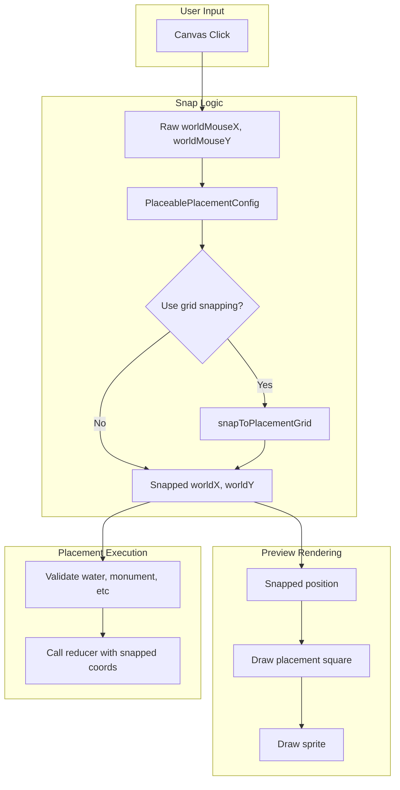

# Placeable Foundation Grid Placement - Implementation Plan

## Overview

Placeables (camp fire, furnace, etc.) will snap to a 48x48 quarter-cell grid that aligns with the 96x96 foundation grid. Each placeable has a defined footprint (1x1, 1x2, 2x1, 2x2, or 4x4 quarters). A placement square is rendered beneath the preview to show the occupied cells.

## Grid Reference

- **Quarter cell**: 48x48 px (1/4 of a foundation)
- **Foundation cell**: 96x96 px (4 quarters)
- **Snap points**: Quarter-cell centers at `(qX*48+24, qY*48+24)`
- **4x4 items** (Shelter): Use foundation grid, center at `(fX*96+96, fY*96+96)`

## Architecture




## Files to Create

### 1. [client/src/config/placeablePlacementConfig.ts](client/src/config/placeablePlacementConfig.ts) (NEW)

Central config for all placeable grid sizes and snap behavior.

**Exports:**

- `PLACEABLE_QUARTER_SIZE = 48` constant
- `PlacementGridSize` type: `{ widthQuarters: number; heightQuarters: number }`
- `PlaceablePlacementConfig` interface: `{ gridSize: PlacementGridSize; snapToGrid: boolean }`
- `PLACEABLE_PLACEMENT_CONFIG: Record<string, PlaceablePlacementConfig>` map keyed by `itemName` or `iconAssetName`

**Config entries (from our discussion):**


| Item                                            | Grid Size | Notes                                                   |
| ----------------------------------------------- | --------- | ------------------------------------------------------- |
| Camp Fire                                       | 1x1       |                                                         |
| Furnace, Large Furnace                          | 2x2       |                                                         |
| Stash                                           | 1x1       |                                                         |
| Lantern                                         | 1x1       |                                                         |
| Ancestral Ward, Signal Disruptor, Memory Beacon | 2x2       |                                                         |
| Tallow Steam Turret                             | 2x2       |                                                         |
| Barbecue                                        | 2x2       |                                                         |
| Wooden Storage Box                              | 1x1       |                                                         |
| Large Wooden Storage Box                        | 2x2       |                                                         |
| Refrigerator (Pantry)                           | 1x2       | Tall, narrow                                            |
| Compost, Repair Bench, Cooking Station          | 2x2       |                                                         |
| Scarecrow                                       | 1x2       | Tall, narrow                                            |
| Wooden Beehive, Reed Rain Collector             | 2x2       |                                                         |
| Sleeping Bag                                    | 2x1       | Wide, short                                             |
| Matron's Chest                                  | 2x2       | (Keeps foundation requirement - no change to its logic) |
| Shelter                                         | 4x4       | Uses foundation grid, not quarter grid                  |
| Explosives                                      | 1x1       |                                                         |


**Items excluded (snapToGrid: false):**

- Seeds (plantSeed) - use 48px tile grid, different semantics
- Broth Pot (Cerametal Field Cauldron) - snaps to heat source
- Doors - snap to foundation edges
- Fish Trap - free placement; shore/water requirements are finnicky

**Helper functions:**

- `getPlacementConfig(placementInfo: PlacementItemInfo): PlaceablePlacementConfig | null`
- `snapToPlacementGrid(worldX: number, worldY: number, config: PlaceablePlacementConfig): { x: number; y: number }` - returns center position for placement
- `shouldUseGridSnapping(placementInfo: PlacementItemInfo): boolean`

**Snap logic:**

- For 1x1, 1x2, 2x1, 2x2: `quarterCellX = floor(worldX/48)`, `quarterCellY = floor(worldY/48)`; center = anchor + half-dimensions
- For 4x4: use `foundationCellToWorldCenter(floor(worldX/96), floor(worldY/96))` for the anchor foundation, then center = foundation center + 96 (middle of 2x2 foundations)

---

## Files to Modify

### 2. [client/src/config/gameConfig.ts](client/src/config/gameConfig.ts)

Add quarter-cell utility (optional - could live in placeablePlacementConfig):

```typescript
export const PLACEABLE_QUARTER_SIZE = 48; // Quarter of foundation (96/2)

export function worldPixelsToQuarterCell(worldX: number, worldY: number): { qX: number; qY: number } {
  return {
    qX: Math.floor(worldX / PLACEABLE_QUARTER_SIZE),
    qY: Math.floor(worldY / PLACEABLE_QUARTER_SIZE),
  };
}

export function quarterCellToWorldCenter(qX: number, qY: number): { x: number; y: number } {
  return {
    x: qX * PLACEABLE_QUARTER_SIZE + PLACEABLE_QUARTER_SIZE / 2,
    y: qY * PLACEABLE_QUARTER_SIZE + PLACEABLE_QUARTER_SIZE / 2,
  };
}
```

Or keep these in `placeablePlacementConfig.ts` to avoid polluting gameConfig.

### 3. [client/src/hooks/usePlacementManager.ts](client/src/hooks/usePlacementManager.ts)

**In `attemptPlacement` (around line 732):**

1. Import `getPlacementConfig`, `snapToPlacementGrid`, `shouldUseGridSnapping` from the new config
2. After distance/monument/water checks, **before** the reducer switch:
  - If `shouldUseGridSnapping(placementInfo)`:
    - `const config = getPlacementConfig(placementInfo)`
    - `const { x: snappedX, y: snappedY } = snapToPlacementGrid(worldX, worldY, config)`
    - Use `snappedX`, `snappedY` for all reducer calls and validation that follows
  - Else: use `worldX`, `worldY` as-is (seeds, broth pot, doors keep current behavior)

**Critical:** Run validation checks (isWaterPlacementBlocked, isMonumentZonePlacementBlocked) **after** snapping, using the snapped coordinates. Move the snap step to the very beginning of attemptPlacement (after the early returns for no connection, no item, etc.) so that validation uses snapped position.

**Flow change:**

```
1. Early returns (no connection, no placementInfo, item doesn't exist)
2. if (isPlacementTooFar) return
3. Compute snappedX, snappedY (snap if grid-snapping item, else pass-through)
4. isMonumentZonePlacementBlocked(connection, snappedX, snappedY)
5. isWaterPlacementBlocked(connection, placementInfo, snappedX, snappedY)
6. isSeedPlacementOnOccupiedTile(...) for seeds
7. Reducer switch: pass snappedX, snappedY for grid-snapping items
```

**Special cases in reducer switch:** Broth pot, doors, Matron's Chest, seeds - these branches use their own logic and may ignore the snapped coords (broth pot uses heat source position, doors use foundation cell, etc.). Ensure we don't overwrite those.

### 4. [client/src/utils/renderers/placementRenderingUtils.ts](client/src/utils/renderers/placementRenderingUtils.ts)

**A. Add grid snapping for standard placeables (before broth pot / door logic, ~line 2045):**

- Import `getPlacementConfig`, `snapToPlacementGrid`, `shouldUseGridSnapping`, `PLACEABLE_QUARTER_SIZE`, `FOUNDATION_TILE_SIZE`
- After `let snappedX = worldMouseX; let snappedY = worldMouseY;`
- Add branch: if `shouldUseGridSnapping(placementInfo)` and NOT (broth pot or door):
  - `const config = getPlacementConfig(placementInfo)`
  - `if (config) { const snapped = snapToPlacementGrid(worldMouseX, worldMouseY, config); snappedX = snapped.x; snappedY = snapped.y; }`

**B. Update validation to use snapped position:**

- `isOnWater` already uses `snappedX, snappedY` (line 2179) - good
- `isTileOccupiedBySeed` uses `snappedX, snappedY` - good
- `isOnFoundation` (Shelter): use `snappedX, snappedY` instead of `worldMouseX, worldMouseY` for 4x4 center calculation
- `isNotOnFoundation` (Matron's Chest): use `snappedX, snappedY`
- `isOnWall`: use `snappedX, snappedY`
- `isInMonumentZone`: use `snappedX, snappedY`

**C. Draw placement square beneath preview:**

- After determining `adjustedX`, `adjustedY` and before drawing the sprite
- If `shouldUseGridSnapping(placementInfo)` and `config`:
  - Compute placement square bounds from config (widthQuarters * 48, heightQuarters * 48)
  - Anchor: top-left of placement = snapped center minus half-width, half-height
  - Draw semi-transparent rectangle: `ctx.strokeRect(squareX, squareY, squareWidth, squareHeight)` with subtle style (e.g. `rgba(0,255,255,0.3)` for valid, `rgba(255,0,255,0.3)` for invalid - reuse existing valid/invalid logic)
  - Draw the square **before** the sprite so it appears beneath

**D. Placement square styling:**

- Reuse `isInvalidPlacement` for square color
- Stroke only (no fill) or very subtle fill to avoid obscuring terrain
- Line width ~2px

---

## Items Excluded from Grid Snapping


| Item                  | Reason                                                    |
| --------------------- | --------------------------------------------------------- |
| Seeds                 | Use 48px tile grid, one-per-tile; different snap logic    |
| Broth Pot             | Snaps to nearest campfire/fumarole                        |
| Wood Door, Metal Door | Snap to foundation edge                                   |
| Matron's Chest        | Requires foundation; keeps existing foundation-cell logic |
| Fish Trap             | Free placement; shore/water requirements are finnicky     |


---

## Server-Side Considerations

**No server changes required** for Phase 1. The server receives `worldX`, `worldY` and stores them. Server validation (water, monument, wall, distance) operates on the received coordinates. Client sends snapped coordinates, so server sees grid-aligned positions.

**Future (optional):** Server could add cell-occupancy checks for grid-snapping items to prevent two 1x1 items placing in the same quarter cell. Current distance-based checks (e.g. campfire-to-campfire) may already reject same-cell placement (distance = 0).

---

## Testing Checklist

- Camp fire snaps to 48x48 grid; placement square visible
- Furnace snaps to 96x96; 2x2 square visible
- Sleeping bag: 2x1 wide footprint
- Refrigerator: 1x2 tall footprint
- Scarecrow: 1x2 tall footprint
- Shelter: 4x4 footprint, snaps to foundation grid
- Seeds: no snapping, behavior unchanged
- Broth pot: still snaps to heat source
- Doors: still snap to foundation edges
- Fish Trap: free placement (no snapping), shore validation unchanged
- Water/monument validation uses snapped position correctly
- Placement square appears beneath sprite; valid/invalid tint correct

---

## Summary of Changes


| File                                                    | Action                                                                   |
| ------------------------------------------------------- | ------------------------------------------------------------------------ |
| `client/src/config/placeablePlacementConfig.ts`         | CREATE - config map, snap helpers                                        |
| `client/src/config/gameConfig.ts`                       | OPTIONAL - add quarter-cell utils or keep in config                      |
| `client/src/hooks/usePlacementManager.ts`               | MODIFY - snap before validation and reducers                             |
| `client/src/utils/renderers/placementRenderingUtils.ts` | MODIFY - snap preview, draw placement square, use snapped for validation |


