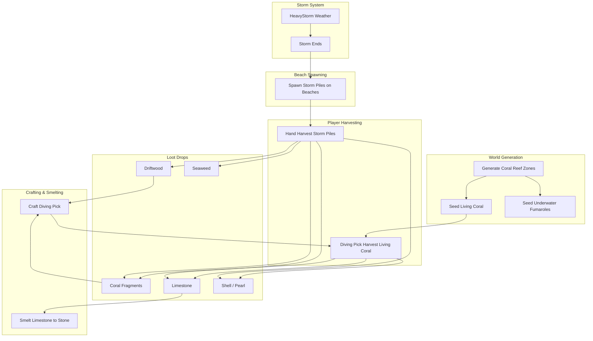

# Coral & Storm Debris System for Broth & Bullets

## Overview

This plan adds an Aleutian Islands-inspired coral reef ecosystem with:
- **Storm Piles**: Beach debris spawning after Heavy Storms (Bleached Coral + Driftwood + Seaweed)
- **Living Coral**: Offshore underwater nodes requiring Diving Pick
- **New Resources**: Coral Fragments, Limestone, Shell, Pearl, Driftwood
- **Diving Pick**: New tool for underwater harvesting
- **Underwater Fumaroles**: Heat sources in coral reef zones

---

## Phase 1: New Items & Resources

### 1.1 Add New Resource Items

Add to [`server/src/items_database/resources.rs`](server/src/items_database/resources.rs):

| Item Name | Description | Category | Max Stack |
|-----------|-------------|----------|-----------|
| Coral Fragments | Bleached coral pieces from storm-washed shores | Resource | 100 |
| Limestone | Calcium carbonate from living coral reefs | Resource | 100 |
| Shell | Rare mollusk shell from coral ecosystems | Resource | 50 |
| Pearl | Precious gem from coral reef oysters | Resource | 20 |
| Driftwood | Weathered wood washed ashore by storms | Resource | 50 |

Note: **Seaweed** already exists in consumables.rs (line 1448).

### 1.2 Add Diving Pick Tool

Add to [`server/src/items_database/tools.rs`](server/src/items_database/tools.rs):

- **Diving Pick**: Specialized underwater harvesting tool
  - Crafted from: Coral Fragments x10, Reed Fiber x5, Driftwood x3
  - Required to harvest Living Coral underwater

### 1.3 Add Recipes

- **Diving Pick recipe**: Coral Fragments x10 + Reed Fiber x5 + Driftwood x3
- **Limestone smelting**: Limestone -> Stone (1:1, existing furnace timing)

---

## Phase 2: Storm Piles System (Beach Debris)

### 2.1 Create Storm Pile Entity

Create or add to [`server/src/coral.rs`](server/src/coral.rs):

```
StormPile table:
  - id, pos_x, pos_y, chunk_index
  - respawn_at: Option<Timestamp>
  - spawned_from_storm: Timestamp (tracks which storm created it)
```

### 2.2 Storm Pile Loot Table

When interacted with (hand-harvestable), Storm Piles drop a MIX of debris:

| Drop | Chance | Amount |
|------|--------|--------|
| Driftwood | 100% | 2-4 |
| Seaweed | 80% | 1-3 |
| Coral Fragments | 60% | 1-2 |
| Limestone | 25% | 1 |
| Shell | 8% | 1 |
| Pearl | 2% | 1 |

### 2.3 Storm-End Spawning Hook

Modify [`server/src/world_state.rs`](server/src/world_state.rs):
- Add hook when weather transitions FROM `HeavyStorm` TO any other weather
- Call `spawn_storm_piles_on_beaches()` when storm ends
- Spawn 8-20 Storm Piles on south beaches (scaled by map size)
- Storm Piles have long respawn timers (45-90 minutes) or may simply despawn after collection

---

## Phase 3: Living Coral System (Underwater)

### 3.1 Create Living Coral Entity

Add to [`server/src/coral.rs`](server/src/coral.rs):

```
LivingCoral table:
  - id, pos_x, pos_y, chunk_index
  - resource_remaining: u32
  - respawn_at: Option<Timestamp>
```

### 3.2 Living Coral Loot Table (Requires Diving Pick)

| Drop | Chance | Amount |
|------|--------|--------|
| Limestone | 100% | 3-5 |
| Coral Fragments | 60% | 1-2 |
| Shell | 12% | 1 |
| Pearl | 5% | 1 |

### 3.3 Interaction Validation

- Player must have Diving Pick equipped (check active equipment)
- Player must be on water tile (is_on_water = true)
- Without Diving Pick: "You need a Diving Pick to harvest this coral."

---

## Phase 4: World Generation - Coral Reef Zones

### 4.1 Add Reef Zones to WorldFeatures

Modify [`server/src/world_generation.rs`](server/src/world_generation.rs):
- Add `coral_reef_zones: Vec<Vec<bool>>` to WorldFeatures
- Reef zones: Deep sea areas (shore_distance < -15 tiles)
- Cluster-based generation using noise (like forest areas but underwater)

### 4.2 Seed Living Coral in Environment

Modify [`server/src/environment.rs`](server/src/environment.rs):
- Add `seed_living_coral()` in `seed_environment()`
- Spawn 30-60 Living Coral nodes in reef zones (scaled by map size)
- Co-locate with underwater fumaroles for warmth during diving

---

## Phase 5: Underwater Fumaroles

### 5.1 Extend Fumarole Table

Modify [`server/src/fumarole.rs`](server/src/fumarole.rs):
- Add `is_submerged: bool` field to Fumarole struct
- Submerged fumaroles spawn in coral reef zones (alongside Living Coral)

### 5.2 Conditional Interaction Logic

- **Above water view**: Rendered blurry, non-interactable
- **Underwater (diving)**: Full clarity, normal interaction
- **Warmth**: Always applies (helps underwater exploration)

Modify interaction reducers:
```rust
// In fumarole interaction reducers
if fumarole.is_submerged && !player.is_on_water {
    return Err("You must be diving to interact with this fumarole.");
}
```

---

## Phase 6: Client-Side Rendering

### 6.1 Storm Pile Renderer

Create [`client/src/utils/renderers/stormPileRenderingUtils.ts`](client/src/utils/renderers/stormPileRenderingUtils.ts):
- Beach debris pile appearance (mix of wood, seaweed, coral fragments)
- Spawns on sand/beach tiles

### 6.2 Living Coral Renderer

Create [`client/src/utils/renderers/coralRenderingUtils.ts`](client/src/utils/renderers/coralRenderingUtils.ts):
- Colorful underwater coral formations
- Apply underwater visual tint when submerged
- Y-sorting support

### 6.3 Underwater Fumarole Effects

Modify fumarole rendering:
- `is_submerged = true`: Apply blur/shimmer when player is NOT underwater
- `is_submerged = true`: Normal rendering when player IS underwater

### 6.4 Integration Points

Update:
- [`client/src/hooks/useSpacetimeTables.ts`](client/src/hooks/useSpacetimeTables.ts): Subscribe to StormPile, LivingCoral
- [`client/src/hooks/useEntityFiltering.ts`](client/src/hooks/useEntityFiltering.ts): Add to visible entities
- [`client/src/hooks/useInteractionFinder.ts`](client/src/hooks/useInteractionFinder.ts): Interaction detection
- [`client/src/components/GameCanvas.tsx`](client/src/components/GameCanvas.tsx): Render both entity types

---

## Phase 7: Respawn System

### 7.1 Coral Respawn Logic

Add to [`server/src/environment.rs`](server/src/environment.rs):

```rust
pub fn check_coral_respawns(ctx: &ReducerContext) {
    // Living Coral: 30-60 minute respawn
    // Storm Piles: Either long respawn (45-90 min) or single-use per storm
}
```

---

## Data Flow Diagram



---

## Files to Create

1. `server/src/coral.rs` - StormPile and LivingCoral entities, interaction logic
2. `client/src/utils/renderers/stormPileRenderingUtils.ts` - Storm pile renderer
3. `client/src/utils/renderers/coralRenderingUtils.ts` - Living coral renderer

## Files to Modify

**Server:**
1. `server/src/lib.rs` - Register coral module
2. `server/src/items_database/resources.rs` - Add Coral Fragments, Limestone, Shell, Pearl, Driftwood
3. `server/src/items_database/tools.rs` - Add Diving Pick
4. `server/src/items_database/recipes.rs` - Add Diving Pick recipe
5. `server/src/furnace.rs` - Add Limestone smelting
6. `server/src/world_state.rs` - Storm-end beach spawning hook
7. `server/src/world_generation.rs` - Coral reef zone generation
8. `server/src/environment.rs` - seed_living_coral(), check_coral_respawns()
9. `server/src/fumarole.rs` - Add is_submerged field, underwater spawning

**Client:**
10. `client/src/hooks/useSpacetimeTables.ts` - Subscribe to new tables
11. `client/src/hooks/useEntityFiltering.ts` - Filter coral/storm piles
12. `client/src/hooks/useInteractionFinder.ts` - Interaction detection
13. `client/src/components/GameCanvas.tsx` - Render new entities

---

## Implementation Order

1. **Phase 1**: Add all new items (Coral Fragments, Limestone, Shell, Pearl, Driftwood, Diving Pick)
2. **Phase 2**: Storm Piles entity + interaction (test with manual spawn)
3. **Phase 3**: Living Coral entity + Diving Pick requirement
4. **Phase 6**: Client rendering for both entity types
5. **Phase 4**: World generation for reef zones
6. **Phase 2.3**: Storm-end spawning hook
7. **Phase 5**: Underwater fumaroles
8. **Phase 7**: Respawn system
