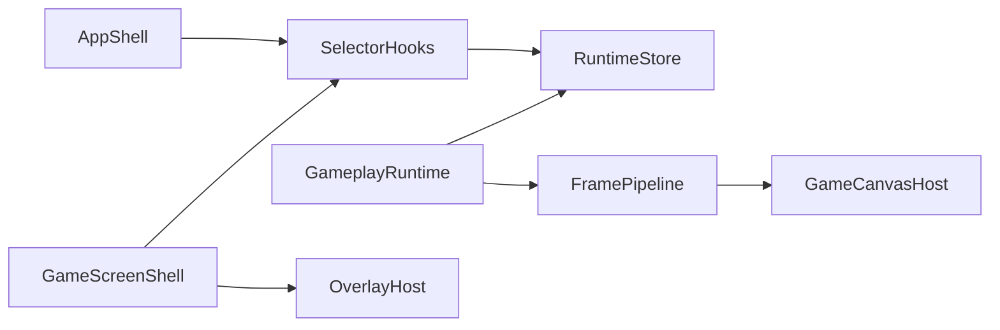

# Remaining Runtime Migration Plan

## Goal

Finish the parts of the runtime migration that are still incomplete in practice:

- Phase 2: gameplay subscription ownership
- Phase 3: input/prediction ownership
- Phase 4: frame assembly ownership
- Phase 6: prop-drilling removal

The immediate targets are [client/src/App.tsx](client/src/App.tsx), [client/src/hooks/useSpacetimeTables.ts](client/src/hooks/useSpacetimeTables.ts), [client/src/components/GameScreen.tsx](client/src/components/GameScreen.tsx), and [client/src/components/GameCanvas.tsx](client/src/components/GameCanvas.tsx).

## Current Reality

The engine-backed store exists, but React still owns too much hot-path runtime behavior.

Key remaining seams:

- [client/src/App.tsx](client/src/App.tsx) still owns `useSpacetimeTables()`, `useMovementInput()`, `usePredictedMovement()`, tap-to-walk state, collision assembly, and a massive `<GameScreen />` prop fan-out.
- [client/src/components/GameScreen.tsx](client/src/components/GameScreen.tsx) still defines a giant prop contract and re-fans runtime data into `GameCanvas`, `Chat`, `SpeechBubbleManager`, quest UI, ALK UI, and overlays.
- [client/src/hooks/useSpacetimeTables.ts](client/src/hooks/useSpacetimeTables.ts) still acts as the monolithic gameplay subscription/wiring hook even though it now writes into the engine store.
- [client/src/components/GameCanvas.tsx](client/src/components/GameCanvas.tsx) still owns frame assembly via `useEntityFiltering`, `useRemotePlayerInterpolation`, `useDayNightCycle`, interaction scanning, and the main `renderGame()` body.

Existing seams to leverage:

- [client/src/engine/react/useEngineSnapshot.ts](client/src/engine/react/useEngineSnapshot.ts)
- [client/src/engine/react/useEngineStoreState.ts](client/src/engine/react/useEngineStoreState.ts)
- [client/src/engine/react/useRuntimeBootstrap.ts](client/src/engine/react/useRuntimeBootstrap.ts)
- [client/src/engine/react/useRuntimeConnectionBridge.ts](client/src/engine/react/useRuntimeConnectionBridge.ts)
- [client/src/engine/react/useRuntimeViewport.ts](client/src/engine/react/useRuntimeViewport.ts)
- [client/src/engine/runtime/gameplaySubscriptionsRuntime.ts](client/src/engine/runtime/gameplaySubscriptionsRuntime.ts)
- [client/src/engine/runtime/uiSubscriptionsRuntime.ts](client/src/engine/runtime/uiSubscriptionsRuntime.ts)
- [client/src/engine/runtime/worldChunkDataRuntime.ts](client/src/engine/runtime/worldChunkDataRuntime.ts)
- [client/src/engine/runtime/gameplayEventEffectsRuntime.ts](client/src/engine/runtime/gameplayEventEffectsRuntime.ts)
- [client/src/engine/adapters/spacetime/gameplayConnectionSetup.ts](client/src/engine/adapters/spacetime/gameplayConnectionSetup.ts)
- [client/src/engine/adapters/spacetime/gameplayTableBindings.ts](client/src/engine/adapters/spacetime/gameplayTableBindings.ts)

## Target Shape

## Delivery Order

### 1. Shrink `App.tsx` first

Convert [client/src/App.tsx](client/src/App.tsx) into an auth/bootstrap/router shell plus only the minimum UI state that truly belongs at the app boundary.

Move out of `App.tsx` first:

- world-table fan-out from `useSpacetimeTables()`
- local player lookup and related runtime-derived reads
- online player count, movement bonus derivation, player music position, and collision entity assembly
- movement input / prediction wiring that is still treated as React-owned hot-path state

Introduce selector-focused hooks under `client/src/engine/react/**` or `client/src/engine/selectors/**` for:

- local player snapshot
- runtime readiness / registration state
- online player count
- equipment-derived movement modifiers
- collision inputs needed by movement
- coarse UI/game entry state used by `LoginScreen` and `GameScreen`

Exit criteria:

- `App.tsx` no longer destructures most gameplay tables.
- `App.tsx` no longer passes dozens of gameplay props into `GameScreen`.
- `App.tsx` is mostly auth, loading, and top-level shell composition.

### 2. Reduce `GameScreen.tsx` to a UI composition shell

Refactor [client/src/components/GameScreen.tsx](client/src/components/GameScreen.tsx) so it reads runtime slices directly instead of accepting a giant prop interface from `App.tsx`.

First migrate read-only engine-backed data already following the newer pattern:

- messages, pins, active connections
- matronage tables
- tutorial / quest tables and notifications
- beacon events
- world chunk data map

Push those reads down to their real consumers where safe:

- `Chat`
- `SpeechBubbleManager`
- `DayNightCycleTracker`
- `QuestsPanel`
- `AlkDeliveryPanel`
- `GameCanvas` only where read-side selectorization is low risk

Keep these prop-driven until later to avoid destabilizing the hot path:

- predicted movement getters
- dodge-roll hooks
- placement actions
- interaction setters
- other imperative callbacks touching gameplay flow

Exit criteria:

- `GameScreenProps` shrinks drastically.
- `GameScreen.tsx` becomes HUD/menu/overlay composition, not a second runtime router.

### 3. Split `useSpacetimeTables.ts` into domain runtimes and compatibility selectors

Treat [client/src/hooks/useSpacetimeTables.ts](client/src/hooks/useSpacetimeTables.ts) as a migration shim and progressively dissolve it.

Extraction order:

- remove UI-owned table duplication already covered by [client/src/engine/runtime/uiSubscriptionsRuntime.ts](client/src/engine/runtime/uiSubscriptionsRuntime.ts)
- move pure effect/event listeners into [client/src/engine/runtime/gameplayEventEffectsRuntime.ts](client/src/engine/runtime/gameplayEventEffectsRuntime.ts) or sibling runtime modules
- split gameplay table binding/connection setup by domain around [client/src/engine/adapters/spacetime/gameplayConnectionSetup.ts](client/src/engine/adapters/spacetime/gameplayConnectionSetup.ts) and [client/src/engine/adapters/spacetime/gameplayTableBindings.ts](client/src/engine/adapters/spacetime/gameplayTableBindings.ts)
- replace the giant hook return object with small selector hooks and thin compatibility wrappers during transition

Likely domain slices:

- player/core world tables
- buildables / placeables / environment
- combat / projectiles / animals
- progression / achievements / encyclopedia
- audio / sound-event tables

Exit criteria:

- `useSpacetimeTables.ts` is no longer the authoritative gameplay subscription orchestrator.
- The file is either deleted or reduced to a thin backward-compat wrapper.
- dead leftovers like [client/src/hooks/useUISubscriptions.ts](client/src/hooks/useUISubscriptions.ts) are removed.

### 4. Finish the remaining input/prediction ownership migration

Move the remaining Phase 3 logic out of `App.tsx` and closer to engine/runtime ownership.

Target logic still stranded in React:

- keyboard input bridge state assembly
- tap-to-walk state and sprint override behavior
- collision entity bundle construction for predicted movement
- predicted position / facing / dodge-roll ownership model

Use the existing runtime store and frame pipeline to separate:

- DOM event capture in React
- hot-path intent processing and movement state in runtime modules

Exit criteria:

- `App.tsx` no longer calls `useMovementInput()` and `usePredictedMovement()` as the place where runtime truth lives.
- React becomes an input bridge and UI reader, not the owner of prediction state.

### 5. Move frame assembly out of `GameCanvas.tsx` in slices

Keep [client/src/components/GameCanvas.tsx](client/src/components/GameCanvas.tsx) stable while progressively extracting frame assembly.

First extract read-side and non-render ownership:

- selectorize read-only runtime data used only for overlays or secondary consumers
- move non-canvas overlay ownership out of `GameCanvas.tsx` into `GameScreen` or a sibling overlay host
  - interface/minimap shell
  - death screen
  - radial/build/upgrade overlays where feasible

Then extract frame assembly responsibilities:

- remote-player interpolation
- visible-set derivation and y-sort preparation
- day/night mask inputs and shared lighting/frame data
- reusable frame snapshot consumed by the render pass

Do not start by rewriting `renderGame()` wholesale. First isolate frame inputs and render-facing contracts so the later move is mechanical.

Exit criteria:

- `GameCanvas.tsx` is primarily a canvas host and engine lifecycle bridge.
- expensive derived world data is produced outside the component and reused consistently.

## Risk Controls

- Keep the writer path stable while first moving read-side consumption to selectors.
- Prefer compatibility hooks over big-bang deletions.
- Do `App.tsx` before `useSpacetimeTables.ts` so the monolith split becomes mechanical instead of architectural.
- Reduce prop drilling before touching the hottest render/prediction code.
- Treat `GameCanvas.tsx` extraction as a staged isolation effort, not a single rewrite.

## Acceptance Checks

- `App.tsx` is materially smaller and no longer routes most gameplay tables.
- `GameScreen.tsx` has a much smaller prop interface and reads runtime/UI slices directly.
- `useSpacetimeTables.ts` is split or reduced to a small compatibility layer.
- `GameCanvas.tsx` no longer owns most derived frame assembly responsibilities.
- runtime ownership is consistent: React captures input and composes UI, engine/runtime owns gameplay state and frame preparation.

