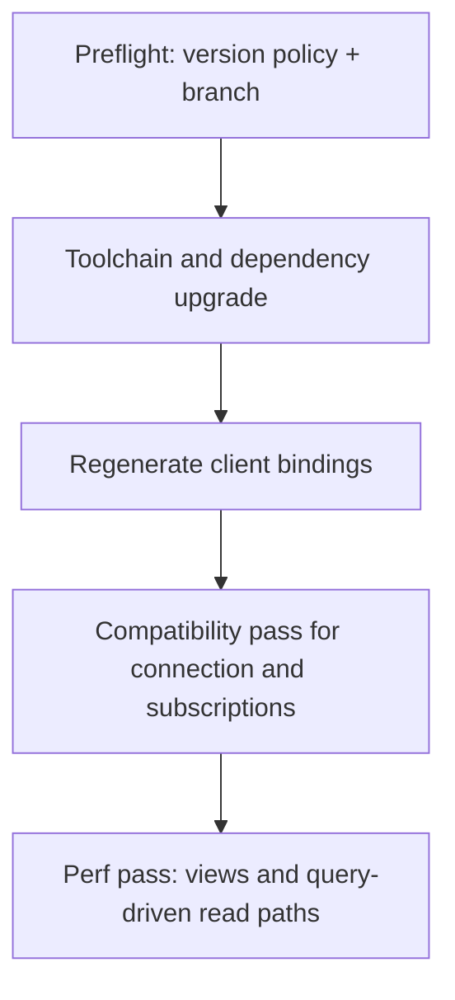

# SpacetimeDB 2.0 Performance-First Migration Plan

## Scope And Constraints

- **Target**: server module and web client only. Agent (`agent/`) is out of scope.
- **Strategy chosen**: performance-first (views/query shaping in the first major milestone).
- **Data policy chosen**: DB reset/backfill windows are acceptable where necessary.
- **Important precondition**: current workspace rules lock SpacetimeDB to 1.6.x; we must first align project rules/workflow before code migration can proceed.

## Migration Flow

## Phase 0: Preflight (Blockers + Baseline)

- Resolve version-policy conflict in project guidance and deployment workflow so 2.0 work is not reverted by local rules:
  - `[.cursor/rules/spacetimedb-config.mdc](.cursor/rules/spacetimedb-config.mdc)`
  - `[.cursor/rules/spacetimedb-workflow.mdc](.cursor/rules/spacetimedb-workflow.mdc)`
- Capture baseline metrics before changes (for objective perf deltas):
  - WS message volume, subscription counts, reconnect behavior, frame-time spikes in chunked traversal paths.
- Create migration branch and freeze non-critical schema churn while migration is active.

## Phase 1: Toolchain + Dependency Upgrade

- Upgrade server crate to SpacetimeDB 2.0-compatible versions and validate compile gates:
  - `[server/Cargo.toml](server/Cargo.toml)`
- Upgrade web SDK dependency and any API surface changes in client app:
  - `[client/package.json](client/package.json)`
- Align local/prod deploy scripts and commands for 2.0 build/publish/generate flow:
  - `[server/deploy-local.ps1](server/deploy-local.ps1)`
  - `[server/deploy-local-clean.ps1](server/deploy-local-clean.ps1)`
  - `[server/deploy-production.ps1](server/deploy-production.ps1)`
  - `[server/deploy-production-clean.ps1](server/deploy-production-clean.ps1)`

## Phase 2: Regenerate Bindings And Restore Runtime Compatibility

- Regenerate client codegen output and fix compile/runtime breakages:
  - `[client/src/generated/index.ts](client/src/generated/index.ts)`
- Update connection lifecycle code to 2.0 connection builder/callback semantics:
  - `[client/src/contexts/GameConnectionContext.tsx](client/src/contexts/GameConnectionContext.tsx)`
- Validate reducer callback registration/unregistration compatibility across main UI and interaction-heavy screens:
  - `[client/src/App.tsx](client/src/App.tsx)`
  - `[client/src/components/Chat.tsx](client/src/components/Chat.tsx)`
  - `[client/src/components/GameCanvas.tsx](client/src/components/GameCanvas.tsx)`

## Phase 3: Performance-First Dataflow Refactor (2.0 Features)

- Introduce server-side view projections for top read-hot paths currently assembled client-side from many tables.
- Candidate first targets:
  - chat/message+sender projection,
  - local-player HUD/quest snapshot,
  - minimap/chunk summary feeds.
- Implement views and query-friendly indexes in server module surface:
  - `[server/src/lib.rs](server/src/lib.rs)`
  - high-traffic domain modules currently subscribed heavily from client (for example `[server/src/environment.rs](server/src/environment.rs)`, `[server/src/projectile.rs](server/src/projectile.rs)`, `[server/src/combat.rs](server/src/combat.rs)`).
- Consume new views in subscription orchestrator to reduce query count/churn:
  - `[client/src/hooks/useSpacetimeTables.ts](client/src/hooks/useSpacetimeTables.ts)`
  - `[client/src/hooks/useUISubscriptions.ts](client/src/hooks/useUISubscriptions.ts)`
- Keep scheduled reducers behaviorally equivalent while reducing unnecessary client-visible table fanout.

## Acceptance Criteria

- Server and web client run on 2.0 toolchain with regenerated bindings.
- No critical regressions in gameplay reducers, scheduling loops, or auth identity handling.
- Measured reduction in subscription/query churn and improved frame stability in web client hot paths.

