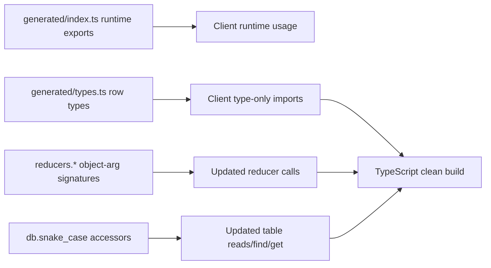

# SpacetimeDB 2.0 Client TS Migration Plan

## Goal

Fix the client-side TypeScript breakages from the SpacetimeDB 2.0 migration by updating import patterns, reducer calls, and `db` table access naming to the new generated SDK contract.

## Chosen Strategy

Use a durable approach: **do not edit** auto-generated files in `[client/src/generated/index.ts](client/src/generated/index.ts)`. Instead, update client code to import row types from `[client/src/generated/types.ts](client/src/generated/types.ts)` (type-only where possible).

## Execution Steps

1. **Fix type import breakages at the source**
  - Update files importing row types from `../generated` to use `../generated/types` (or split imports into runtime from `../generated` + type-only from `../generated/types`).
  - Prioritize files with the highest type churn, including:
    - `[client/src/hooks/useSpacetimeTables.ts](client/src/hooks/useSpacetimeTables.ts)`
    - `[client/src/components/InterfaceContainer.tsx](client/src/components/InterfaceContainer.tsx)`
    - `[client/src/components/Chat.tsx](client/src/components/Chat.tsx)`
    - `[client/src/contexts/GameConnectionContext.tsx](client/src/contexts/GameConnectionContext.tsx)`
    - `[client/src/components/GameCanvas.tsx](client/src/components/GameCanvas.tsx)`
2. **Migrate reducer invocations to object-argument signatures**
  - Replace positional reducer arguments with one object argument matching generated reducer parameter names.
  - Apply to known hotspots first:
    - `[client/src/hooks/usePlayerActions.ts](client/src/hooks/usePlayerActions.ts)`
    - `[client/src/contexts/PlayerActionsContext.tsx](client/src/contexts/PlayerActionsContext.tsx)`
    - `[client/src/hooks/useViewportSync.ts](client/src/hooks/useViewportSync.ts)`
    - `[client/src/components/CraftingUI.tsx](client/src/components/CraftingUI.tsx)`
    - `[client/src/components/ActiveCraftingQueueUI.tsx](client/src/components/ActiveCraftingQueueUI.tsx)`
    - `[client/src/hooks/usePlacementManager.ts](client/src/hooks/usePlacementManager.ts)`
    - `[client/src/components/Chat.tsx](client/src/components/Chat.tsx)`
  - Convert numeric IDs/coords to `BigInt(...)` where reducer schema expects `u64/i64`.
3. **Rename `connection.db` table access from camelCase to snake_case**
  - Update all `db.someTableName` to `db.some_table_name` according to generated table accessors.
  - Cover known heavy-use files:
    - `[client/src/hooks/useSpacetimeTables.ts](client/src/hooks/useSpacetimeTables.ts)`
    - `[client/src/components/InterfaceContainer.tsx](client/src/components/InterfaceContainer.tsx)`
    - `[client/src/hooks/usePlacementManager.ts](client/src/hooks/usePlacementManager.ts)`
    - `[client/src/utils/renderers/placementRenderingUtils.ts](client/src/utils/renderers/placementRenderingUtils.ts)`
    - `[client/src/effects/cutGrassEffect.ts](client/src/effects/cutGrassEffect.ts)`
    - `[client/src/hooks/useUISubscriptions.ts](client/src/hooks/useUISubscriptions.ts)`
    - `[client/src/hooks/useBuildingManager.ts](client/src/hooks/useBuildingManager.ts)`
    - plus remaining files found by `\.db\.[a-z]+[A-Z]` search.
4. **Resolve secondary inference fallout**
  - Re-check and fix residual `unknown`/implicit `any`/generic mismatch errors that remain after import and API-signature migration.
  - Address listener naming mismatches only where compiler indicates invalid reducer/listener symbol names.
5. **Verification and stabilization**
  - Run client TypeScript check and resolve all migration-related errors.
  - Run lint diagnostics for touched files and apply quick fixes.
  - Provide a concise report of what changed, remaining risks, and any follow-up regeneration caveats.

## Validation Checklist

- No imports of removed `*_type` generated modules remain.
- No positional reducer calls remain where generated signature expects one object.
- No camelCase `db` table accessor usage remains.
- Client typecheck passes for touched migration surface.

## Dataflow Snapshot

