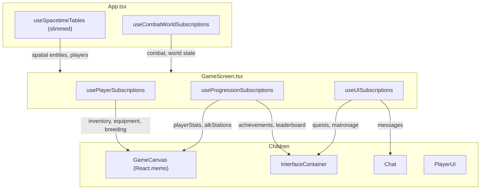

# Split useSpacetimeTables Into Domain Hooks

## The Problem

`[useSpacetimeTables.ts](client/src/hooks/useSpacetimeTables.ts)` has **109 useState** calls and **3231 lines**. It is called solely from `[App.tsx](client/src/App.tsx)`. Any state update (chat message, achievement notification, quest progress, etc.) triggers: `App re-render -> GameScreen re-render -> GameCanvas re-render check`. Most of these updates are irrelevant to the rendering pipeline.

## Architecture




**Key insight**: Hooks called in GameScreen that return data NOT passed to GameCanvas (matronage, quests, messages, notifications) cause GameScreen to re-render but GameCanvas's `React.memo` blocks the cascade. Only hooks whose data is a GameCanvas prop (spatial entities, combat, worldState) reach GameCanvas.

## Hook Design

Each extracted hook is **fully self-contained**: it takes `connection`, creates its own `subscriptionBuilder()` calls, registers its own `onInsert`/`onUpdate`/`onDelete` callbacks, manages its own `useState`, and cleans up its own subscriptions on disconnect. SpacetimeDB's SDK supports multiple callback registrations per table, so hooks don't interfere with each other.

### 1. `useSpacetimeTables.ts` -- SLIMMED (stays in App.tsx)

**Keeps (~37 useState):** All chunk-based spatial entities + players + chunk subscription system.

- players, trees, stones, runeStones, cairns, playerDiscoveredCairns, harvestableResources, campfires, barbecues, furnaces, lanterns, turrets, homesteadHearths, brothPots, woodenStorageBoxes, droppedItems, rainCollectors, waterPatches, fertilizerPatches, firePatches, placedExplosives, barrels, plantedSeeds, seaStacks, fumaroles, basaltColumns, livingCorals, foundationCells, wallCells, doors, fences, wildAnimals (ref-batched), animalCorpses, hostileDeathEvents, clouds, grass, grassState, localPlayerRegistered
- Chunk subscription lifecycle (batching, throttling, hysteresis, progressive loading)
- Player ref-batching optimization, wildAnimals ref-batching, cancelPlacement integration
- Global subs for: `player`, `rune_stone` (minimap), `cairn` (minimap), `player_discovered_cairn`

**Removes:** ALL other global subscriptions (~68 subs), their callbacks, and their state.

### 2. `useCombatWorldSubscriptions.ts` -- NEW (called from App.tsx)

**~14 useState.** High-frequency data that flows directly to GameCanvas rendering.

- **Combat:** knockedOutStatus, rangedWeaponStats, projectiles (with ref-batching), deathMarkers, shelters, playerDodgeRollStates (with ref)
- **World:** worldState, minimapCache, chunkWeather (with ref-batching), monumentParts, largeQuarries, hotSprings
- **Events:** soundEvents, continuousSounds (subscriptions for arrow_break_event, thunder_event remain here since their callbacks fire effects)
- **Global subs:** ~14 tables

### 3. `usePlayerSubscriptions.ts` -- NEW (called from GameScreen.tsx)

**~16 useState.** Player inventory, equipment, and state data.

- inventoryItems, activeEquipments, craftingQueueItems, recipes, itemDefinitions
- activeConsumableEffects, fishingSessions, playerDrinkingCooldowns
- sleepingBags, playerCorpses, stashes
- caribouBreedingData, walrusBreedingData, caribouRutState, walrusRutState
- **Global subs:** ~16 tables

### 4. `useProgressionSubscriptions.ts` -- NEW (called from GameScreen.tsx)

**~18 useState.** Progression, achievements, ALK system.

- playerStats, achievementDefinitions, playerAchievements
- achievementUnlockNotifications, levelUpNotifications, dailyLoginNotifications, progressNotifications, comparativeStatNotifications
- leaderboardEntries, dailyLoginRewards, plantConfigDefinitions, discoveredPlants
- alkStations, alkContracts, alkPlayerContracts, alkState, playerShardBalance, memoryGridProgress
- **Global subs:** ~18 tables

### 5. `useUISubscriptions.ts` -- NEW (called from GameScreen.tsx)

**~15 useState.** Low-frequency UI data that never reaches GameCanvas.

- messages, playerPins, activeConnections
- matronages, matronageMembers, matronageInvitations, matronageOwedShards
- tutorialQuestDefinitions, dailyQuestDefinitions, playerTutorialProgress, playerDailyQuests
- questCompletionNotifications, questProgressNotifications, sovaQuestMessages, beaconDropEvents
- **Global subs:** ~15 tables

## Key Files Modified

- `**[App.tsx](client/src/App.tsx)`:** Call `useSpacetimeTables` (slimmed) + `useCombatWorldSubscriptions`. Remove destructuring of extracted state. Pass spatial + combat/world data to GameScreen.
- `**[GameScreen.tsx](client/src/components/GameScreen.tsx)`:** Call `usePlayerSubscriptions`, `useProgressionSubscriptions`, `useUISubscriptions`. Merge their returns with props from App. Pass all needed data to GameCanvas and UI children.
- `**[GameCanvas.tsx](client/src/components/GameCanvas.tsx)`:** Props interface shrinks slightly (some data now comes from GameScreen's hooks rather than App's props). Rendering behavior unchanged.
- `**[useSpacetimeTables.ts](client/src/hooks/useSpacetimeTables.ts)`:** Remove ~72 useState, ~65 global subscriptions, and ~200 callback handlers. Drops from ~3231 to ~1500 lines.

## Implementation Order

Each step is independently verifiable: build + run + check that the game still works.

1. **Create `useCombatWorldSubscriptions.ts**` -- Copy state, callbacks, subscriptions for combat/world tables from useSpacetimeTables. Delete them from useSpacetimeTables. Wire into App.tsx.
2. **Create `useUISubscriptions.ts**` -- Copy state, callbacks, subscriptions for quests/matronage/social. Delete from useSpacetimeTables. Wire into GameScreen.tsx (easiest since none of this data flows to GameCanvas).
3. **Create `useProgressionSubscriptions.ts**` -- Copy state, callbacks, subscriptions for progression/ALK. Delete from useSpacetimeTables. Wire into GameScreen.tsx.
4. **Create `usePlayerSubscriptions.ts**` -- Copy state, callbacks, subscriptions for inventory/state/breeding. Delete from useSpacetimeTables. Wire into GameScreen.tsx.
5. **Update GameScreen.tsx props interface** -- Remove all props that are now provided by hooks called internally. Update the `<GameCanvas>` JSX to pass data from both App props and internal hooks.
6. **Lint, verify all data flows, test gameplay.**

## Extracted Hook Template

Each hook follows this pattern (matching existing codebase conventions):

```typescript
import { useState, useEffect, useRef } from 'react';
import { DbConnection } from '../generated';
import * as SpacetimeDB from '../generated';

type SubscriptionHandle = { unsubscribe: () => void } | null;

export const useUISubscriptions = (connection: DbConnection | null) => {
    const [messages, setMessages] = useState<Map<string, SpacetimeDB.Message>>(() => new Map());
    // ... more useState ...
    
    const subscribedRef = useRef(false);
    const subsRef = useRef<SubscriptionHandle[]>([]);

    useEffect(() => {
        if (!connection || subscribedRef.current) return;
        subscribedRef.current = true;

        // Register callbacks
        connection.db.message.onInsert((ctx, msg) => {
            setMessages(prev => new Map(prev).set(msg.id.toString(), msg));
        });
        // ... more callbacks ...

        // Create subscriptions
        subsRef.current = [
            connection.subscriptionBuilder()
                .onError(err => console.error("[MESSAGE Sub Error]:", err))
                .subscribe('SELECT * FROM message'),
            // ... more subs ...
        ];

        return () => {
            subsRef.current.forEach(s => s?.unsubscribe());
            subsRef.current = [];
            subscribedRef.current = false;
            setMessages(new Map());
            // ... reset all state ...
        };
    }, [connection]);

    return { messages, /* ... */ };
};
```

## Risk Mitigation

- **No spatial subscription changes:** The complex chunk system stays intact in useSpacetimeTables. Zero risk to the spatial rendering pipeline.
- **Incremental extraction:** Each hook is extracted and tested independently. If one hook causes issues, only that domain's data is affected.
- **Callback independence:** SpacetimeDB SDK supports multiple `onInsert`/`onUpdate`/`onDelete` handlers per table. New hooks registering callbacks don't interfere with existing ones.
- **Same data, same flow:** The data content reaching each component is identical before and after. Only the source component (App vs GameScreen) changes.
- **Subscription guard:** Each hook uses a `subscribedRef` guard to prevent double-subscription in React Strict Mode, matching the existing `isSubscribingRef` pattern.

